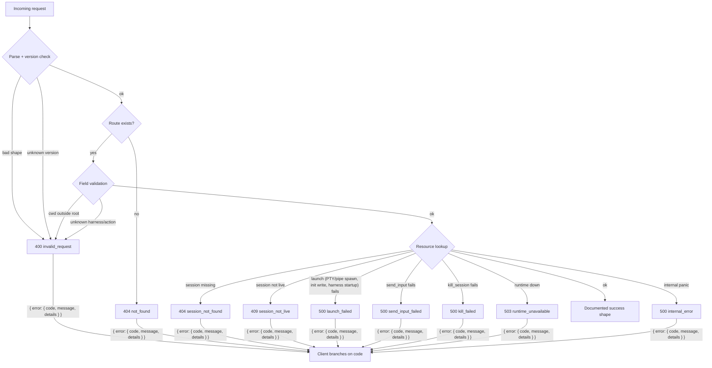
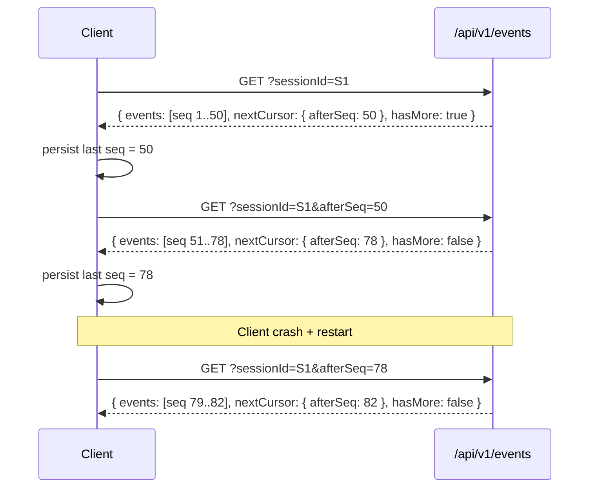

# Coven local API contract

> **See also:** the condensed [API contract reference](reference/api-contract.md), which summarizes versioning and links per-topic pages under `docs/daemon/`. This page is the fuller single-page contract.

The Coven daemon API is a public compatibility boundary for comux and external
clients such as external OpenClaw bridge plugin. It travels over same-user local
IPC: `<COVEN_HOME>/coven.sock` on Unix-like hosts, or an owner-only named pipe
selected by `COVEN_HOME` on Windows. Health and `coven daemon status` report
the active endpoint; clients must not construct a Windows pipe name from the
Unix convention.

## Current stable version

Clients negotiate compatibility with `GET /api/v1/health`. Its `apiVersion`
field is the named contract `coven.daemon.v1`; clients must then check every
capability required by the operation before sending a dependent request.
Capabilities advertise availability and never grant permission.

`GET /api/v1/api-version` is a legacy route-family diagnostic. Its existing
`apiVersion: "v1"` and `supportedApiVersions: ["v1"]` values identify the
`/api/v1/*` route namespace, not the named compatibility contract. Existing
values remain wire-compatible, but new clients must not use this response as
proof of `coven.daemon.v1` support.

- `GET /api/v1/health` exposes `apiVersion: "coven.daemon.v1"`, `covenVersion`, and a machine-readable `capabilities` object.
- Clients should read `/api/v1/health` before assuming any response shape from other endpoints.
- Legacy unversioned routes such as `GET /health` remain early-MVP aliases; new clients should use `/api/v1`.
- Control-plane clients should discover capabilities before sending action ids.
- All API failures are returned as structured `{ "error": { "code", "message", "details" } }` envelopes.
- Events include a monotonic `seq` cursor for incremental reads.
- Event payloads are redacted by default before API display.

### Reusable Rust client

Rust integrations should use `coven-client` rather than compose HTTP over the
daemon transport themselves. Construct a `DaemonEndpoint` only through
`DaemonEndpoint::discover(coven_home)`, then pass it to `DaemonClient::new`.
The public client accepts no URLs or arbitrary socket/pipe paths, exposes only
known `/api/v1/*` operations, caps response bodies at 4 MiB, and negotiates
health before dependent operations. Negotiation is bound to a transport peer
fingerprint. If the daemon endpoint is replaced, the next dependent operation
fails before sending request bytes and clears the cached negotiation. Call
`health` again, re-check capabilities, and then decide whether to retry; the
client never replays a mutation automatically.

On Unix, discovery accepts only the current user's private
`<COVEN_HOME>/coven.sock`. On Windows, it derives only Coven's owner-only pipe
for the supplied private Coven home, then verifies that the pipe owner is the
current user and that its DACL is exactly Coven's owner-rights `GENERIC_ALL`
rule. During an upgrade, it may use a legacy pipe recorded in the private
`daemon.json` only when the file and recorded pipe pass the same owner-only
validation and the name matches Coven's fixed pipe-name shape. The daemon
status must also match the historical deterministic pipe name for the selected
`COVEN_HOME`; copying a protected status file between profiles is rejected.
The daemon remains responsible for creating that descriptor.
`ClientError::Daemon` preserves the HTTP status and `error.code`,
`error.message`, and `error.details` from a structured daemon failure.

`coven.daemon.v1` session routing predates URL-component semantics. The daemon
does not percent-decode session ids: path routes consume the raw remainder
between `/sessions/` and an action suffix, and `GET /events` reads the raw
`sessionId` query value up to the next `&`. A literal `%2F` therefore names
`%2F`, while `engine/42` remains a reachable id. Changing those bytes under the
same named contract would retarget mixed-version mutations.

The typed client emits representable ids verbatim. It rejects empty ids,
whitespace, control characters, and `?` in path-routed ids because the
inherited HTTP request line cannot preserve them; the events query rejects
empty ids, whitespace, control characters, and `&`. Session detail ids that
collide with inherited nested route suffixes (`/handoffs`, `/log`, `/events`,
or `/artifacts/`) are not exposed by that typed operation. These are inherited
`v1` routing limitations, not a new id grammar.

The typed session listing carries `limit`, the opaque page `cursor`, and
`includeArchived`, mirroring the query the daemon already serves (see
[Session list pagination (`v1`)](#session-list-pagination-v1)). It rejects a
cursor outside the daemon's URL-safe base64 alphabet before sending, so a
corrupted or hand-composed value cannot smuggle a separator into the request
target. Setting none of the three requests the inherited unpaginated array;
setting any of them requests the envelope.

## `GET /api/v1/health`

`GET /api/v1/health` returns daemon reachability, the named contract version, coven version, and machine-readable capabilities:

```json
{
  "ok": true,
  "apiVersion": "coven.daemon.v1",
  "covenVersion": "0.0.0",
  "capabilities": {
    "sessions": true,
    "events": true,
    "travel": true,
    "scheduler": true,
    "hub": true,
    "executorDispatch": true,
    "eventCursor": "sequence",
    "structuredErrors": true,
    "sessionHandoff": true,
    "sessionLaunchPolicy": true,
    "afs": true,
    "afsMount": false,
    "afsCommit": true,
    "afsCommitDryRun": true,
    "executionBindingContracts": ["psyche.execution_binding.v1"],
    "requestAdoptionContracts": ["psyche.request_adoption.v1"]
  },
  "daemon": {
    "pid": 12345,
    "startedAt": "2026-05-09T06:43:00Z",
    "socket": "<local IPC endpoint>",
    "processCreationTime": "134157822123456789"
  },
  "eventWriter": {
    "state": "healthy",
    "queuedBytes": 0,
    "capacityBytes": 2097152,
    "droppedOutputEvents": 0,
    "droppedOutputBytes": 0,
    "connectionOpens": 1,
    "transactions": 42,
    "committedEvents": 513
  },
  "hub": {
    "role": "hub",
    "hubId": "hub_01J...",
    "nodesTotal": 2,
    "nodesAvailable": 1
  }
}
```

`processCreationTime` is an optional Windows-only process fingerprint. It is a
decimal string so the full 64-bit FILETIME survives JSON consumers; clients
must continue to accept records and health responses that omit it.

If the daemon metadata is unavailable, `daemon` may be `null`. When present,
`daemon.socket` reports the active local IPC endpoint. The `hub` block reports
the daemon's control-plane role and node availability summary; full node detail
lives at `GET /api/v1/hub/status`.

`eventWriter` is present for the daemon-owned live-session runtime. Its
`state` is `healthy`, `pressured`, or `failed`. A pressured writer reports raw
output that could not enter the byte-bounded queue; lifecycle, tool, error, and
exit events reserve capacity and are not dropped for pressure. Raw output is
the only lossy class. Each contiguous pressure episode produces one ordered
`output_truncated` event for the affected session, inserted immediately before
that session's next accepted event; the marker's `created_at` is the first
rejected chunk timestamp. Global writer counters remain in the health payload.
A failed writer includes `lastError`; clients should surface it as degraded
persistence rather than treating the daemon's liveness as successful event
durability.

### Capability fields

| Field             | Type    | Description                                                       |
|-------------------|---------|-------------------------------------------------------------------|
| `sessions`        | boolean | Sessions API (`/sessions`, `/sessions/:id`) is available.        |
| `events`          | boolean | Events API (`/events`) is available.                             |
| `travel`          | boolean | Travel profile, delta, and state APIs are available.             |
| `scheduler`       | boolean | Scheduler decision and recovery APIs are available.              |
| `hub`             | boolean | Hub control-plane APIs (node registry, routing, queues) are available. |
| `executorDispatch`| boolean | Hub-outbound executor poll/dispatch APIs are available.          |
| `eventCursor`     | string  | Cursor type supported; `"sequence"` means `afterSeq` is stable.  |
| `structuredErrors`| boolean | All errors use the `{ error: { code, message, details } }` shape.|
| `sessionHandoff` | boolean | Durable generation-fenced session handoff routes are available. |
| `sessionLaunchPolicy` | boolean | Owner-gated local IPC accepts the exact unattended Codex launch policy. Always `false` over TCP. |
| `afs` | boolean | The AFS route family is available. |
| `afsMount` | string or `false` | Active mount backend, or `false` when mount-backed access is unavailable. |
| `afsCommit` | boolean | AFS deltas can be materialized into a Git branch. |
| `afsCommitDryRun` | boolean | AFS commit accepts the side-effect-free `dryRun` contract. |
| `executionBindingContracts` | string array | Psyche execution-binding contract names this daemon accepts. Currently `["psyche.execution_binding.v1"]`. This remains the additive O2 capability field, including for O2-only bound kill integrations. See [Psyche execution binding contract (`v1`)](#psyche-execution-binding-contract-v1). |
| `requestAdoptionContracts` | string array | Psyche request-adoption contract names accepted by the dedicated adopted launch/input routes. Currently `["psyche.request_adoption.v1"]`. This O3 value advertises the composite adopted-route contract, including its mandatory per-request exact O2 proof. The bundled adopted client checks this exact value before POST and does not independently gate those methods on `executionBindingContracts`; absence, malformed data, or an unsupported value fails locally without legacy fallback. See [Psyche request-adoption contract (`v1`)](#psyche-request-adoption-contract-v1). |

## Structured error envelope


```mermaid
flowchart TD
  Req[Incoming request] --> Parse{Parse + version check}
  Parse -- bad shape --> ErrInvalid["400 invalid_request"]
  Parse -- unknown version --> ErrInvalid
  Parse -- ok --> Route{Route exists?}
  Route -- no --> ErrNotFound["404 not_found"]
  Route -- yes --> Validate{Field validation}
  Validate -- cwd outside root --> ErrInvalid
  Validate -- unknown harness/action --> ErrInvalid
  Validate -- ok --> Action{Resource lookup}
  Action -- session missing --> ErrSession["404 session_not_found"]
  Action -- session not live --> ErrLive["409 session_not_live"]
  Action -- launch (PTY/pipe spawn, init write, harness startup) fails --> ErrLaunch["500 launch_failed"]
  Action -- send_input fails --> ErrSend["500 send_input_failed"]
  Action -- kill_session fails --> ErrKill["500 kill_failed"]
  Action -- runtime down --> ErrRuntime["503 runtime_unavailable"]
  Action -- internal panic --> ErrInternal["500 internal_error"]
  Action -- ok --> Success[Documented success shape]

  ErrInvalid & ErrNotFound & ErrSession & ErrLive & ErrLaunch & ErrSend & ErrKill & ErrRuntime & ErrInternal -->|"{ error: { code, message, details } }"| Client[Client branches on code]
```

All API errors use the following stable envelope. Clients must branch on `error.code`, not `error.message`:

```json
{
  "error": {
    "code": "session_not_found",
    "message": "Session was not found.",
    "details": {
      "sessionId": "abc-123"
    }
  }
}
```

`details` is optional and included when extra context is useful.

### Stable error codes

| Code                   | HTTP status | Description                                      |
|------------------------|-------------|--------------------------------------------------|
| `not_found`            | 404         | Generic route not found.                         |
| `invalid_request`      | 400 or 404  | Malformed request, unknown harness id, missing required field, or unsupported API version. |
| `forbidden`            | 403         | The request asks TCP to exercise an owner-local-IPC-only capability such as `launchPolicy`. |
| `session_not_found`    | 404         | Session id does not exist.                       |
| `harness_not_found`    | 404         | `GET /capabilities/:harnessId`: harness id is not a known capability scan target. |
| `session_not_live`     | 409         | Session exists but is not running.               |
| `project_root_violation`| 400        | Reserved. Cwd-outside-root currently emits `invalid_request` with the violation message in the body; promoting to its own code would let clients branch without parsing prose. |
| `pty_spawn_failed`     | 500         | Reserved. PTY spawn failures currently emit `launch_failed`; promoting to its own code would let clients distinguish "the PTY couldn't open" (likely a host issue) from "the harness CLI errored at startup" (likely an auth/config issue). |
| `launch_failed`        | 500         | Daemon accepted the launch payload but runtime establishment or immediate launch-status persistence failed. A legacy unbound launch includes `details.sessionId` for its inserted row. A synchronous adopted postcommit failure instead has marker-only details `{"adopted":true,"delivery":"not_asserted"}`; its conditional `created -> failed` transition may lose to an authoritative `idle` or terminal status, or itself fail to persist. |
| `maintenance_locked`   | 423         | A valid repository maintenance owner is draining or holds the common-directory gate. `details.owner` carries its fenced generation and deadline. |
| `maintenance_state_invalid` | 423  | The repository maintenance protocol contains malformed or ambiguous state. Coven fails closed rather than launching a writer. |
| `maintenance_gate_unavailable` | 423 | Coven could not establish a repository maintenance writer intent. |
| `send_input_failed`    | 500         | Daemon accepted the input payload but the runtime write failed (closed pipe, killed process, IO error). Legacy input includes `details.sessionId`; a synchronous adopted postcommit failure instead has marker-only details `{"adopted":true,"delivery":"not_asserted"}`. |
| `kill_failed`          | 500         | Daemon accepted the kill request but the runtime signal/kill call failed (permission, missing process, IO error). `details.sessionId` is the affected session. |
| `runtime_unavailable`  | 503         | The session runtime is unavailable.              |
| `internal_error`       | 500         | Unexpected internal error.                       |
| `raw_artifacts_disabled` | 403       | Raw artifact retrieval was requested without explicit raw artifact persistence enabled. |
| `raw_artifact_requires_raw_flag` | 400 | Raw artifact retrieval omitted the required `raw=1` query flag. |
| `artifact_not_found`   | 404         | Sensitive artifact id does not exist for the session. |
| `travel_profile_not_found` | 404     | Travel profile id does not exist.                |
| `travel_profile_expired` | 409       | Travel profile is expired and cannot accept deltas. |
| `source_hub_mismatch`  | 409         | Delta source hub does not match the travel profile source hub. |
| `no_scheduler_target`  | 409         | No available scheduler node matches the requested capabilities and policy. |
| `scheduler_decision_not_found` | 404 | Scheduler decision id does not exist.            |
| `scheduler_loop_not_found` | 404     | Scheduler loop state does not exist.             |
| `node_not_found`       | 404         | Node id does not exist in the hub registry.      |
| `node_unavailable`     | 409         | Requested assignment target node is not available. |
| `node_missing_capabilities` | 409    | Requested assignment target node lacks required capabilities. |
| `job_not_found`        | 404         | Job id does not exist in the hub queue.          |
| `job_already_queued`   | 409         | A job with the same id already exists in the global queue. |
| `job_not_assignable`   | 409         | Job has already reached a terminal state.        |
| `no_available_node`    | 409         | No available registered node satisfies the job's required capabilities. |
| `session_id_conflict`  | 409         | `POST /sessions/external`: a daemon-managed (non-external) session with the supplied id already exists. |
| `not_external_session` | 422         | `POST /sessions/:id/complete`: the session exists but is not an external session. Use `POST /sessions/:id/kill` for daemon-managed sessions. |
| `external_session_not_killable` | 422 | `POST /sessions/:id/kill`: the session is external and not managed by the daemon; use `POST /sessions/:id/complete` instead. |
| `execution_binding_invalid` | 400   | A launch-time `executionBinding` (or its nested `parent`) is malformed, missing a required member, or carries an unknown/extra member; a bound-mutation proof is malformed or carries an unknown/extra member; a launch cross-field rule (root/child) or canonical-familiar-presence rule fails; or an external-session registration supplies `executionBinding` at all. Missing/incomplete proof members on adopted input, legacy bound input, and bound kill instead use `execution_binding_required`. See [Psyche execution binding contract (`v1`)](#psyche-execution-binding-contract-v1). |
| `execution_binding_unsupported` | 400 | A complete binding has a string `executionBinding.contract` value other than `psyche.execution_binding.v1`. A malformed member type is `execution_binding_invalid` at the parser container instead. |
| `execution_binding_required` | 400 | Adopted input, legacy bound input, or bound kill omits `executionBinding` or supplies an incomplete proof. An absent proof or missing root member names `executionBinding`; a missing member inside non-null `parent` names the parser's `executionBinding.parent` container path. |
| `execution_binding_expired` | 409  | A genuinely new adopted launch/input, whose adoption is absent after replay/conflict prechecks, references an elapsed `executionBinding.expiresAt`. Exact adopted launch/input replay and bound kill are explicitly exempt. |
| `execution_binding_mismatch` | 409 | A complete, syntactically valid bound request proof byte-differs from the stored binding on at least one field, including parent correlation. Malformed shape, contract, or digest is invalid/unsupported rather than a mismatch. This also covers a bound launch whose `executionBinding.familiarId` does not exact-match the canonical `FamiliarContext.id` resolved from top-level `familiarId`. `details.fields` names only the first mismatched field path, never a value. |
| `request_adoption_required` | 400 | An adopted route omitted `requestAdoption`, or a legacy bound launch/input omitted it after O2 validation. Supplying `requestAdoption` where the legacy route forbids it is instead `request_adoption_invalid` at `requestAdoption`. |
| `request_adoption_invalid` | 400 | `requestAdoption` has the wrong shape or syntax, is used at an invalid location (including a legacy bound route that supplies it), lacks a binding, or its launch digest differs from the binding digest. |
| `request_adoption_unsupported` | 400 | `requestAdoption.contract` is not `psyche.request_adoption.v1`. |
| `request_adoption_conflict` | 409 | A global request key or five-field launch attempt scope is already retained for a non-identical identity. |
| `event_preflight_failed` | 500 | A new adopted input could not check event-writer capacity before adoption. Details are omitted. |
| `input_lease_release_failed` | 500 | The adopted-input lease could not be released after adoption. Details are the marker-only adopted postcommit shape. |
| `input_coordination_failed` | 500 | Runtime input coordination failed after adoption. Details are the marker-only adopted postcommit shape. |
| `event_persistence_failed` | 500 | The adopted input event could not be persisted after adoption. Details are the marker-only adopted postcommit shape. |

## Capability catalog shape (`v1`)

`GET /api/v1/capabilities` returns the daemon/control-plane capability catalog. This is the intended intake-client discovery surface for deciding which actions to show or route through Coven after compatibility negotiation.

```json
{
  "capabilities": [
    {
      "id": "coven.control.actions",
      "label": "Coven control-plane action router",
      "adapter": "coven-daemon",
      "status": "available",
      "policy": "allow",
      "actions": ["coven.capabilities.refresh"]
    },
    {
      "id": "coven.travel",
      "label": "Travel profiles and offline delta reconciliation",
      "adapter": "coven-daemon",
      "status": "available",
      "policy": "allow",
      "actions": []
    },
    {
      "id": "coven.scheduler",
      "label": "Multi-host scheduler decisions and recovery",
      "adapter": "coven-daemon",
      "status": "available",
      "policy": "allow",
      "actions": []
    },
    {
      "id": "desktop.automation",
      "label": "Desktop automation adapters",
      "adapter": "desktop-use",
      "status": "planned",
      "policy": "requiresApproval",
      "actions": []
    }
  ]
}
```

Known enum values in `v1`:

- `status`: `available`, `planned`
- `policy`: `allow`, `requiresApproval`

Clients should ignore unknown future capability ids and action ids unless they explicitly support them.

## Harness capability manifests (`v1`)

Distinct from the control-plane catalog above, `GET /api/v1/capabilities/harnesses` returns what each installed harness brings (global instructions, skills, plugins) plus Coven-owned skills, and `GET /api/v1/capabilities/:harnessId` returns a single harness's manifest. Both accept `?refresh=1` to invalidate the 5-minute scan cache. This surface keeps the snake_case field names pinned by `specs/coven-harness-capabilities/`:

```json
{
  "coven_skills": [],
  "harness_capabilities": [
    {
      "harness_id": "codex",
      "scanned_at": "2026-07-15T12:00:00Z",
      "global_instructions": { "present": false },
      "skills": [],
      "plugins": [],
      "warnings": []
    }
  ],
  "scanned_at": "2026-07-15T12:00:00Z"
}
```

Uninstalled harnesses return empty manifests, never errors. Unknown harness ids on `/capabilities/:harnessId` return `404 harness_not_found`. `harnesses` is a reserved path segment, never a harness id. See [Capabilities endpoint](reference/api-capabilities.md) for the full reference.

## Memory dashboard read shapes (`v1`)

The memory read surface is additive to the existing observability list:

- `GET /api/v1/memory` returns summary rows;
- `GET /api/v1/memory/overview` returns counts and capability state;
- `GET /api/v1/memory/:id` returns one validated detail row.

The list preserves its original `familiar_id`, `title`, `path`, `updated_at`,
and `excerpt` fields, and adds the same authoritative `source` object returned
by detail. `path` is relative to the memory root and exists for CLI
compatibility; it is never absolute. The opaque UUID `id` is stable while the
relative file identity is stable. Browser-facing adapters should omit `path`
from their DTOs.

Memory enumeration is metadata-only. It accepts UTF-8 familiar directory names
and UTF-8 `.md` file names whose directory entries are regular files. Confirmed
non-UTF-8 names, symlinks, Windows reparse points, non-files/non-directories,
and entries that disappear during enumeration are excluded. Unexpected
iterator, directory-open, or entry-metadata errors fail the request instead of
returning a partial or empty success. If two accepted entries ever produce the
same opaque id, the request fails closed instead of returning an ambiguous id.
The list then reads each accepted file through a no-follow,
directory-relative handle to build its excerpt. If that body is unavailable,
invalid UTF-8, or larger than 4 MiB, the metadata-valid row remains in the list
with an empty `excerpt`; other valid rows are still returned.

```json
[
  {
    "id": "d251bc66-3e45-5d03-8d78-1e76919642f9",
    "familiar_id": "sage",
    "title": "notes",
    "path": "sage/notes.md",
    "updated_at": "4m ago",
    "updated_at_iso": "2026-07-26T09:56:00Z",
    "excerpt": "Durable fact.",
    "source": {
      "kind": "coven-origin",
      "label": "Coven origin"
    },
    "privacy_classification": null,
    "reveal_required": null,
    "verification_state": "unknown"
  }
]
```

The overview uses the same metadata-only enumeration and does not read any file
bodies. A structurally valid entry is therefore counted even when its body is
invalid UTF-8 or too large for list/detail reads. The overview does not
translate unavailable metadata into zero or healthy:

```json
{
  "generated_at": "2026-07-26T10:00:00Z",
  "totals": {
    "entries": 1,
    "familiars": 1,
    "verified": 0,
    "needs_review": 0,
    "unknown": 1
  },
  "last_updated_at": "2026-07-26T09:56:00Z",
  "capabilities": {
    "detail": true,
    "verification": false,
    "attestation_metadata": false,
    "supersession_history": false,
    "mutations": false
  },
  "verification": {
    "state": "unavailable",
    "checked_at": "2026-07-26T10:00:00Z",
    "manifest": null,
    "index": null,
    "issues": []
  }
}
```

Detail accepts only a UUID returned by the list. It enumerates metadata, opens
only the matching entry through a no-follow directory-relative handle,
validates that exact handle as a regular file, and reads from that same handle.
It returns content without a path:

```json
{
  "id": "d251bc66-3e45-5d03-8d78-1e76919642f9",
  "familiar_id": "sage",
  "title": "notes",
  "updated_at": "2026-07-26T09:56:00Z",
  "source": {
    "kind": "coven-origin",
    "label": "Coven origin"
  },
  "content": "Durable fact.",
  "content_format": "markdown",
  "privacy": {
    "classification": null,
    "reveal_required": null,
    "reason": "privacy taxonomy unavailable"
  },
  "verification": {
    "state": "unknown",
    "reason": "verification metadata unavailable"
  },
  "attestation": null,
  "supersession": {
    "supersedes": null,
    "superseded_by": null
  }
}
```

Detail content must be UTF-8 and no larger than 4 MiB (4,194,304 bytes).
Malformed ids return `400 invalid_request`; well-formed ids that do not resolve,
or entries that disappear or become an unsafe target before the validated
open, return `404 memory_not_found`. Permission failures, unexpected open
failures, and metadata/read failures on an already-opened handle return
`503 memory_content_unavailable`. Its error details contain only `memoryId`;
filesystem errors and paths are never exposed. Oversize content returns
`413 memory_content_too_large` with `details.maxBytes`; invalid UTF-8 returns
`422 memory_content_invalid`. Until the promotion privacy contract provides a
classification, clients must treat `classification: null` and
`reveal_required: null` as requiring explicit reveal.

## Control action shape (`v1`)

`POST /api/v1/actions` accepts a policy-shaped action envelope. The daemon validates the action id before any adapter work is allowed.

```json
{
  "action": "coven.capabilities.refresh",
  "origin": "external-client",
  "intentId": "intent-1",
  "args": {}
}
```

Immediately completed safe actions return `200`:

```json
{
  "ok": true,
  "accepted": true,
  "action": "coven.capabilities.refresh",
  "status": "completed",
  "event": {
    "kind": "capabilities.refreshed",
    "action": "coven.capabilities.refresh",
    "origin": "external-client",
    "intentId": "intent-1",
    "payload": { "capabilities": 5 }
  }
}
```

Unknown action ids return `400` and fail closed:

```json
{
  "ok": false,
  "accepted": false,
  "action": "desktop.deleteEverything",
  "status": "rejected",
  "reason": "unknown action `desktop.deleteEverything`"
}
```

## `POST /api/v1/sessions`

Launches a daemon-managed harness session. `model` is optional; when present,
the daemon forwards the provider-qualified id through the selected harness
adapter's declared `strip_provider` or `preserve` transform. Clients that omit
it retain the harness's own default model.

Clients must observe `capabilities.sessionLaunchPolicy === true` before sending
`launchPolicy`. The only supported policy is an exact, explicit Codex
`nonInteractive` contract: approval `never`, sandbox `workspace-write`, and
optional absolute additional directories. Every `addDirs` entry must be a
non-empty, existing directory; entries are canonicalized and deduplicated
before they reach Codex. This supports an explicitly granted mission workspace
outside the research context root without granting any implicit parent or
sibling path. Unknown fields or values, other harnesses or modes, relative,
missing, or non-directory paths fail with `400 invalid_request` before a
session row or process is created. Omitting `launchPolicy` preserves the
harness default.
This policy is owner-local-IPC-only: health advertises
`sessionLaunchPolicy: false` over TCP, and a TCP request that nevertheless
includes the field fails with `403 forbidden` before a session row or process
is created. Host and Origin allowlists do not grant this authority.
Capabilities advertise availability; the owner-gated local IPC boundary,
exact requested write set, and Rust validation remain the authority boundary.

```json
{
  "projectRoot": "/repo",
  "harness": "codex",
  "model": "openai/gpt-5.6-sol",
  "launchMode": "nonInteractive",
  "launchPolicy": {
    "approval": "never",
    "sandbox": "workspace-write",
    "addDirs": []
  },
  "prompt": "Fix the tests"
}
```

An unbound launch that omits `executionBinding` behaves as before. A bound
launch is no longer accepted on this legacy route: it must use
`POST /api/v1/adopted-sessions` with both `executionBinding` and
`requestAdoption`. After binding shape/relationship validation, omitting
`requestAdoption` here returns `request_adoption_required`; supplying it at
this forbidden legacy location returns `request_adoption_invalid` at
`requestAdoption`. See
[Psyche execution binding contract (`v1`)](#psyche-execution-binding-contract-v1)
and [Psyche request-adoption contract (`v1`)](#psyche-request-adoption-contract-v1).

## Session record shape (`v1`)

In `v1`, session responses stay as raw JSON objects using the Rust daemon's snake_case field names.

Endpoints that return this shape:

- `GET /api/v1/sessions` → `SessionRecord[]` or the paginated envelope, see
  [Session list pagination (`v1`)](#session-list-pagination-v1)
- `POST /api/v1/sessions` → `SessionRecord`
- `POST /api/v1/adopted-sessions` → `SessionRecord`
- `GET /api/v1/sessions/:id` → `SessionRecord`
- `POST /api/v1/sessions/external` → `SessionRecord`
- `POST /api/v1/sessions/:id/complete` → `SessionRecord`

```json
{
  "id": "session-1",
  "project_root": "/repo",
  "harness": "codex",
  "title": "Fix the tests",
  "status": "running",
  "exit_code": null,
  "archived_at": null,
  "created_at": "2026-05-09T06:43:00Z",
  "updated_at": "2026-05-09T06:43:05Z",
  "conversation_id": null,
  "familiar_id": null,
  "execution_binding": null,
  "labels": [],
  "visibility": "private",
  "external": false,
  "transcript_path": null
}
```

`execution_binding` is `null` for every session launched without a Psyche
binding; it is never omitted from the payload. A session launched with a
bound `executionBinding` request field serializes the full stored
`psyche.execution_binding.v1` object here instead, unchanged by archive
state, cursor position, or lifecycle status. See
[Psyche execution binding contract (`v1`)](#psyche-execution-binding-contract-v1).

The `external` field is `true` for sessions registered via `POST /api/v1/sessions/external`; it is `false` for all daemon-launched sessions. The `transcript_path` field carries the absolute path to the external session's transcript file when provided at registration; it is `null` for daemon-launched sessions and for external sessions where no path was supplied.

Classify the row kind before interpreting `status`. Synthetic `active` rows can appear in raw store or list output, but `active` is not a harness-session state.

| Harness-session status | Terminal? | Meaning |
|---|---|---|
| `created` | No | Ledger row exists before runtime ownership. On an adopted launch, an authoritative runtime exit may move it directly to `idle` or a terminal status before activation; the later `created -> running` compare-and-set then returns false and does not overwrite that winner. A definitive runtime-establishment failure conditionally moves only a still-`created` row to `failed`; failure to persist that transition leaves retained ambiguity. Stale unowned rows without launch-adoption or historical reservation evidence recover to `failed`. |
| `running` | No | Reported live state. Inspect `external` to determine whether Coven owns and supervises the runtime. |
| `idle` | No | Reusable daemon/socket conversational session is waiting for more work after a successful exit. For an adopted row, the exit writer may persist `idle` from either `created` or `running`; `idle` is authoritative but nonterminal. |
| `completed` | Yes | Harness session completed successfully. |
| `failed` | Yes | Launch or execution failed, including a successfully persisted adopted `created -> failed` runtime-establishment transition. |
| `killed` | Yes | Terminal in the current ledger. This status is not proof that process termination was acknowledged. |
| `orphaned` | Yes | Runtime ownership was lost and the outcome remains unresolved. |

Archive is not a session status. It is stored separately in `archived_at`; archive and summon preserve the existing lifecycle status of every non-running session, including `created` and `idle`.

External `running` sessions are not daemon-control targets: `POST /api/v1/sessions/:id/input` returns `409 session_not_live` because Coven has no owned live runtime, and `POST /api/v1/sessions/:id/kill` returns `422 external_session_not_killable` as documented below.

## Session list pagination (`v1`)

`GET /api/v1/sessions` serves two response shapes and the query selects between
them. The daemon inspects only `limit`, `cursor`, and `includeArchived`: any one
of the three switches it to the paginated envelope below, and when none of them
is present it returns the inherited unpaginated `SessionRecord[]` — so an empty
query and a query carrying only unrelated parameters both yield the array.
Sessions are ordered newest first by `created_at`, then by `id` descending as
the tiebreak.

### Query parameters

| Parameter        | Required | Description                                                        |
|------------------|----------|--------------------------------------------------------------------|
| `limit`          | No       | Sessions per page, 1–1000. Defaults to 100 when the envelope is selected by another parameter. |
| `cursor`         | No       | Opaque continuation from a previous page's `next_cursor`.          |
| `includeArchived`| No       | `true` or `false`. Defaults to `false`, which keeps the `archived_at IS NULL` filter. |

An out-of-range `limit`, a non-boolean `includeArchived`, or a cursor the daemon
cannot decode is a `400 invalid_request`.

### Response envelope

```json
{
  "sessions": [
    { "id": "session-2", "created_at": "2026-05-09T06:43:00Z" },
    { "id": "session-1", "created_at": "2026-05-09T06:42:00Z" }
  ],
  "next_cursor": "<opaque page cursor>"
}
```

`sessions` carries full [session records](#session-record-shape-v1); the sample
above elides their fields. `next_cursor` is `null` on the last page, so a client
pages until it is `null` rather than until a page comes back short.

Note the key is snake_case, matching the [session record
shape](#session-record-shape-v1) rather than the camelCase `nextCursor` of the
[event envelope](#event-record-shape-and-cursor-pagination-v1). A client that
reads `nextCursor` here decodes nothing, cannot tell that from a genuine last
page, and silently truncates at the first page.

The cursor is URL-safe base64 without padding, so it is safe to place in a
query string verbatim, and it is opaque: it encodes the last row's sort key,
which keeps it stable while rows are inserted ahead of it. Clients must not compose one —
only echo back what the daemon issued. A daemon old enough to predate this
envelope answers a `limit` or `cursor` query with the plain array instead, so a
client that decodes the envelope should treat that as a version mismatch rather
than an empty page.

## `POST /api/v1/sessions/external`

Registers a session that is already running outside the daemon (for example, the engine's interactive TUI). The daemon creates a ledger row with `external: true` and does not own the PTY or lifecycle.

### Request body

```json
{
  "id": "sess-engine-abc",
  "projectRoot": "/repo",
  "harness": "coven-code",
  "title": "coven-code session",
  "transcriptPath": "/repo/.claude/sessions/sess-engine-abc.jsonl"
}
```

| Field            | Type   | Required | Description                                                                 |
|------------------|--------|----------|-----------------------------------------------------------------------------|
| `id`             | string | Yes      | Session id. Must be non-empty after trimming whitespace.                    |
| `projectRoot`    | string | Yes      | Absolute path to the project root. Must be non-empty after trimming.       |
| `harness`        | string | Yes      | Harness identifier (e.g. `"coven-code"`). Must be non-empty after trimming.|
| `title`          | string | No       | Display title. Defaults to `"External session"` when absent or empty.      |
| `transcriptPath` | string | No       | Absolute path to the external session's transcript file. Stored as-is; the daemon does not read or validate the path. |

Session ids use the inherited raw `v1` routing described under
[Reusable Rust client](#reusable-rust-client). Do not percent-encode them while
claiming `coven.daemon.v1`; doing so changes the id selected by an existing
daemon.

### Responses

| Status | Condition                                                                                          |
|--------|----------------------------------------------------------------------------------------------------|
| `201`  | Session did not exist; row created. Body: the new `SessionRecord`.                                 |
| `200`  | An external session with this id was already registered (idempotent re-register). Body: the existing `SessionRecord`. |
| `409`  | `session_id_conflict` — a daemon-managed (non-external) session with this id already exists. The daemon refuses to alias it. |
| `400`  | `invalid_request` — malformed JSON or a required field is missing or blank.                        |
| `400`  | `request_adoption_invalid` — the request supplies `requestAdoption` at all. External registration is not an adoption location. This check runs immediately after JSON parsing and wins when both reserved fields are supplied. `details.fields` is `["requestAdoption"]`. |
| `400`  | `execution_binding_invalid` — after the request-adoption check, the request supplies `executionBinding` at all. Coven does not supervise an externally registered runtime and cannot honor bound-operation guarantees for it. This check still precedes every registration field. `details.fields` is `["executionBinding"]`. |

On success the response body is the full `SessionRecord` as described in [Session record shape (`v1`)](#session-record-shape-v1), with `external: true` and `status: "running"`.

## `POST /api/v1/sessions/:id/complete`

Marks an externally-registered session finished. The daemon updates the session status based on `exitCode` and returns the updated `SessionRecord`.

### Request body

```json
{
  "exitCode": 0
}
```

| Field      | Type    | Required | Description                                                                                   |
|------------|---------|----------|-----------------------------------------------------------------------------------------------|
| `exitCode` | integer | No       | Process exit code. Absent, `null`, or `0` → status becomes `"completed"`. Any nonzero value → status becomes `"failed"`. |

### Responses

| Status | Condition                                                                                  |
|--------|--------------------------------------------------------------------------------------------|
| `200`  | Session updated. Body: the updated `SessionRecord` with the new `status` and `exit_code`.  |
| `404`  | `session_not_found` — no session with this id exists.                                      |
| `422`  | `not_external_session` — the session exists but was not registered as external. For daemon-managed sessions use `POST /api/v1/sessions/:id/kill`. |

### Kill on an external session

`POST /api/v1/sessions/:id/kill` returns `422 external_session_not_killable` when the target session has `external: true`. The kill endpoint is only valid for daemon-managed sessions.

## Psyche execution binding contract (`v1`)

Coven binds a session at launch to an immutable, opaque
`psyche.execution_binding.v1` tuple that Psyche defines. On every route that
treats the value as an O2 binding/proof, Coven validates the closed shape,
syntax, and contract identity. It validates expiry only for a genuinely new
adopted launch/input after exact replay and retained-conflict prechecks; exact
adopted replay and kill do not reject an elapsed tuple. (A reserved
`executionBinding` member on legacy unbound input is stripped without O2
validation, as documented below.) Coven persists an accepted launch tuple
unchanged and exact-compares it, byte for byte, on every subsequent bound
mutating request (input, kill) that must prove it. This is a
mismatch-correlation guarantee only — it detects a proof drawn from, or
matching, a different attempt's tuple. O2 by itself is **not** authentication
and did not provide uniqueness or replay protection. The additive O3
request-adoption contract now supplies those guarantees for bound launch and
input without changing O2's byte-exact proof semantics. See
[Non-goals](#non-goals) below and the normative O2 design,
`specs/psyche/O2_CONTRACT_DESIGN.md`.

### Contract identity and field naming

The named contract is `psyche.execution_binding.v1`. Requests carry it under
the camelCase field `executionBinding`, matching request conventions. The
persisted `SessionRecord` response exposes it under the snake_case field
`execution_binding` (see [Session record shape (`v1`)](#session-record-shape-v1)),
matching response conventions. The binding object itself always carries its
own `contract` member, so a stored or returned object is self-describing
independent of the wrapper field name. The health capability array is named
`executionBindingContracts` (see [Capability fields](#capability-fields)) —
distinct from the request/response field name, so it never collides by name
or type with the `executionBinding` object itself.

### JSON shape

Root (non-delegated) launch — the object contains exactly these 13 members,
no more, no fewer:

```json
{
  "familiarId": "sage",
  "executionBinding": {
    "contract": "psyche.execution_binding.v1",
    "principalRef": "principal:operator",
    "familiarId": "sage",
    "familiarSnapshotDigest": "sha256:aaaaaaaaaaaaaaaaaaaaaaaaaaaaaaaaaaaaaaaaaaaaaaaaaaaaaaaaaaaaaaaa",
    "projectDigest": "sha256:bbbbbbbbbbbbbbbbbbbbbbbbbbbbbbbbbbbbbbbbbbbbbbbbbbbbbbbbbbbbbbbb",
    "graphId": "graph-1",
    "nodeId": "node-1",
    "attemptId": "attempt-1",
    "requestDigest": "sha256:cccccccccccccccccccccccccccccccccccccccccccccccccccccccccccccccc",
    "policyRevision": "policy:7",
    "expiresAt": "2099-01-01T00:00:00Z",
    "parent": null,
    "delegationDigest": null
  }
}
```

Child (delegated) launch requires the top-level `callerFamiliarId` and a
complete, non-null `parent` object (exactly these 4 members) and
`delegationDigest`:

```json
{
  "familiarId": "sage",
  "callerFamiliarId": "cody",
  "executionBinding": {
    "contract": "psyche.execution_binding.v1",
    "principalRef": "principal:operator",
    "familiarId": "sage",
    "familiarSnapshotDigest": "sha256:aaaaaaaaaaaaaaaaaaaaaaaaaaaaaaaaaaaaaaaaaaaaaaaaaaaaaaaaaaaaaaaa",
    "projectDigest": "sha256:bbbbbbbbbbbbbbbbbbbbbbbbbbbbbbbbbbbbbbbbbbbbbbbbbbbbbbbbbbbbbbbb",
    "graphId": "graph-2",
    "nodeId": "node-2",
    "attemptId": "attempt-2",
    "requestDigest": "sha256:dddddddddddddddddddddddddddddddddddddddddddddddddddddddddddddddd",
    "policyRevision": "policy:7",
    "expiresAt": "2099-01-01T00:00:00Z",
    "parent": {
      "sessionId": "parent-1",
      "graphId": "graph-1",
      "nodeId": "node-1",
      "attemptId": "attempt-1"
    },
    "delegationDigest": "sha256:eeeeeeeeeeeeeeeeeeeeeeeeeeeeeeeeeeeeeeeeeeeeeeeeeeeeeeeeeeeeeeee"
  }
}
```

`GET /api/v1/sessions/:id` and any session-listing route return the same
typed field values under `execution_binding`: `null` for an unbound session
(never omitted), the full typed object for a bound one.

### Field semantics

Every field is opaque to Coven. It validates syntax and contract identity on
every proof-bearing path; it validates non-expiry only for a genuinely new,
absent adoption on the dedicated launch/input routes, after replay/conflict
resolution. Coven never interprets principal, familiar, graph, node, attempt,
policy, or delegation meaning.

| Field | Nullable | Coven's obligation |
|---|---:|---|
| `contract` | No | Must equal `psyche.execution_binding.v1`; rejected otherwise. |
| `principalRef` | No | Opaque ref syntax; store and exact-compare. |
| `familiarId` | No | Opaque ref syntax; at launch, must exact-match the canonical `FamiliarContext.id` resolved from top-level `familiarId` (not merely the raw alias). |
| `familiarSnapshotDigest` | No | Digest syntax; store and exact-compare. |
| `projectDigest` | No | Digest syntax; store and exact-compare. Independent of, and never derived from or checked against, the Coven-canonical `project_root`. |
| `graphId` | No | Opaque ID syntax; store and exact-compare. |
| `nodeId` | No | Opaque ID syntax; store and exact-compare. |
| `attemptId` | No | Opaque ID syntax; store and exact-compare. |
| `requestDigest` | No | Digest syntax; store and exact-compare on bound input/kill. O2 itself defines no uniqueness or conflict detection over this field. |
| `policyRevision` | No | Opaque revision syntax; store and exact-compare. Coven never evaluates policy. |
| `expiresAt` | No | Canonical UTC RFC 3339 whole-second timestamp. Coven always checks syntax. Only a genuinely new adopted launch/input whose adoption remains absent after replay/conflict prechecks must also be unexpired; exact adopted replay and kill are exempt. |
| `parent` | Yes | `null` for a root binding; a complete 4-field object for a child binding. Coven checks referenced-session existence, a stored non-null binding, and exact familiar/graph/node/attempt correlation. It does not check parent status or liveness and never infers graph topology. |
| `delegationDigest` | Yes | `null` for a root binding; a digest for a child binding. Store and exact-compare. Coven never authorizes delegation. |

### Exact-object membership and no normalization

`executionBinding` and its nested `parent` are each a closed, exact set of
members — there is no open/extensible schema at either level:

- `executionBinding` must contain exactly the 13 members above — no more, no
  fewer, no additional ones.
- A non-null `parent` must contain exactly `sessionId`, `graphId`, `nodeId`,
  `attemptId` — no more, no fewer, no additional ones.
- Any unrecognized member key at either level is rejected with
  `execution_binding_invalid` before any other validation runs. This applies
  identically at launch and to the proof on bound input/kill.
- Coven performs **no normalization**: no trimming, no case folding, no
  Unicode normalization, no other reformatting. A value is checked against
  the syntax rule below and then stored/compared exactly as received, byte
  for byte. A same-after-normalization value is not a match — it is a syntax
  failure (`execution_binding_invalid`) if it fails raw syntax, or a mismatch
  (`execution_binding_mismatch`) on bound input/kill if it is syntactically
  valid but byte-differs from the stored value. For example, a `graphId`
  differing only in letter case from the stored value is rejected as a
  mismatch, not silently accepted.
- The same byte-exact rule extends to the top-level `familiarId` field of a
  *bound* launch (it is not itself a member of `executionBinding`, but its
  correlation against `executionBinding.familiarId` and admission both
  depend on it): it is never trimmed before use, unlike an unbound launch's
  existing `familiarId` trim/collapse-to-"no familiar" behavior, which is
  unchanged. See [Launch correlation rules](#launch-correlation-rules).

### Shape validation

| Value class | Applies to | Rule |
|---|---|---|
| Opaque ref/ID/policy-revision | `principalRef`, `familiarId` (both locations), `graphId`, `nodeId`, `attemptId`, `policyRevision`, `parent.sessionId`, `parent.graphId`, `parent.nodeId`, `parent.attemptId` | 1 to 255 ASCII bytes, matching `[A-Za-z0-9._:/-]` only. |
| Digest | `familiarSnapshotDigest`, `projectDigest`, `requestDigest`, `delegationDigest` (when present) | Exactly `sha256:` followed by 64 lowercase hexadecimal characters (71 bytes total). |
| Timestamp | `expiresAt` | Canonical UTC RFC 3339 whole-second: `YYYY-MM-DDTHH:MM:SSZ`. No fractional seconds, no non-`Z` offset. Coven validates by parsing the value as RFC 3339 and re-serializing the parsed instant through the same canonical whole-second formatter, accepting the value only if the two are byte-identical. This check does not special-case a leap second: `SS` may be the RFC 3339 leap-second value `60` in addition to `00`-`59`, because a leap-second instant round-trips unchanged through that same parse/format pair — `SS` is not restricted to `00`-`59` only. |
| Contract | `contract` | Must equal `psyche.execution_binding.v1` exactly. |

### Launch correlation rules

- The top-level, Coven-resolved canonical `projectRoot` remains Coven
  authority and is persisted unchanged as `project_root`. `projectDigest` is
  Psyche-owned, independently persisted, and never derived from or checked
  against `project_root`.
- A bound launch requires top-level `familiarId`; its absence is
  `400 execution_binding_invalid` (`details.fields: ["familiarId"]`). Unlike
  an unbound launch — which trims `familiarId` and collapses an empty or
  whitespace-only value to "no familiar" — a bound launch applies no such
  trimming to the raw top-level `familiarId` it received: the raw value must
  already be byte-exact. Any leading/trailing whitespace, or any other value
  that would only resolve or match after normalization, is rejected as
  `400 execution_binding_invalid` (`details.fields: ["familiarId"]`) before
  familiar resolution, the runtime, or the store are touched. Coven then
  runs its existing `resolve_familiar` resolution on that exact value and
  `executionBinding.familiarId` must exact-match the resolved
  `FamiliarContext.id` — not merely the raw alias supplied. A mismatch is
  `409 execution_binding_mismatch` (`details.fields: ["executionBinding.familiarId"]`)
  and no session row is created.
- **Root binding:** `parent` must be `null`, `delegationDigest` must be
  `null`, and `callerFamiliarId` must be absent from the top-level request.
  Any other combination of these three is rejected with
  `400 execution_binding_invalid`, naming the single field responsible
  (`executionBinding.parent`, `executionBinding.delegationDigest`, or
  `callerFamiliarId`). A present `callerFamiliarId` that is `null`,
  non-string, empty, or carries leading/trailing whitespace always fails at
  `callerFamiliarId`, independent of `parent`/`delegationDigest` — it is
  never collapsed into "absent".
- **Child binding:** `parent` must be a complete object, `delegationDigest`
  must be present, and `callerFamiliarId` is required. The session named by
  `parent.sessionId` must exist (`404 session_not_found`,
  `details.fields: ["parent.sessionId"]`, if it does not) and must itself
  carry a stored, non-null `execution_binding`; if it exists but is unbound,
  the response is `409 execution_binding_mismatch` naming only
  `parent.sessionId`, since no stored binding fields exist to compare. That
  parent's stored `familiar_id` must exact-match the request's
  `callerFamiliarId` (mismatch: `execution_binding_mismatch`,
  `details.fields: ["callerFamiliarId"]`), and the parent's stored
  `graphId`/`nodeId`/`attemptId` must exact-match the request's
  `parent.graphId`/`parent.nodeId`/`parent.attemptId` respectively (mismatch:
  `execution_binding_mismatch`, `details.fields` naming the bare
  `parent.graphId`/`parent.nodeId`/`parent.attemptId` path, one test per
  field).
- Parent correlation is existence and exact-match only. Coven never
  authorizes delegation policy or infers graph topology beyond the single
  parent reference given, and it does not resolve or enforce Coven Calls
  delegation authority from `callerFamiliarId`.

### Field path conventions in error `details`

`details.fields` always names exactly one static field path, never a value or
digest. The parser and exact comparator deliberately use different path
classes:

- **Absent/incomplete mutation proof** (`execution_binding_required`) applies
  to adopted input, legacy bound input, and bound kill. An entirely absent
  proof or any missing root member reports the parser's
  `executionBinding` container path. A missing member inside a non-null
  `parent` reports `executionBinding.parent`. The parser does not invent a
  missing leaf such as `executionBinding.parent.sessionId`. Launch-time
  missing membership is instead `execution_binding_invalid`, using those same
  container paths.
- **Malformed shape, contract, syntax, or launch cross-field data** is
  `execution_binding_invalid` or `execution_binding_unsupported`. Unknown or
  extra root/parent membership reports `executionBinding` or
  `executionBinding.parent`; an unsupported, otherwise string contract reports
  `executionBinding.contract`; a complete object with an invalid digest reports
  its static leaf such as `executionBinding.requestDigest`. A decoded type error
  may report its parser container. `callerFamiliarId` is bare because it is a
  top-level launch field.
- **Exact-match mismatch** (`execution_binding_mismatch`) is possible only
  after the supplied proof has a complete, accepted shape, contract, and
  syntax. Top-level binding mismatches use full paths such as
  `executionBinding.familiarId`, `executionBinding.graphId`, and
  `executionBinding.delegationDigest`. Nested parent mismatches are bare —
  `parent`, `parent.sessionId`, `parent.graphId`, `parent.nodeId`, or
  `parent.attemptId` — never `executionBinding.parent.sessionId`.
  `callerFamiliarId` mismatches are likewise bare. A malformed contract or
  digest is invalid/unsupported, not an exact mismatch.

### Persistence and API behavior

- The immutable tuple is the complete `executionBinding` object plus the
  session row's own Coven-canonical `project_root` and assigned session id.
  Nothing else is added to it.
- The binding is persisted atomically with session-row creation in a
  nullable `execution_binding_json TEXT` column on the session row; there is
  no separate binding table.
- No route may update any field of an existing session's `execution_binding`
  after creation. A stored binding round-trips deterministically, byte for
  byte, across a daemon restart.
- A `NULL` stored `execution_binding_json` is the only representation of an
  unbound session. If a non-null stored value fails to parse as valid JSON,
  or its `contract` does not equal `psyche.execution_binding.v1`, reading
  that row is a store error — it is never silently treated as unbound.
- `GET /api/v1/sessions/:id` and any listing route return the same typed
  `execution_binding` value unchanged by archive state, cursor position, or
  lifecycle status.

### Bound input and kill

On an O3 daemon, bound input is accepted only at
`POST /api/v1/sessions/:id/adopted-input`, with a complete exact
`executionBinding`, `requestAdoption`, and the existing `data` payload. The
legacy `POST /api/v1/sessions/:id/input` route returns
`request_adoption_required` only when a valid bound request omits
`requestAdoption`; if that forbidden member is supplied, the route returns
`request_adoption_invalid` at `requestAdoption`. The O2 proof portion carried
by adopted input has this shape:

```json
{
  "data": "existing input payload, unchanged shape",
  "executionBinding": {
    "contract": "psyche.execution_binding.v1",
    "principalRef": "principal:operator",
    "familiarId": "sage",
    "familiarSnapshotDigest": "sha256:aaaaaaaaaaaaaaaaaaaaaaaaaaaaaaaaaaaaaaaaaaaaaaaaaaaaaaaaaaaaaaaa",
    "projectDigest": "sha256:bbbbbbbbbbbbbbbbbbbbbbbbbbbbbbbbbbbbbbbbbbbbbbbbbbbbbbbbbbbbbbbb",
    "graphId": "graph-1",
    "nodeId": "node-1",
    "attemptId": "attempt-1",
    "requestDigest": "sha256:cccccccccccccccccccccccccccccccccccccccccccccccccccccccccccccccc",
    "policyRevision": "policy:7",
    "expiresAt": "2099-01-01T00:00:00Z",
    "parent": null,
    "delegationDigest": null
  }
}
```

This fragment is not a complete O3 request by itself; the adopted route also
requires the closed `requestAdoption` object documented below.

`POST /api/v1/sessions/:id/kill` on a bound session, which today carries no
body, gains a JSON body carrying only the binding:

```json
{
  "executionBinding": {
    "contract": "psyche.execution_binding.v1",
    "principalRef": "principal:operator",
    "familiarId": "sage",
    "familiarSnapshotDigest": "sha256:aaaaaaaaaaaaaaaaaaaaaaaaaaaaaaaaaaaaaaaaaaaaaaaaaaaaaaaaaaaaaaaa",
    "projectDigest": "sha256:bbbbbbbbbbbbbbbbbbbbbbbbbbbbbbbbbbbbbbbbbbbbbbbbbbbbbbbbbbbbbbbb",
    "graphId": "graph-1",
    "nodeId": "node-1",
    "attemptId": "attempt-1",
    "requestDigest": "sha256:cccccccccccccccccccccccccccccccccccccccccccccccccccccccccccccccc",
    "policyRevision": "policy:7",
    "expiresAt": "2099-01-01T00:00:00Z",
    "parent": null,
    "delegationDigest": null
  }
}
```

For adopted input, legacy bound input, and bound kill (after kill's earlier
reserved-O3 check):

- A missing or incomplete proof fails closed as
  `400 execution_binding_required`. An absent proof or missing root member
  reports `details.fields: ["executionBinding"]`; a missing nested parent member
  reports `["executionBinding.parent"]`.
- A malformed proof shape or digest fails as
  `400 execution_binding_invalid`; an unrecognized `contract` value fails as
  `400 execution_binding_unsupported`. These shape/contract/syntax failures are
  not exact mismatches.
- Only a complete, well-formed proof that byte-differs from the stored binding
  fails as `409 execution_binding_mismatch`, naming the first mismatched field
  path per the conventions above.
- **A genuinely new adopted input** whose adoption is still absent after
  replay/conflict prechecks additionally rejects an expired binding:
  `409 execution_binding_expired`,
  `details.fields: ["executionBinding.expiresAt"]`. An exact already-adopted
  input instead replays with `200` after expiry—even if the session is now
  `idle` or terminal—and performs no delivery.
- **Kill is explicitly exempt from the expiry check.** An exact-matching
  proof whose `expiresAt` has already elapsed still succeeds, because kill
  only narrows authority (stops a running attempt) and preserves operator
  safety. Kill still requires an exact match on every other field.
- Read/list/events endpoints (`GET /api/v1/sessions/:id`,
  `GET /api/v1/sessions`, event/cursor reads) require no binding proof.
  `GET /api/v1/sessions/:id` and any session-listing route return the stored
  `execution_binding` field as-is. Event/cursor reads (`GET /api/v1/events`,
  `GET /api/v1/sessions/:id/events`) do not: the `EventRecord` shape (see
  [Event record shape and cursor pagination (`v1`)](#event-record-shape-and-cursor-pagination-v1))
  carries no `execution_binding` field at all, bound or unbound — there is
  nothing to return, only nothing to prove. Coven defines correlation here,
  not authentication — read access is unchanged from today.

An unbound session still runs no O2 proof check. Unbound kill preserves its
existing status/liveness and runtime semantics, but its body is now parsed
best-effort far enough to reject the reserved `requestAdoption` member; parse
failures and every other body field remain ignored. Unbound input checks
liveness before parsing its body. If live, it rejects `requestAdoption` rather
than treating it as legacy payload data; every other field keeps its prior
shape and precedence except the now-reserved `executionBinding` key. That key
is always stripped before the writer, runtime, or persisted event, even when
malformed, because no proof validation runs for an unbound target. See
[Metadata isolation](#metadata-isolation) below. Legacy unbound launch, input,
and kill requests that supply no O3 metadata otherwise retain their prior
behavior.

#### Operation precedence

Bound launch and input use the dedicated O3 routes. Their complete
replay-before-mutable ordering is normative in
[Request ordering and durable side effects](#request-ordering-and-durable-side-effects).
The legacy launch/input routes validate O2 before applying the O3 route rule;
they never create a bound session or deliver bound input. Legacy bound launch
parses the closed binding and checks its root/child relationship plus raw
top-level familiar correlation; it has no stored proof to exact-compare and
does no parent lookup before rejecting the legacy location. Legacy bound input
runs session lookup and JSON parsing first, then parses and exact-compares the
complete O2 proof. An absent/incomplete proof returns
`execution_binding_required` at `executionBinding` or
`executionBinding.parent`; malformed shape/contract/digest and an exact
mismatch retain their distinct O2 errors. Only after a valid exact proof does
an absent `requestAdoption` return `400 request_adoption_required` at
`requestAdoption`; supplying that forbidden member instead returns
`400 request_adoption_invalid` at the same path. A live unbound input checks
liveness before body parsing and rejects a supplied `requestAdoption` as an
unbound relationship at `details.fields: ["executionBinding"]`; it is not
ignored.

Bound kill remains on `POST /api/v1/sessions/:id/kill`: session lookup occurs
first, followed by body parsing and the reserved O3 check. Any parsed
`requestAdoption` member returns `400 request_adoption_invalid` with
`details.fields: ["requestAdoption"]` before O2 proof, status, or external
processing—even when the O2 proof is malformed or the target is unbound and
terminal. A bound kill without that member then requires and exact-compares
the complete O2 proof before status/external checks and runtime kill; expiry is
deliberately skipped. A malformed bound body is `400 invalid_request` with the
route `sessionId`. An unbound body is parsed only to find the reserved O3
member; parse failures and all other fields remain ignored, preserving the O2
kill semantics.

#### Metadata isolation

`executionBinding` is proof metadata consumed entirely by the API layer; it
never reaches the harness/runtime or a recorded event, on any code path,
including error paths:

- **Input, bound session:** only the existing `data` field reaches the
  session runtime's input call; the exact-match proof above has already
  served its purpose, so the full request body is discarded in favor of
  `{"data": data}`. The persisted input event is likewise built from `data`
  only — its pre-O2 shape, containing no `executionBinding` key.
- **Input, unbound session:** every other field of the parsed body reaches
  the session runtime's input call and the persisted input event exactly as
  before O2 — legacy precedence and shape for those fields is unaffected.
  The `executionBinding` key is the one exception: it is now reserved, so if
  present it is always stripped from the body before the runtime call and
  the persisted event, even though it is never parsed or validated on this
  path (an unbound session never runs the proof steps). A malformed
  `executionBinding` value is stripped the same as a well-formed one; it is
  never a validation error here.
- **Kill:** the binding proof exists solely to satisfy the exact-match check;
  kill deliberately performs no expiry check. The proof is never passed to the
  runtime's kill call, which continues to take only the session id, and the
  persisted kill event remains the pre-O2 shape — a bare
  `{"status": "killed"}` marker, no binding fields. This holds for both bound
  and unbound sessions. An unbound kill body is parsed only enough to reject
  `requestAdoption`; every other member remains ignored, so no
  metadata-stripping step applies.

The O3 `requestAdoption` object is likewise API-only metadata and is never
passed through as input data. Adopted-operation isolation and the internal
event-correlation boundary are specified in
[Metadata isolation and privacy](#metadata-isolation-and-privacy).

### Health negotiation

`GET /api/v1/health` advertises `capabilities.executionBindingContracts`
additively (see [Capability fields](#capability-fields)):

```json
{
  "capabilities": {
    "executionBindingContracts": ["psyche.execution_binding.v1"]
  }
}
```

`executionBindingContracts` remains the additive discovery field for
standalone O2 support, including bound kill. Adopted launch and input instead
negotiate the exact `psyche.request_adoption.v1` value through
`requestAdoptionContracts` and use the dedicated routes. That O3 value
advertises the composite route contract, but every POST still carries the
complete exact O2 proof. The bundled adopted client does not independently
gate those methods on this O2 array. Legacy unbound sessions remain fully
compatible.

Externally registered (non-Coven-owned) sessions must reject any
`executionBinding` supplied at registration time (see
[`POST /api/v1/sessions/external`](#post-apiv1sessionsexternal)), because
Coven does not supervise that runtime and cannot honor bound-operation
guarantees for it.

### Error matrix

| Code | Status | Condition |
|---|---:|---|
| `execution_binding_invalid` | 400 | A launch binding is malformed, missing a required root/nested member, or contains an unknown/extra member; a launch root/child or canonical-familiar-presence rule fails; a mutation proof has malformed shape/contract-member type/digest or an unknown/extra member; or external registration supplies `executionBinding`. Missing/incomplete mutation proof membership uses `execution_binding_required`, not this code. |
| `execution_binding_unsupported` | 400 | A complete binding has a string `contract` literal other than `psyche.execution_binding.v1`; malformed member type is `execution_binding_invalid`. |
| `execution_binding_required` | 400 | Adopted input, legacy bound input, or bound kill omits the proof or supplies incomplete root/nested membership. Details use `executionBinding` for an absent proof/missing root member and `executionBinding.parent` for a missing nested parent member. |
| `execution_binding_expired` | 409 | A genuinely new adopted launch/input whose adoption remains absent after replay/conflict prechecks references an elapsed binding. Exact adopted replay and kill are exempt. |
| `execution_binding_mismatch` | 409 | A complete, shape-valid proof or launch correlation fails exact comparison. This includes parent/canonical-familiar correlation and a child launch whose `parent.sessionId` exists but has a `null` stored binding. Malformed shape, contract, or digest never reaches mismatch comparison. |
| `session_not_found` | 404 | The current session, or a child launch's referenced `parent.sessionId`, does not exist at all. Unchanged from existing behavior (see [Stable error codes](#stable-error-codes)). |

`details.fields` names only the parser container/static path or first mismatch
path; it never includes field values or digests. In particular, missing proof
members use `executionBinding` or `executionBinding.parent`, while a
shape-valid exact mismatch may use `executionBinding.graphId` or the bare
`parent.attemptId`. No broader denial taxonomy is introduced by this contract.

### Non-goals

O2 defines only the immutable launch/correlation core. Its original
non-goals remain true when O2 is considered alone; O3 adds request adoption
without changing the binding's meaning:

- An `executionBinding` alone is not an adoption key and does not make a
  request idempotent. Current bound launch/input therefore also require O3
  metadata; legacy O2-only bound mutations are rejected.
- O2 still defines no lookup-by-binding route.
- No return-or-fence lookup semantics and no cancellation acknowledgement.
- No content-addressed artifact binding and no crash-matrix recovery proofs
  beyond deterministic persistence and restart round-trip.
- No broader structured-denial taxonomy beyond the six error codes above.
- No interpretation of `graphId`/`nodeId`/`attemptId` topology, descendant
  enumeration, or delegation authorization — `callerFamiliarId` is
  correlation metadata only, never a delegation-authority decision.
- No production child/subagent dispatch.

## Psyche request-adoption contract (`v1`)

`psyche.request_adoption.v1` makes Coven durably responsible for a bound
launch or input before its runtime side effect. Adoption means that Coven has
committed immutable evidence and will not automatically execute that request
again. It does **not** mean input delivery, runtime establishment, process
completion, or any terminal outcome succeeded. O3 deliberately reports
delivery as `not_asserted`.

### Closed request shape and byte rules

Adopted requests carry this exact object under `requestAdoption`:

```json
{
  "contract": "psyche.request_adoption.v1",
  "key": "psyche:graph-1/node-1/attempt-1/request-1",
  "requestDigest": "sha256:aaaaaaaaaaaaaaaaaaaaaaaaaaaaaaaaaaaaaaaaaaaaaaaaaaaaaaaaaaaaaaaa"
}
```

The object is closed: all three members are required, and any missing,
unknown, or extra member is `request_adoption_invalid`.

| Field | Exact rule |
|---|---|
| `contract` | Must equal `psyche.request_adoption.v1` byte-for-byte. |
| `key` | 1 to 255 ASCII bytes; every byte must match `[A-Za-z0-9._:/-]`. |
| `requestDigest` | Exactly `sha256:` followed by 64 lowercase hexadecimal characters (71 ASCII bytes total). |

Coven performs no trimming, case folding, Unicode normalization, or semantic
interpretation. Accepted values are stored and compared byte-for-byte. Psyche
owns canonical request serialization and digest computation; Coven checks
syntax and equality only. Request adoption is neither authentication nor
content attestation.

For launch, `requestAdoption.requestDigest` must exact-match
`executionBinding.requestDigest`. For input, it identifies the input request
and is independent of the immutable launch digest in `executionBinding`.

### Adopted routes, compatibility, and responses

| Method and path | Required body metadata | First adoption | Exact replay |
|---|---|---|---|
| `POST /api/v1/adopted-sessions` | The normal launch fields plus a complete `psyche.execution_binding.v1` `executionBinding` and the closed `requestAdoption` object. Root/child and familiar correlation remain required. | `201` with the full `SessionRecord`. | `200` with the current persisted `SessionRecord`. |
| `POST /api/v1/sessions/:id/adopted-input` | `data` as a string, the complete exact O2 `executionBinding` proof, and the closed `requestAdoption` object. | `202` with the exact first-adoption shape below. | `200` with the exact replay shape below. |

The first successful adopted-input response is exactly:

```json
{
  "adopted": true,
  "replayed": false,
  "delivery": "not_asserted"
}
```

An exact adopted-input replay is exactly:

```json
{
  "adopted": true,
  "replayed": true,
  "delivery": "not_asserted"
}
```

An adopted-launch replay returns the session's current persisted record without
changing it. It may be `created` during the commit-to-runtime window, `running`
after activation, `idle` after a successful conversational exit, or terminal
(`completed`, `failed`, `killed`, or `orphaned`). Replay neither fabricates a
status nor relaunches.

An exact adopted-input replay returns the `200` replay body above before expiry
or liveness checks. It therefore still returns `200` after
`executionBinding.expiresAt` has elapsed and after the session becomes `idle` or
terminal; it never calls the runtime again.

On an O3 daemon, bound operations cannot bypass adoption:

- `POST /api/v1/sessions` and `POST /api/v1/sessions/:id/input` reject a
  bound request that omits adoption with `400 request_adoption_required` at
  `details.fields: ["requestAdoption"]`, after the route's O2 validation.
  Supplying `requestAdoption` on those legacy bound routes is instead
  `400 request_adoption_invalid` at the same static path.
- Existing unbound launch and input behavior remains compatible when the
  request omits both O2 and O3 metadata. An unbound request that supplies
  `requestAdoption` is `400 request_adoption_invalid` at
  `details.fields: ["executionBinding"]`; it receives no O3 idempotency
  guarantee.
- Bound kill remains on `POST /api/v1/sessions/:id/kill` and still requires
  only its exact O2 proof. Kill is not an O3 adoption operation, and a
  `requestAdoption` member there is `400 request_adoption_invalid` at
  `details.fields: ["requestAdoption"]` before proof or status processing.
- `POST /api/v1/sessions/external` rejects `requestAdoption` with
  `request_adoption_invalid`; Coven cannot adopt a side effect for a runtime
  it does not own. This check precedes the external route's
  `executionBinding` rejection, so request adoption wins when both are present.
- The dedicated route names are a downgrade discriminator. A pre-O3 daemon
  returns its normal unknown-route response; a client must not retry a legacy
  mutation or silently discard adoption metadata.

### Global key and launch-attempt uniqueness

`requestAdoption.key` is globally unique within one Coven store across
operation kinds, sessions, projects, and contract versions. A retained row is
an exact replay only when all identity members match:

- request-adoption contract;
- operation kind (`launch` or `input`);
- request digest;
- complete byte-exact execution binding;
- input session id for input; and
- the complete launch attempt scope for launch.

Reusing a key for a different digest, operation, session, binding, or attempt
is `request_adoption_conflict`; retained identity is never overwritten.

A launch also has a unique five-field attempt scope:

```text
executionBinding.principalRef
executionBinding.projectDigest
executionBinding.graphId
executionBinding.nodeId
executionBinding.attemptId
```

These five byte-exact values are the complete O3 attempt identity.
`requestDigest`, familiar fields, parent fields, and `delegationDigest` are
intentionally excluded: changing them for the same attempt must conflict
rather than create a second session. The same key plus the exact complete
identity is replay. A different key for the same scope conflicts at
`executionBinding.attemptId`; a different `attemptId` under a new key may
create a new session.

Store migration retains a non-replay-addressable launch reservation for every
pre-O3 bound session. Each reservation occupies the same five-field scope.
Duplicate historical scopes fail startup closed; migration never chooses a
winner.

### Request ordering and durable side effects

Replay and retained conflict evidence outrank mutable admission drift.
Structural JSON member/type parsing occurs first, followed by the closed O2
and O3 shapes, contract identities, syntax, exact O2 proof comparison, and
launch digest equality. Filesystem canonicalization, current harness and
familiar availability, parent existence/exact correlation, binding expiry,
maintenance, capacity, handoff fences, and runtime liveness are mutable checks
and do not hide an exact replay or retained conflict. Parent status/liveness is
not an admission check.

For adopted launch:

1. Validate structural O2/O3 data without performing mutable filesystem,
   roster, harness, parent, maintenance, or runtime work.
2. Resolve the global key and five-field scope read-only. Return `200` for an
   exact replay or `409` for conflict.
3. Acquire the process-independent adoption gate for digests of the key and
   attempt scope, then repeat replay/conflict resolution.
4. For a genuinely new request only, run project/cwd, harness, expiry,
   familiar, parent existence/exact-correlation, and maintenance admission.
5. In an `IMMEDIATE` transaction, repeat authoritative replay/conflict
   resolution, revalidate the same child-parent existence/correlation, and
   commit the new `created` `SessionRecord` and launch adoption together.
6. Only after commit, invoke the runtime.

For adopted input, the daemon first looks up the target session, parses O2,
O3, and `data`, and exact-matches the O2 proof. It then resolves the key,
acquires the key adoption gate, and repeats resolution. Only a genuinely new
input proceeds through expiry, liveness, event-capacity, and handoff checks.
An `IMMEDIATE` transaction repeats resolution and commits the input lease and
adoption together. Runtime input and event persistence happen only after that
commit.

The authoritative replay/conflict check is therefore repeated after gate
acquisition and again in the committing transaction. A waiter cannot return a
mutable-admission error after another request wins and commits. Exact replay
may return after expiry, familiar removal, project/cwd or harness drift,
maintenance changes, or an `idle`/terminal transition because it performs no
new side effect. Store corruption is an internal error, never an
absent-adoption fallback.

### Lifecycle, ambiguity, and retention

An adopted launch transaction commits both the `created` session and adoption
before runtime work. Immediately after cancellation ownership registration and
before initial stream or piped prompt delivery, the runtime invokes its
ownership callback exactly once to compare-and-set `created -> running`. The
daemon exit writer may instead move `created` or `running` to the authoritative
persisted exit status: a successful
conversation-grouped row (`conversation_id` present) becomes nonterminal
`idle`, a successful ungrouped row becomes terminal `completed`, and a failed
exit becomes terminal `failed`. If that status wins before activation, the
later `created -> running` compare-and-set returns false and must not overwrite
it; a false compare-and-set is not a persistence error. Existing authoritative
terminal states such as `killed` or `orphaned` are likewise not rewritten by
that activation CAS. Generic stale-created recovery excludes every session
with a launch adoption or historical attempt reservation.

If runtime establishment returns a definitive failure after that atomic
commit, the request handler conditionally compare-and-sets
`created -> failed`. An authoritative `idle` or terminal status that already
won is not overwritten. The synchronous response remains `500 launch_failed`
with the post-adoption ambiguity marker, and exact replay returns the row's
current stored status—`created`, `running`, `idle`, or terminal—without
relaunching. If persisting the `failed` transition itself fails, the session
and adoption remain retained but the lifecycle state remains ambiguous; replay
still returns whatever status is stored and performs no runtime work.

The interval after adoption commit and before established runtime ownership is
intentionally visible as `created`. Once cancellation ownership is registered,
`running` publication precedes initial prompt delivery. If that publication
fails, the response is post-adoption ambiguity and replay never relaunches; O3
does not add O4 recovery behavior. It retains the evidence for O4
lookup/fencing and O7 reconciliation and performs no automatic redispatch.

Request-adoption rows are immutable and append-only. They survive normal
session status updates, archive, summon, event retention, and daemon restart.
Sessions with any adopted or historical reserved evidence cannot be
sacrificed. O3 defines no expiry or release mechanism for that evidence.

Only a synchronous HTTP failure returned after adoption commits receives the
concrete post-adoption code with `error.details` set exactly to:

```json
{
  "adopted": true,
  "delivery": "not_asserted"
}
```

That marker means the caller must not interpret the failure as safe
non-adoption. Exact replay reports the retained adoption and never invokes the
runtime again; it makes no delivery or completion claim, and O3 has no
automatic redispatch path. Asynchronous output, exit-event, or authoritative
exit-status persistence can fail after an HTTP response has already returned.
Such failures are logged while the session/adoption evidence remains retained;
they cannot retroactively add this marker to, or otherwise update, the
completed response.

### Metadata isolation and privacy

`executionBinding` and `requestAdoption` are consumed by the API layer. They
are stripped before runtime launch/input, input-capacity accounting, and
persisted event payload construction. Input event correlation uses an
internal nullable SQL column named `request_adoption_id`; that identifier is
never serialized in the public `EventRecord`, event payload, or harness
input. No public adoption-record response object or internal ledger id is
exposed.

O3 errors use static field paths only. The mapping is:

| Condition | `error.details.fields` |
|---|---|
| Missing adoption on an adopted route or legacy bound launch/input | `["requestAdoption"]` |
| Non-object adoption or an object with a missing/extra member | `["requestAdoption"]` |
| Malformed/non-string contract or unsupported contract literal | `["requestAdoption.contract"]` |
| Malformed key or global key-identity conflict | `["requestAdoption.key"]` |
| Malformed digest or launch/O2 digest mismatch | `["requestAdoption.requestDigest"]` |
| Different key already owns the same five-field launch scope | `["executionBinding.attemptId"]` |
| Adoption on an unbound launch/input relationship, including a legacy unbound route | `["executionBinding"]` |
| Adoption on a legacy bound launch/input, kill, or external registration | `["requestAdoption"]` |

Messages and details never disclose an adoption key, digest, binding value,
input data, or a session id learned from the adoption ledger. Existing
non-adoption errors may still echo a caller-supplied route session id as
documented; O3 never turns retained private ledger data into an error oracle.
Adoption-gate filenames and diagnostics likewise use only cryptographic
digests, never caller values.

### O3 error matrix

The adopted routes also return the generic and O2 errors documented above.
The complete O3 adoption/phase-specific surface is:

| Code | Status | Phase and condition | Exact message and details |
|---|---:|---|---|
| `request_adoption_required` | 400 | Pre-adoption: an adopted route omitted `requestAdoption`, or a bound launch/input attempted the legacy route without it. | `Bound operation requires requestAdoption.` with `{"fields":["requestAdoption"]}`. |
| `request_adoption_invalid` | 400 | Pre-adoption: non-object, missing/extra member, malformed contract/key/digest, invalid cross-field use, adoption without binding, launch digest mismatch, or adoption at a kill/external/legacy location. | `Request adoption is invalid.` with the static `fields` path above. |
| `request_adoption_unsupported` | 400 | Pre-adoption: `requestAdoption.contract` is not `psyche.request_adoption.v1`. | `Request adoption is invalid.` with `{"fields":["requestAdoption.contract"]}`. |
| `request_adoption_conflict` | 409 | Pre-side-effect: a global key or launch attempt scope is retained under a non-identical identity. | `Request adoption conflicts with retained evidence.` with `{"fields":["requestAdoption.key"]}` or `{"fields":["executionBinding.attemptId"]}`. |
| `event_preflight_failed` | 500 | Pre-adoption input: event-writer capacity could not be checked. | `Input event capacity could not be checked.`; details are omitted. |
| `launch_failed` | 500 | Post-adoption launch: runtime establishment failed; the `created -> running` status update returned a persistence error; or the committed session could not be reread. A false activation CAS because `idle` or a terminal status already won is successful preservation, not this error. | Respectively `Session runtime launch failed after adoption.`, `Session runtime status could not be persisted after adoption.`, or `Session state could not be read after adoption.`; details are exactly `{"adopted":true,"delivery":"not_asserted"}`. |
| `session_not_live` | 409 | Pre-adoption input if the stored status is not live, or post-adoption if the runtime reports not-live after adoption. | Before commit: `Session is not live.` with `{"sessionId":"<route id>"}`. After commit: `Session runtime was not live after input adoption.` with the marker-only adopted details. |
| `send_input_failed` | 500 | Post-adoption input: the runtime input call failed for a reason other than the typed not-live condition. | `Session runtime input failed after adoption.` with the marker-only adopted details. |
| `input_coordination_failed` | 500 | Post-adoption input: session input coordination failed. | `Session input coordination failed after adoption.` with the marker-only adopted details. |
| `event_persistence_failed` | 500 | Post-adoption input: synchronous input-event persistence failed. | `Session input event persistence failed after adoption.` with the marker-only adopted details. |
| `input_lease_release_failed` | 500 | Post-adoption input: runtime/event work returned successfully but lease release failed. | `Session input lease could not be released after adoption.` with the marker-only adopted details. |

New adopted input may also fail before commit with `413 input_too_large`
(`Input payload exceeds the daemon event writer capacity.`) or
`409 session_handoff_active`
(`Session input is fenced by a committed handoff takeover.`); each carries
`{"sessionId":"<route id>"}`. These are ordinary admission failures, not
post-adoption markers.

Decoding and structural member/type errors precede O2/O3 semantic validation.
For a structurally valid adopted request, exact proof, replay, and conflict
resolution precede mutable expiry, roster, parent existence/exact correlation,
runtime liveness, maintenance, capacity, and handoff checks. Parent status is
not inspected. A genuinely new request still must pass every applicable
mutable admission check before adoption commits; exact replay performs none of
those checks.

### Health negotiation and fail-closed clients

`GET /api/v1/health` advertises accepted adoption contracts additively:

```json
{
  "apiVersion": "coven.daemon.v1",
  "capabilities": {
    "executionBindingContracts": ["psyche.execution_binding.v1"],
    "requestAdoptionContracts": ["psyche.request_adoption.v1"]
  }
}
```

Before every adopted launch or input, the bundled client completes health
negotiation in a fixed three-step order. First it requires `health.apiVersion`
to be the exact string `coven.daemon.v1`.
Second it requires `health.ok === true`.
Only after both checks pass does it require
`health.capabilities.requestAdoptionContracts` to be an array containing the
exact `psyche.request_adoption.v1` string.
Missing, null, false, and non-boolean `health.ok` values all fail locally.
Any health transport, API-version, health-ok, or capability failure sends zero
POST requests and never falls back to a legacy mutation. That O3 capability
advertises the composite adopted-route contract; the client does not independently gate
these adopted methods on `executionBindingContracts`. It
does not replace proof: every adopted request must still carry a complete,
exact O2 `executionBinding` proof, which the Rust authority validates along
with all per-operation admission checks. Capabilities advertise availability;
they never grant permission or prove a request.

### O4-O8 exclusions

O3 exposes durable adoption and replay/conflict behavior only:

- No adoption lookup route or public ledger query exists.
- No `proven-not-adopted`, `unknown`, fence, or generation disposition exists.
- No retention expiry, retention/fence release, or pruning mechanism exists.
- No redispatch or recovery endpoint exists, and ambiguous post-adoption work
  is never executed automatically.
- No cancellation acknowledgement is added; kill remains outside adoption.
- No content-addressed artifact binding is added.
- No production child dispatch, descendant enumeration, graph traversal, or
  delegation authorization is added.

Those are later O4-O8 responsibilities. O3 must not be interpreted as shipping
any of them.

## Event record shape and cursor pagination (`v1`)

`GET /api/v1/events` returns a paginated envelope with monotonic `seq` cursors. `GET /api/v1/sessions/:id/events` is the session-scoped alias with the same response shape and cursor query parameters except that `sessionId` comes from the path.

### Query parameters

| Parameter     | Required | Description                                             |
|---------------|----------|---------------------------------------------------------|
| `sessionId`   | Yes      | Session to fetch events for.                           |
| `afterSeq`    | No       | Return only events with `seq > afterSeq` (preferred).  |
| `afterEventId`| No       | Compatibility cursor — resolves to a sequence position.|
| `limit`       | No       | Maximum number of events to return (daemon-enforced, max 1000). |

When `limit` is omitted, the daemon returns every remaining event that fits in
one transport response; it does not apply an implicit 1000-event page. If the
complete response would exceed the transport body limit, the request fails
with `event_response_too_large` instead of silently returning a partial page.

### Response envelope

```json
{
  "events": [
    {
      "seq": 42,
      "id": "event-uuid-a",
      "session_id": "session-uuid",
      "kind": "output_truncated",
      "payload_json": "{\"droppedEvents\":3,\"droppedBytes\":128}",
      "created_at": "2026-05-09T06:43:09Z"
    },
    {
      "seq": 43,
      "id": "event-uuid-b",
      "session_id": "session-uuid",
      "kind": "output",
      "payload_json": "{\"data\":\"hello\"}",
      "created_at": "2026-05-09T06:43:10Z"
    }
  ],
  "nextCursor": {
    "afterSeq": 43
  },
  "hasMore": false
}
```

`nextCursor` is `null` when there are no events. `hasMore` is `true` when a `limit` was applied and more events may exist.

`payload_json` is the redacted preview payload used by clients. Raw sensitive artifacts are never included in this envelope. `output_truncated` is additive and ordered: it appears in the session event stream before the next accepted event for the same session, and it uses `{"droppedEvents": <u64>, "droppedBytes": <u64>}` with `droppedBytes` counting rejected UTF-8 payload bytes only.

Adjacent accepted output callbacks for the same session may coalesce into one `output` event, and that event's `created_at` is the first accepted callback timestamp.

## Log preview shape (`v1`)

`GET /api/v1/sessions/:id/log` currently returns the full redacted log preview for the session as an unbounded array:

```json
[
  {
    "ts": "2026-05-09T06:43:10Z",
    "level": "info",
    "message": "> hello"
  }
]
```

## Travel mode profile and delta shapes (`v1`)

Travel mode lets a same-user local client export a bounded, read-only working profile for laptop/offline work and later reconcile appended results back into the hub store. It is additive to sessions/events: uploaded offline events are persisted as ordinary redacted event-log entries on a reconciliation session.

### `POST /api/v1/travel/profiles`

Request:

```json
{
  "familiarId": "sage",
  "workspaceId": "workspace-1",
  "expiresInSeconds": 604800,
  "staleAfterSeconds": 172800
}
```

`familiarId` is required. `workspaceId` defaults to `"default"`. Expiry values must be positive when supplied; defaults are 7 days for `expiresInSeconds` and 2 days for `staleAfterSeconds`, capped at the expiry.

Response `201`:

```json
{
  "profileId": "travel_...",
  "version": "0.1",
  "generatedAt": "2026-07-04T12:00:00Z",
  "expiresAt": "2026-07-11T12:00:00Z",
  "staleAfter": "2026-07-06T12:00:00Z",
  "sourceHub": {
    "hubId": "hub_...",
    "displayName": "Coven hub"
  },
  "scope": {
    "familiarId": "sage",
    "workspaceId": "workspace-1"
  },
  "sourceRevision": {
    "memoryRevision": "mem_...",
    "loopRevision": "loop_..."
  },
  "permissions": {
    "mode": "travel-read-only",
    "allowedLocalAgents": ["lightweight"],
    "allowMemoryOverwrite": false,
    "allowHeavyweightLocalWork": false
  },
  "encoding": "gzip+base64",
  "contentHash": "sha256:...",
  "profileBlob": "..."
}
```

The daemon also writes a gzip profile artifact under `<covenHome>/travel/profiles/` and marks it read-only. The profile payload may include familiar memory context for the requested familiar; clients must treat it as a snapshot, not a write target.

### `POST /api/v1/travel/deltas`

Request:

```json
{
  "profileId": "travel_...",
  "sourceHubId": "hub_...",
  "sourceRevision": {
    "memoryRevision": "mem_...",
    "loopRevision": "loop_..."
  },
  "clientId": "laptop-1",
  "events": [
    { "id": "local-event-1", "kind": "assistant", "text": "offline result" }
  ],
  "artifacts": [
    { "id": "artifact-1", "kind": "summary" }
  ],
  "proposedMemoryAdditions": [
    { "path": "MEMORY.md", "text": "append this" }
  ]
}
```

`profileId`, `sourceHubId`, and `clientId` are required. Query `state` may be `handoff_pending`, `syncing_delta`, or `hub_resumed`; omitted state defaults to `hub_resumed`. Query `defer=1` is a compatibility alias for `state=handoff_pending`.

Response `202`:

```json
{
  "deltaId": "delta_...",
  "state": "hub_resumed",
  "acceptedEvents": 1,
  "acceptedArtifacts": 1,
  "memoryReviewState": "queued",
  "canonicalMemoryOverwriteApplied": false,
  "reconciliationSessionId": "travel-delta_...",
  "hubRevision": {
    "memoryRevision": "mem_...",
    "loopRevision": "loop_..."
  }
}
```

The daemon appends offline events as `travel.offline_event` and offline artifacts as `travel.offline_artifact` entries on the reconciliation session. Proposed memory additions are queued for review; canonical memory overwrite is never applied by this endpoint.

### `GET /api/v1/travel/state`

Query parameters:

| Parameter   | Required | Description                                      |
|-------------|----------|--------------------------------------------------|
| `clientId`  | Yes      | Client whose latest travel delta state is read. |
| `profileId` | No      | Profile to evaluate before any delta exists.    |

Response `200`:

```json
{
  "state": "travel_local",
  "profileId": "travel_...",
  "pendingDeltaBytes": 0,
  "lastSyncError": null,
  "hubReachable": false,
  "profileFreshness": "fresh",
  "travelExecutionAllowed": true,
  "validStates": [
    "hub_active",
    "travel_local",
    "travel_stale",
    "handoff_pending",
    "syncing_delta",
    "hub_resumed"
  ]
}
```

`profileFreshness` is `fresh`, `stale`, `expired`, `none`, or `unknown`. Expired profiles return `travelExecutionAllowed: false`; local clients should fail closed when that flag is false.

## Scheduler decision and recovery shapes (`v1`)

The scheduler routes multi-host work across local laptop, stationary, hub, and compute executor roles. Decisions are stored so clients can inspect prior routing and recover loop state after daemon restart.

### `POST /api/v1/scheduler/decisions`

Request:

```json
{
  "jobId": "job-gpu-loop",
  "requiredCapabilities": ["gpu", "long-running-loop"],
  "taskWeight": "heavyweight",
  "travelState": "hub_active",
  "allowHeavyweightLocalWork": false,
  "nodes": [
    {
      "nodeId": "node-compute-idle",
      "role": "compute_executor",
      "available": true,
      "capabilities": ["gpu", "long-running-loop"],
      "queuePressure": 1
    }
  ]
}
```

Response `201`:

```json
{
  "decisionId": "sched_...",
  "jobId": "job-gpu-loop",
  "target": {
    "role": "compute_executor",
    "nodeId": "node-compute-idle"
  },
  "reason": "compute_executor has required capability set and low queue pressure",
  "inputs": {
    "requiredCapabilities": ["gpu", "long-running-loop"],
    "queuePressure": "low",
    "travelState": "hub_active",
    "taskWeight": "heavyweight",
    "nodesSource": "request_snapshot"
  },
  "createdAt": "2026-07-04T12:00:00Z"
}
```

The daemon filters unavailable nodes, required capability misses, low-battery `laptop_local` nodes during travel, and heavyweight laptop-local work while `travelState` is `travel_local` or `travel_stale` unless explicitly allowed.

`nodes` is optional. When it is omitted or empty, candidates are loaded from the persistent hub node registry instead (`inputs.nodesSource` is `"hub_registry"`); supplying a `nodes` snapshot keeps the request fully deterministic for failure simulations. An empty snapshot with an empty registry returns `409 no_scheduler_target`.

### `GET /api/v1/scheduler/decisions/:id`

Returns the same shape as `POST /api/v1/scheduler/decisions` for a persisted decision, or `404 scheduler_decision_not_found`.

### `POST /api/v1/scheduler/redispatch`

Request:

```json
{
  "loopId": "loop-gpu",
  "jobId": "job-gpu-loop",
  "currentNodeId": "compute-primary",
  "requiredCapabilities": ["gpu", "long-running-loop"],
  "loopResumable": true,
  "nodes": [
    {
      "nodeId": "compute-primary",
      "role": "compute_executor",
      "available": false,
      "capabilities": ["gpu", "long-running-loop"],
      "queuePressure": 3,
      "queuedJobIds": ["job-gpu-loop"]
    },
    {
      "nodeId": "compute-fallback",
      "role": "compute_executor",
      "available": true,
      "capabilities": ["gpu", "long-running-loop"],
      "queuePressure": 1
    }
  ]
}
```

Response `202`:

```json
{
  "decisionId": "sched_...",
  "state": "redispatched",
  "loopId": "loop-gpu",
  "jobId": "job-gpu-loop",
  "target": {
    "role": "compute_executor",
    "nodeId": "compute-fallback"
  },
  "reason": "compute-primary went offline; redispatched resumable loop to compute-fallback",
  "preservedSubqueue": {
    "nodeId": "compute-primary",
    "jobIds": ["job-gpu-loop"]
  },
  "nodeAvailability": [
    {
      "nodeId": "compute-primary",
      "role": "compute_executor",
      "available": false,
      "queuePressure": "medium"
    }
  ],
  "hubJobSynced": true,
  "createdAt": "2026-07-04T12:00:00Z"
}
```

If the loop is not resumable or no alternate node matches, `state` is `paused` and `target` is `{ "role": "paused", "nodeId": null }`. In both cases, the failed node subqueue is preserved.

`nodes` is optional. When omitted or empty, both the failed node and the redispatch candidates are resolved from the persistent hub node registry, with subqueue contents taken from the persistent per-executor queues (`inputs.nodesSource` on the persisted decision is `"hub_registry"`). If `currentNodeId` is not in the registry either, the call fails with `400 invalid_request`.

`hubJobSynced` reports whether the job is tracked in the hub's persistent global queue. When `true`, the redispatch also updated hub state so the outcome is visible at `GET /api/v1/hub/jobs/:jobId` and `GET /api/v1/hub/status`:

- `redispatched` — the job becomes `assigned` to the new node, the routing table points at it, and both nodes' subqueues are rebuilt.
- `paused` — the job becomes `held` on its current node without leaving that node's subqueue.

Snapshot-only jobs (not enqueued via `POST /api/v1/hub/jobs`) leave hub state untouched (`hubJobSynced: false`), which keeps deterministic failure-simulation fixtures independent of the registry.

### `GET /api/v1/scheduler/loops/:loopId`

Returns the persisted redispatch/pause state with the same fields as `POST /api/v1/scheduler/redispatch`, plus `updatedAt`, or `404 scheduler_loop_not_found`.

## Hub control-plane shapes (`v1`)

The hub control plane is the durable multi-host state described in `specs/coven-multi-host-daemon`: a persistent node registry, a routing table, a global job queue, and per-executor subqueues. All hub state persists in the daemon SQLite store and reloads after a daemon restart. Hub job assignment routes against the persistent registry; the `POST /api/v1/scheduler/*` routes also fall back to the registry whenever a request omits its `nodes` snapshot.

### `POST /api/v1/hub/nodes`

Registers a node or re-registers an existing one (updating role, transport, capabilities, and availability). Returns `201` for a new node and `200` for a re-registration.

Request:

```json
{
  "nodeId": "compute-primary",
  "role": "compute_executor",
  "transport": "ssh",
  "transportConfig": {
    "kind": "ssh",
    "host": "compute-primary.internal",
    "user": "coven",
    "port": 22,
    "identityFile": "/var/lib/coven/keys/id_ed25519"
  },
  "capabilities": ["gpu", "long-running-loop"],
  "available": true
}
```

Response:

```json
{
  "nodeId": "compute-primary",
  "role": "compute_executor",
  "transport": "ssh",
  "transportConfig": { "kind": "ssh", "host": "compute-primary.internal", "user": "coven", "port": 22, "identityFile": "/var/lib/coven/keys/id_ed25519" },
  "capabilities": ["gpu", "long-running-loop"],
  "available": true,
  "queuePressure": 0,
  "lastHealthAt": "2026-07-06T12:00:00Z",
  "lastError": null,
  "registeredAt": "2026-07-06T12:00:00Z",
  "updatedAt": "2026-07-06T12:00:00Z"
}
```

`transport` defaults to `"ssh"`. `queuePressure` is hub-computed from the node's persistent subqueue and cannot be set by the caller. `transportConfig` is the structured hub-outbound dispatch link (`kind: "ssh"` or `kind: "local"` for private-network/same-host process dispatch); it is validated at registration, required before the hub can poll or dispatch to the node, and preserved when a re-registration omits it.

### `GET /api/v1/hub/nodes` and `GET /api/v1/hub/nodes/:nodeId`

List all registered nodes (`{ "nodes": [ ... ] }`) or fetch one node record. Unknown ids return `404 node_not_found`.

### `POST /api/v1/hub/nodes/:nodeId/health`

Records an executor health report and updates `lastHealthAt`:

```json
{
  "available": false,
  "capabilities": ["gpu", "long-running-loop"]
}
```

Availability transitions move the node's jobs between `assigned` and `held` without removing them from the node's persistent subqueue:

- `available: false` — every `assigned` job on the node becomes `held`; the subqueue and loop ids are preserved.
- `available: true` — every `held` job on the node returns to `assigned`.

Response:

```json
{
  "node": { "nodeId": "compute-primary", "available": false, "queuePressure": 1 },
  "heldSubqueue": { "nodeId": "compute-primary", "jobIds": ["job_01J..."] },
  "transitionedJobs": { "from": "assigned", "to": "held", "jobIds": ["job_01J..."] }
}
```

### `POST /api/v1/hub/nodes/:nodeId/poll`

Hub-initiated availability poll for the stateless executor protocol (`coven.executor.v1`). The hub connects **outbound** over the node's registered `transportConfig` (SSH batch mode with pinned host keys, or a local/private-network process launch), runs `coven executor probe`, and records the advertised capabilities plus last-known availability. Executors never push registration or heartbeats to the hub.

The response always returns `200` with the poll outcome; failures are recorded on the node (`available: false`, `lastError`), never fatal:

```json
{
  "nodeId": "compute-primary",
  "ok": true,
  "probe": {
    "protocolVersion": "coven.executor.v1",
    "role": "compute_executor",
    "capabilities": ["shell", "gpu"],
    "available": true,
    "queuePressure": 0,
    "covenVersion": "0.0.0",
    "probedAt": "2026-07-06T12:00:00Z"
  },
  "heldSubqueue": { "nodeId": "compute-primary", "jobIds": [] },
  "node": { "nodeId": "compute-primary", "available": true }
}
```

Availability transitions from a poll move the node's jobs between `assigned` and `held` exactly like a health report. A probe that advertises a role different from the registered one fails closed (`ok: false`, node unavailable). Nodes registered without a `transportConfig` return `409 node_transport_not_configured`.

### `POST /api/v1/hub/nodes/:nodeId/dispatch`

Hub-outbound job dispatch. The hub sends a full-context job spec (argv, cwd, env, stdin payload, timeout, opaque `context` blob) to `coven executor run-job` on the node, so the stateless executor needs no local durable authority.

Request:

```json
{
  "jobId": "job_01J...",
  "command": ["sh", "-c", "…"],
  "cwd": "/work/checkout",
  "env": { "KEY": "value" },
  "stdin": "optional payload",
  "timeoutSeconds": 300,
  "requiredCapabilities": ["gpu"],
  "context": { "workspaceId": "workspace_01J..." }
}
```

`jobId` is optional (the hub generates `job_<uuid>` when omitted). Required capabilities are checked against the node's last-known capability metadata (`409 executor_capability_mismatch`). The executor replies with a normalized result envelope, persisted with the dispatch record:

```json
{
  "jobId": "job_01J...",
  "nodeId": "compute-primary",
  "createdAt": "2026-07-06T12:00:00Z",
  "envelope": {
    "protocolVersion": "coven.executor.v1",
    "jobId": "job_01J...",
    "status": "completed",
    "exitCode": 0,
    "stdout": "…",
    "stderr": "…",
    "startedAt": "2026-07-06T12:00:00Z",
    "finishedAt": "2026-07-06T12:00:05Z",
    "durationMs": 5000,
    "error": null
  }
}
```

Envelope `status` is one of `completed`, `failed`, `timeout`, `rejected`, or `transport_error` (synthesized by the hub-side dispatcher when the node is unreachable or replies with a malformed envelope, returned as `502 executor_unreachable` with the envelope in `details`). A dispatch doubles as an availability observation, and when `jobId` names a job on the hub queue, that job's state advances from the envelope (`completed`, or `failed` for `failed`/`timeout`/`rejected`); a transport error leaves the queued job held so no work is lost.

### `GET /api/v1/hub/dispatches/:jobId`

Returns the persisted dispatch record — full job spec, normalized result envelope (or `null` while in flight), status, node id, and timestamps — or `404 executor_job_not_found`.

### `POST /api/v1/hub/jobs`

Enqueues a job on the persistent global queue with state `queued`. `jobId` is optional (the hub generates `job_<uuid>` when omitted). Duplicate ids return `409 job_already_queued`.

```json
{
  "jobId": "job_01J...",
  "requiredCapabilities": ["gpu"],
  "priority": 5,
  "loopId": "loop_01J...",
  "payload": { "kind": "loop-run" }
}
```

Job states: `queued`, `assigned`, `held`, and the terminal states `completed`, `failed`, `cancelled`.

### `GET /api/v1/hub/jobs?state=...` and `GET /api/v1/hub/jobs/:jobId`

List queued jobs (optionally filtered by `state`, ordered by priority then age) or fetch one job. The single-job response includes the job's routing-table entry under `route` (or `null` when unrouted).

### `POST /api/v1/hub/jobs/:jobId/assign`

Assigns the job to an executor from the persistent node registry. With an empty body, the hub picks the best available node by capability match, then lowest queue pressure, then role rank (`compute_executor` before `stationary_executor` before `hub` before `laptop_local`). Passing `{ "nodeId": "..." }` forces a specific registered node (`409 node_unavailable` / `409 node_missing_capabilities` when it cannot take the job).

On success the hub persists, in one pass:

- the job's state (`assigned`) and `assignedNodeId`;
- a routing-table entry mapping the job to the node;
- a scheduler decision record (readable at `GET /api/v1/scheduler/decisions/:id`); and
- the target node's rebuilt subqueue and queue pressure.

If no registered node qualifies, the call returns `409 no_available_node` and the job stays `queued`.

### `POST /api/v1/hub/jobs/:jobId/complete`

Marks a job terminal (`{ "state": "completed" | "failed" | "cancelled" }`, defaulting to `completed`), removes it from its executor subqueue, and refreshes the node's queue pressure. Terminal jobs cannot be reassigned (`409 job_not_assignable`).

### `GET /api/v1/hub/routing`

Returns the persistent routing table:

```json
{
  "routes": [
    {
      "jobId": "job_01J...",
      "nodeId": "compute-primary",
      "decisionId": "sched_01J...",
      "reason": "compute-primary selected from hub registry by capability match and queue pressure",
      "createdAt": "2026-07-06T12:00:00Z",
      "updatedAt": "2026-07-06T12:00:00Z"
    }
  ]
}
```

### `GET /api/v1/hub/status`

Returns the hub role, identity, node availability, and queue depths:

```json
{
  "role": "hub",
  "hubId": "hub_01J...",
  "nodes": [ { "nodeId": "compute-primary", "available": true, "queuePressure": 1 } ],
  "nodesTotal": 1,
  "nodesAvailable": 1,
  "globalQueue": { "queued": 0, "assigned": 1, "held": 0, "total": 1 },
  "executorQueues": [ { "nodeId": "compute-primary", "jobIds": ["job_01J..."], "updatedAt": "2026-07-06T12:00:00Z" } ]
}
```

`hubId` is the same stable identity embedded as `sourceHub.hubId` in generated travel profiles.

Restart and supervision guidance for hub daemons lives in [`HUB-OPERATIONS.md`](HUB-OPERATIONS.md).

## Raw artifact access (`v1`)

`GET /api/v1/sessions/:id/artifacts/:artifactId?raw=1` is intentionally narrow. It is unavailable unless raw artifact persistence is explicitly enabled in local privacy settings. Disabled installs return:

```json
{
  "error": {
    "code": "raw_artifacts_disabled",
    "message": "Raw artifact persistence is not enabled.",
    "details": {
      "sessionId": "session-1",
      "artifactId": "event-1"
    }
  }
}
```

### Incremental read pattern

1. Poll `GET /events?sessionId=<id>` to get all events (with optional `limit`).
2. Use `nextCursor.afterSeq` in subsequent requests: `GET /events?sessionId=<id>&afterSeq=<seq>`.
3. Repeat until `hasMore` is `false`.

This gives clients stable incremental reads. Exactly-once delivery also requires client-side checkpointing and idempotency.


```mermaid
sequenceDiagram
  participant Client
  participant Daemon as /api/v1/events

  Client->>Daemon: GET ?sessionId=S1
  Daemon-->>Client: { events: [seq 1..50], nextCursor: { afterSeq: 50 }, hasMore: true }
  Client->>Client: persist last seq = 50
  Client->>Daemon: GET ?sessionId=S1&afterSeq=50
  Daemon-->>Client: { events: [seq 51..78], nextCursor: { afterSeq: 78 }, hasMore: false }
  Client->>Client: persist last seq = 78

  note over Client,Daemon: Client crash + restart
  Client->>Daemon: GET ?sessionId=S1&afterSeq=78
  Daemon-->>Client: { events: [seq 79..82], nextCursor: { afterSeq: 82 }, hasMore: false }
```

Persisting `afterSeq` survives daemon restarts: events are append-only and seq numbers are monotonic, so a resumed poll always picks up where it stopped.

## Live control response shapes (`v1`)

Both live-control endpoints return the same accepted response shape on success:

- `POST /api/v1/sessions/:id/input`
- `POST /api/v1/sessions/:id/kill`

```json
{
  "ok": true,
  "accepted": true
}
```

Shared non-success responses use the structured error envelope:

- `404` when the session does not exist:

```json
{
  "error": {
    "code": "session_not_found",
    "message": "Session was not found.",
    "details": { "sessionId": "session-1" }
  }
}
```

- `409` when the session exists but is not live:

```json
{
  "error": {
    "code": "session_not_live",
    "message": "Session is not live.",
    "details": { "sessionId": "session-1" }
  }
}
```

The session lookup (and its `404 session_not_found`) always runs first, even
against a bound session with a malformed or missing proof. On legacy bound
input, JSON and the complete O2 proof are then validated before the route's O3
location rule: absent/incomplete proof is `execution_binding_required`,
malformed shape/contract/digest retains its invalid/unsupported error, and only
a complete valid-but-different proof is `execution_binding_mismatch`. After an
exact proof, absent `requestAdoption` is `request_adoption_required`; supplying
that forbidden member is `request_adoption_invalid` at `requestAdoption`. The
legacy route never reaches liveness or input delivery. Bound kill rejects a
supplied `requestAdoption` first, then requires the same complete exact O2 proof
before the existing `409 session_not_live` and external checks. See
[Psyche execution binding contract (`v1`)](#psyche-execution-binding-contract-v1)
for the complete precedence and static field paths.

## comux and OpenClaw bridge compatibility

- comux reads the `capabilities` object from `/api/v1/health` to decide which features to use.
- The external OpenClaw bridge plugin (`packages/openclaw-coven`) is updated in this repo alongside the daemon and uses `apiVersion === "coven.daemon.v1"` as its contract guard.
- Client updates to use `afterSeq` cursors and paginated event envelopes may happen independently of the daemon update; the daemon-enforced shape is the source of truth.
- The `supportedApiVersions` field has been removed from the health response in `coven.daemon.v1`; clients should check `apiVersion` directly.

## Compatibility and migration policy

- `coven.daemon.v1` clients may rely on the documented field names and top-level response shapes above.
- Additive fields are backward compatible. Clients should ignore unknown fields when safe.
- Any incompatible change must ship under a new `apiVersion` value exposed by `GET /api/v1/health` or its successor route.
- Before a client switches to a new major contract, the Coven repo should publish updated contract docs and a migration note that maps the old shape to the new one.

## Recommended client handshake

1. Call `GET /api/v1/health`.
2. Verify `apiVersion === "coven.daemon.v1"` exactly.
3. Require `ok === true`; do not coerce or accept truthy values.
4. Verify `capabilities.structuredErrors === true`.
5. Verify `capabilities.sessions === true` before session requests and
   `capabilities.events === true` before event requests.
6. Check `capabilities.eventCursor === "sequence"` before using `afterSeq` pagination.
7. Check `capabilities.sessionLaunchPolicy === true` before sending
   `launchPolicy`; a missing, false, or malformed value means unsupported.
8. For an integration that negotiates a standalone O2 operation such as bound
   kill, use `capabilities.executionBindingContracts` and require
   `"psyche.execution_binding.v1"`.
9. Before every adopted launch or input, and only after steps 2 and 3 pass,
   require
   `capabilities.requestAdoptionContracts` to be an array containing the exact
   `"psyche.request_adoption.v1"` literal; this O3 value advertises the
   composite route contract. The bundled adopted client checks this field, not
   `executionBindingContracts`, and never falls back. Still send the complete
   exact O2 proof on every request.
10. Only then depend on the documented `v1` sessions/events shapes.

## Scope boundary

The `coven.daemon.v1` contract covers daemon health, capability discovery,
action routing, sessions, events, live input, live kill, travel-mode
profile/delta reconciliation, scheduler decision/recovery routes, and the
Psyche execution-binding and request-adoption contracts described above. Do
not treat route names outside this document as reserved API until they are
implemented and documented here.
