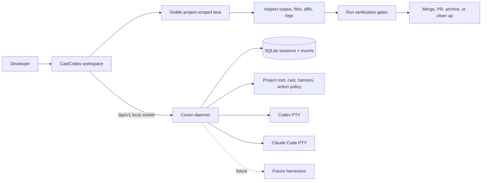

# CastCodes and Coven integration

CastCodes is the product users open. Coven is the runtime that powers it.

The public story should stay simple:

> CastCodes is a local-first AI coding workspace powered by Coven.

Coven powers CastCodes with harness sessions, project boundaries, logs, artifacts, handoffs, policy, and orchestration. CastCodes is where users inspect the work, review diffs, verify changes, and decide whether to merge, PR, archive, or clean up.

## Product hierarchy

1. **CastCodes** is the primary workspace and public proof surface.
2. **Coven** is the daemon/runtime/API/session authority.
3. **OpenCoven** is the umbrella and lab behind the product direction.

Other clients belong in advanced, legacy, migration, or compatibility docs unless the page is explicitly about those clients.

## Runtime loop

The daemon stays the authority for project-root checks, working directories, harness ids, session liveness, input, kill, archive state, destructive deletion, and future action policy.

## CastCodes responsibilities

CastCodes should own the user-facing workspace:

- terminal tabs and workspace lanes;
- editor and file context;
- agent panel and harness picker;
- live output and structured session status;
- changed-file and diff review surfaces;
- verification result display;
- PR, merge, archive, and cleanup actions behind explicit approval;
- command-palette rituals and templates; and
- handoff and retrospective views when a task ends.

## Coven responsibilities

Coven should own the runtime contract:

- launch and session lifecycle;
- project-root and cwd validation;
- harness allowlists and adapter contracts;
- append-only event history;
- log and artifact redaction;
- capability discovery;
- action and approval policy;
- local socket compatibility; and
- handoff records between harnesses.

## What comux proved

comux is reference evidence, not the future-facing public product. It proved a set of primitives that should move into CastCodes-native concepts.

| comux primitive | CastCodes target |
| --- | --- |
| Pane | Agent lane / terminal tab / workspace lane |
| Worktree isolation | CastCodes/Coven isolated task lane |
| Agent launcher registry | CastCodes harness picker backed by Coven/Cast Agent |
| Multi-select launch | Multi-harness CastCodes lane creation |
| Ritual | CastCodes command palette ritual/template |
| File browser/diff | Native editor diff/review surface |
| Merge/PR flow | CastCodes review, verification, PR, cleanup workflow |
| Lifecycle hooks | Coven/Cast Agent events and hooks |
| Coven bridge | Direct CastCodes/Coven integration |

Use this wording when public docs need migration context:

> comux proved the terminal cockpit model. Its durable primitives are being folded into CastCodes so Coven has one primary product surface.

## Demo loop

The future-facing demo loop is CastCodes + Coven:

1. Open a repository in CastCodes.
2. Start or discover the local Coven runtime.
3. Launch a visible project-scoped lane with Codex, Claude Code, or a future Coven-backed harness.
4. Watch terminal output and structured session status in CastCodes.
5. Inspect changed files, diffs, logs, and artifacts.
6. Run verification gates and display results.
7. Merge, create a PR, archive, or clean up explicitly after review.
8. Record what worked, what was missing, and what should become a CastCodes/Coven issue.

If a capability has not shipped in CastCodes yet, describe it as a parity milestone rather than current behavior.

## Public wording rules

Use:

- `Coven powers CastCodes.`
- `CastCodes is a local-first AI coding workspace powered by Coven.`
- `Run Codex, Claude Code, and future harnesses as visible project-scoped lanes.`
- `Inspect their work, preserve context, review diffs, verify changes, and merge with confidence.`
- `Coven is invisible until you need to trust it. CastCodes is where you feel it.`

Avoid leading with:

- comux as the active flagship cockpit;
- OpenMeow as required intake;
- OpenClaw bridge as the primary user story;
- optional clients as the first-contact explanation; and
- broad ecosystem diagrams before the CastCodes + Coven story is clear.
