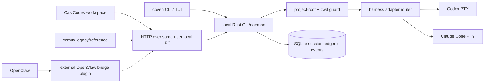

# Coven operational model

## Core boundary

Coven's Rust layer is the local authority boundary. It owns process launch, project-root validation, PTY lifecycle, daemon state, session/event persistence, and the local IPC API.

CastCodes and other clients are integration layers. They may validate inputs for better UX, but Rust must revalidate every launch, input, kill, and path-sensitive request before acting.

See [Architecture diagrams](/ARCHITECTURE) for the fuller runtime topology and lifecycle diagrams.

OpenClaw core does not include OpenCoven or Coven. The OpenClaw integration lives outside the OpenClaw repo as the ClawHub package external OpenClaw bridge plugin, sourced from `packages/openclaw-coven` in this repo. That package is an opt-in compatibility adapter, not part of the Coven trust root.

The current auth posture is documented in [Authentication and local access](/AUTH). Coven uses same-user local IPC today: a filesystem-permission-protected Unix socket on Unix-like hosts or an owner-only named pipe on Windows. It does not bind TCP by default or provide OAuth, JWT, bearer-token, API-key, cookie, RBAC, or remote network auth for the daemon API.

## Trust rules

- Treat every socket client as untrusted, including first-party clients.
- Never launch work without an explicit project root.
- Canonicalize `projectRoot` and `cwd` in Rust before comparing paths.
- Reject symlink escapes and outside-root `cwd` values.
- Keep harness execution allowlisted until a real policy layer exists.
- Build harness commands with argv APIs. Do not use `sh -c` for prompt execution.
- Keep provider credentials in the harness/provider's normal local auth flow.
- Do not store repository secrets, environment dumps, private URLs, or tokens in event logs intentionally.
- Do not let CastCodes, OpenClaw, comux, or npm package configuration widen Rust launch authority.

## Rust responsibilities

The Rust CLI/daemon should stay narrow and boring:

- `coven doctor` detects supported local harnesses.
- `coven run` and `POST /api/v1/sessions` launch only known harness ids.
- `coven sessions` opens the interactive session browser in terminals and prints table output for scripts/pipes.
- `coven attach` replays and follows Coven-managed event output.
- `coven archive`, `coven summon`, and `coven sacrifice --yes` manage completed session history without making users memorize ids in the TUI path.
- `coven daemon start/status/restart/stop` manages one local daemon state directory.
- The daemon exposes a small local API over same-user local IPC.
- SQLite stores session metadata, archive state, and append-only event history.

The local API should remain stable and intentionally small. The current named
public contract is `coven.daemon.v1`, served under `/api/v1/...` routes. New
clients negotiate it through `GET /api/v1/health`; the route prefix alone is
not proof of named-contract support. Archive/summon/sacrifice are currently
CLI/store rituals; live runtime control remains on the local IPC API:

- `GET /api/v1/api-version`
- `GET /api/v1/health`
- `GET /api/v1/sessions`
- `POST /api/v1/sessions`
- `GET /api/v1/sessions/:id`
- `GET /api/v1/events?sessionId=...`
- `POST /api/v1/sessions/:id/input`
- `POST /api/v1/sessions/:id/kill`

Legacy unversioned routes remain as early-MVP aliases, but external clients
must not use an alias or route-family token as named-contract proof.

## Client responsibilities

### CastCodes

CastCodes is the primary public workspace for Coven. It may present visible lanes, workspace context, diffs, verification status, and approval flows, but it should not become the runtime authority.

### comux

comux is a legacy/reference cockpit client. It may list, launch, open, and attach to Coven sessions through the local API, but it should not become the harness runtime or the future-facing public surface.

### OpenClaw

OpenClaw integration is externalized through external OpenClaw bridge plugin.

The plugin:

- registers an optional ACP backend named `coven`;
- validates plugin configuration and the Unix-socket trust anchor for its current Unix integration;
- launches sessions through `POST /api/v1/sessions`;
- polls Coven events and maps them into ACP runtime events;
- maps only Codex and Claude Code agent ids by default for v0;
- uses fallback ACP backends only when explicitly configured.

OpenClaw remains responsible for chat/session routing, ACP bindings, task state, permissions UX, and user-facing delivery. Coven remains responsible for local harness supervision.

### npm CLI wrapper

The npm wrapper should only resolve and execute the native `coven` binary. It should not implement launch policy, path policy, or local IPC trust decisions that Rust does not also enforce.

## Compatibility policy

Externalization makes the local IPC API a product contract. Clients negotiate
compatibility with `GET /api/v1/health`, verify its named `apiVersion`, and
check every capability required by the operation before a dependent request.
Capabilities advertise availability and never grant permission.

Additional compatibility protections before broad distribution:

- retain `covenVersion` in health as daemon build identity distinct from the
  named contract version;
- treat `GET /api/v1/api-version` as a legacy route-family diagnostic whose
  `apiVersion: "v1"` and `supportedApiVersions: ["v1"]` values are not proof of
  `coven.daemon.v1` support;
- keep legacy `GET /health` available as an early-MVP alias, but never
  recommend it as the compatibility handshake;
- retain structured error codes for API failures;
- maintain daemon-bounded event pagination with the monotonic `afterSeq`
  cursor and the `afterEventId` compatibility cursor;
- keep unknown fields ignored where safe and unknown required behavior rejected;
- maintain plugin tests against representative daemon responses;
- document breaking API changes in the Coven repo before updating the plugin.

## Hardening priorities

1. Enforce private `COVEN_HOME` ownership and permissions in Rust before creating, binding, or removing daemon state.
2. Add daemon request limits for request line length, header bytes, `Content-Length`, body bytes, and read duration.
3. Maintain named API versioning and structured error codes across new and changed routes.
4. Maintain daemon-bounded event pagination with monotonic `afterSeq` and `afterEventId` compatibility.
5. Enable SQLite durability defaults suitable for a local daemon, including WAL and a busy timeout.
6. Add release gates for Rust dependency audit, npm/package dry runs, and plugin compatibility tests.
7. Keep generic/custom command adapters out of v0 until policy and approval behavior are explicit.

## Release split

Coven repo release gates:

- Rust format, clippy, tests, and locked dependency checks.
- Secret guard across current tree and history.
- Native binary packaging with checksums.
- Local smoke: doctor, daemon health, launch/list/attach/kill against a safe test harness.

Plugin package release gates:

- OpenClaw SDK compatibility tests.
- Config validation tests.
- Unix-socket trust-anchor tests for the plugin's current Unix integration.
- Fallback behavior tests.
- ClawHub package dry run or publish validation.

These release paths should be coordinated but independent. A plugin update should not require OpenClaw core changes, and a Rust daemon update should not assume OpenClaw repo internals.
