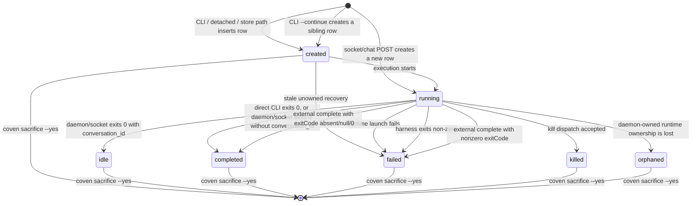
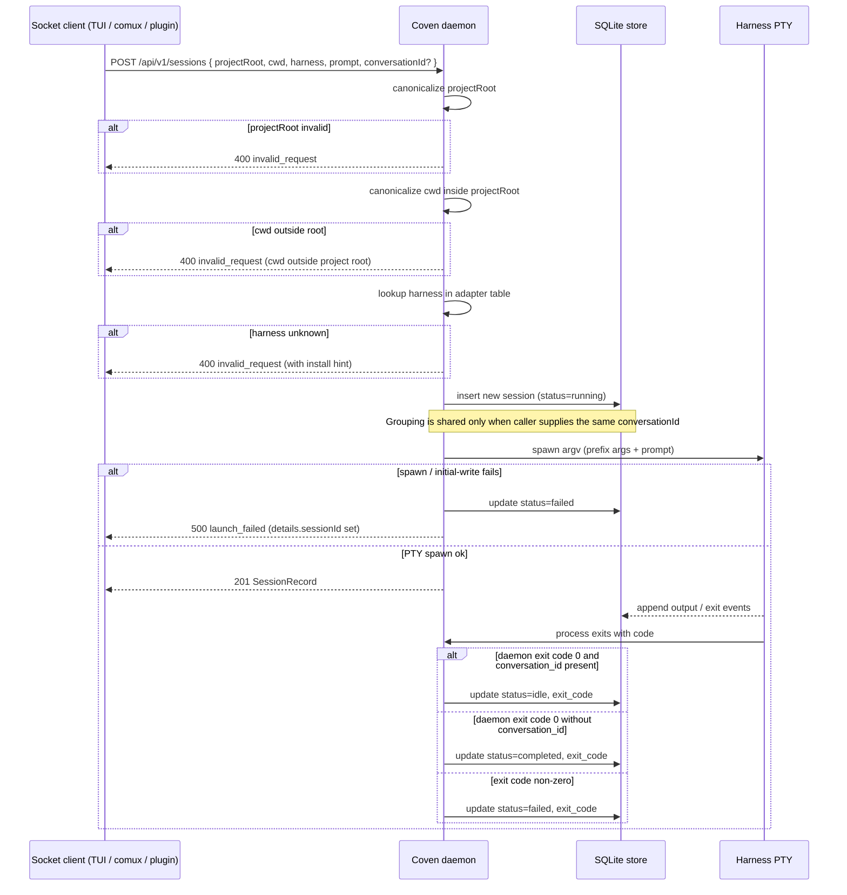

# Session Lifecycle

This document explains what happens from `coven run` through completion, replay, archive, summon, and deletion.

## Lifecycle states

Classify the row kind before interpreting its status. Synthetic `active` rows can appear in raw store or list output, but `active` is not a harness-session state.

| Harness-session status | Ledger-terminal? | Meaning |
|---|---|---|
| `created` | No | Ledger row exists before runtime ownership. Stale unowned `created` rows recover to `failed`. |
| `running` | No | Reported live state. Inspect the external flag before inferring daemon runtime ownership. |
| `idle` | No | A daemon/socket-managed, conversation-grouped session (`conversation_id` present) exited successfully and is waiting for more work. CLI and socket/chat continuation create a new row. |
| `completed` | Yes | A direct CLI run persisted a successful harness result (even when `conversation_id` is present), a daemon-managed session without `conversation_id` exited successfully, or an externally registered running session was completed with an absent, `null`, or zero `exitCode`. |
| `failed` | Yes | Launch or execution failed, or an externally registered running session was completed with a nonzero `exitCode`. |
| `killed` | Yes | Terminal in the current ledger. This status is not proof that process termination was acknowledged. |
| `orphaned` | Yes | Runtime ownership was lost and the outcome remains unresolved. |

Archive visibility is stored separately as `archived_at`; it is not a `SessionRecord.status`. Archiving may hide any non-running session, including one with `created` or `idle` status, without changing that status. Summoning clears `archived_at` and reveals the same status again.



The diagram above describes harness-session statuses in the current ledger. On a clean exit, only the daemon/socket-managed path in `daemon.rs` converts a successful harness result to `idle`, and only when `conversation_id` is present. A direct CLI run persists the harness result, normally `completed`, even when its row has `conversation_id`; a daemon-managed row without `conversation_id` also persists as `completed` after a clean exit. Automatic `coven run <harness> --continue` selects the latest non-archived row with both the same project root and the requested harness. Explicit `coven run <harness> --continue <ID>` performs a direct id or conversation lookup and may select an archived row, but rejects a source whose harness differs from the requested harness. Both forms accept any current status and create a fresh, initially unarchived sibling in the same conversation group. The selected source row is unchanged, including its status, exit code, archive overlay, and timestamps. Socket/chat continuation through `POST /api/v1/sessions` also inserts a new row. It shares grouping with a prior conversation only when the caller explicitly supplies the same `conversationId`; a resume hint does not derive that id automatically. Archive and summon are omitted because they only set or clear the separate `archived_at` visibility overlay; they do not create lifecycle states. Archive rejects only `running`, and sacrifice may permanently delete any non-running row whether visible or archived. A `running → killed` ledger transition records accepted kill dispatch, not acknowledged process termination.

For an externally registered `running` session, `POST /api/v1/sessions/:id/complete` records the caller-owned outcome: an absent, `null`, or zero `exitCode` moves the row to `completed`, while a nonzero `exitCode` moves it to `failed`. This completion path does not give the daemon runtime ownership. External running sessions remain exempt from daemon orphan recovery, and daemon input and kill requests remain rejected.

## Launch path

All launch paths perform the same validation:

1. User or client sends a task through the CLI or local API.
2. Coven resolves the project root.
3. Coven canonicalizes the project root and working directory.
4. Coven rejects outside-root working directories.
5. Coven verifies the harness id is supported.
6. Coven persists a session record in SQLite.

The lifecycle around launch depends on the entry point:

- `POST /api/v1/sessions` always inserts a new row as `running` before launching the runtime. The new row shares a prior conversation's grouping only when the caller explicitly supplies the same `conversationId`; a resume hint alone does not derive it. The prior row is unchanged. If PTY spawn or the initial write fails, the daemon transitions the new row to `failed`.
- A new direct CLI `coven run` inserts a `created` row, transitions it to `running`, and then launches the harness. Automatic continuation selects by the same project root and harness; explicit continuation rejects a harness mismatch. Either form accepts any source status but leaves the source unchanged, including its archive and terminal evidence. Continuation creates a fresh, unarchived sibling with a new id and a stable resume/group key: the source row's `conversation_id` when present, otherwise its id. The harness resumes with that key, and the sibling owns the new `created` → `running` → terminal lifecycle. A detached run remains `created`; stale unowned `created` rows recover to `failed`.

Once execution starts, output and exit data are written as events, and the terminal status and exit code are persisted when the harness exits.

The Rust layer performs the authority checks even when a TypeScript client has already validated the request for UX.



## Detached records

`coven run ... --detach` creates the session record without launching the harness. This is useful for testing and development flows that need a ledger record without starting an external process.

Detached records should not be presented as completed agent work.

## Attach and replay

`coven attach <session-id>` replays known event output and follows live output when the session is still active.

For a completed session, attach acts like a log viewer. For a running session, attach also forwards input to the live daemon session.

## Session browser behavior

`coven sessions` chooses output mode based on context:

- In an interactive terminal, it opens the session browser.
- When piped or run with `--plain`, it prints table output.
- `--json` prints machine-readable session records for local clients.
- `--all` includes archived sessions.
- `--manage` forces the browser.

The browser offers contextual actions so users do not have to memorize session ids.

## Archive

Archive hides a non-running session from the default active list while preserving the session record and event log.

```sh
coven archive <session-id>
```

Use archive for old work that should remain inspectable.

## Summon

Summon restores an archived session to the active list and then replays/follows it:

```sh
coven summon <session-id>
```

Summon does not re-run the original harness prompt. It changes archive state and opens the existing record.

## Sacrifice

Sacrifice permanently deletes a non-running session and cascades deletion to its events:

```sh
coven sacrifice <session-id> --yes
```

The command refuses live sessions. The interactive browser asks the user to type `sacrifice` before deletion.

Use sacrifice only when the session and its logs should be removed from the local ledger.

## Orphan recovery

If the daemon starts and finds daemon-owned sessions that were marked `running` from a previous daemon lifetime, those sessions are marked `orphaned`. Externally registered running sessions are exempt because the daemon does not own their lifecycle.

An orphaned session means Coven no longer owns a live process for that record. The event log may still be useful, but live input and kill operations should fail.

## Event durability

Events are append-only records in SQLite. This gives clients a stable replay source even when the original PTY process has exited.

Do not intentionally write secrets, environment dumps, private URLs, or token-bearing command output into events. Coven cannot guarantee that harness output is secret-free, so users should avoid running untrusted prompts in sensitive repositories.

## Search and continuation (added 2026-05)

- `coven sessions search <query>` runs a SQLite FTS5 query over `events.payload_json`.
  Supports the full FTS5 query syntax (`phoenix OR rises`, `"exact phrase"`, `phoe*`).
  Output is a flat list of hits ordered most-recent-first; pass `--json` to get the raw
  SearchHit array for client tools.
- `coven run <harness> --continue` resumes the most recently created, non-archived
  session whose `project_root` and `harness` match the current request, without restricting its
  current status. The selected row remains unchanged, including any archive or terminal
  evidence. Coven creates a fresh, unarchived sibling with a new id; its stable
  resume/group key is the selected row's `conversation_id` when present, otherwise the
  selected row's id. The harness resumes using that key, and the new row owns the new
  lifecycle.
- `coven run <harness> --continue <ID>` resumes by explicit session id or conversation
  lookup. It can select an archived row and accepts any current status, but rejects a
  source whose harness differs from `<harness>`. As with automatic
  continuation, the selected row remains unchanged and a fresh, unarchived sibling with
  a new id owns the resumed lifecycle, using the same stable resume/group key rule.
- `coven run <harness> --labels foo,bar --visibility workspace --archive "task"` tags
  and archives a one-shot run in a single command. `--labels` and `--visibility` are
  creation-time only (ignored when resuming). Valid visibility values: `private`
  (default), `workspace`, `shared`.
- `--detach` and `--continue` are mutually exclusive — resuming-but-not-running is
  incoherent.
