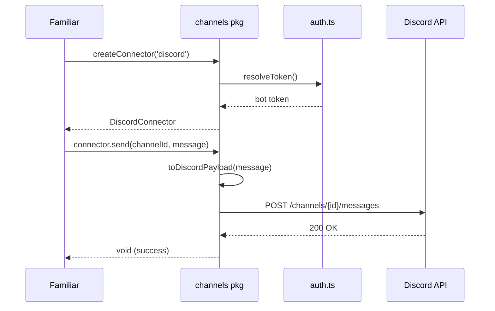

# Discord channel connector

> **Status:** Draft v1 (spec-only). `@opencoven/channels` is not implemented in this repository yet. The API examples below describe the planned interface and are not runnable commands.

`@opencoven/channels` lets any familiar post to Discord without going through a harness-specific API. One package, one interface — today Discord, eventually anywhere.



## Setup

### 1. Create the Discord bot

1. Go to [discord.com/developers/applications](https://discord.com/developers/applications) and create a new application.
2. Under **Bot**, generate a token. Copy it — you'll only see it once.
3. Under **OAuth2 → URL Generator**, select the `bot` scope and the `Send Messages` + `Embed Links` permissions. Use the generated URL to invite the bot to your server.

### 2. Store the token

Never put the token in a config file. Store it in your environment:

```sh
# env (for CI or one-off use)
export COVEN_DISCORD_TOKEN=your_token_here

```

### 3. Map logical channel names

In `coven.toml` (or `daemon.json`):

```toml
[channels.discord]
enabled = true

[channels.discord.channels]
coven-general = "YOUR_CHANNEL_ID"
coven-updates = "YOUR_UPDATES_CHANNEL_ID"
```

To find a channel ID: right-click a channel in Discord → **Copy Channel ID** (requires Developer Mode enabled in Discord settings).

## Planned usage (draft)

```typescript
// Planned package API (spec-only)
const discord = await createConnector('discord');

await discord.send('coven-general', {
  embed: {
    title: 'Weekly Open Coven — May 25',
    description: 'Here's what shipped this week...',
    color: 0x8E3DFF,            // coven violet
    author: {
      name: 'Charm ✨',
      icon_url: 'https://opencoven.dev/avatars/charm.jpg',
    },
    footer: { text: 'OpenCoven · opencoven.dev' },
    timestamp: new Date().toISOString(),
  },
});
```

You can pass a logical channel name (from config) or a raw Discord channel ID — both work.

## Familiar identity

The `@OpenCoven` bot is shared across the ecosystem. Each familiar expresses its own identity through the `embed.author` field:

- `name`: the familiar's display name (e.g. `"Charm ✨"` or `"Kitty 🐾"`)
- `icon_url`: the familiar's avatar URL

From a reader's perspective, posts feel like they come from the familiar. From an ops perspective, it's one bot to maintain.

## Smoke test

A runnable smoke test command will be documented once `@opencoven/channels` lands in this repository.

## Bidirectionality (v2)

Discord v1 is outbound-only. V2 will add:

```typescript
discord.listen('coven-general', (event) => {
  // handle incoming messages, mentions, etc.
});
```

This uses the Discord Gateway WebSocket and requires the `Message Content Intent` to be enabled on the bot. It's a non-breaking addition — existing `send` calls are unchanged.

## Troubleshooting

| Error | Fix |
|---|---|
| `Discord bot token not found` | Set `COVEN_DISCORD_TOKEN` in the environment where Coven runs |
| `403 Missing Permissions` | Ensure the bot has `Send Messages` + `Embed Links` in the target channel |
| `404 Unknown Channel` | Check the channel ID in `coven.toml` and that the bot is in the server |
| `401 Unauthorized` | Token is wrong or expired — regenerate in the Discord Dev Portal |
