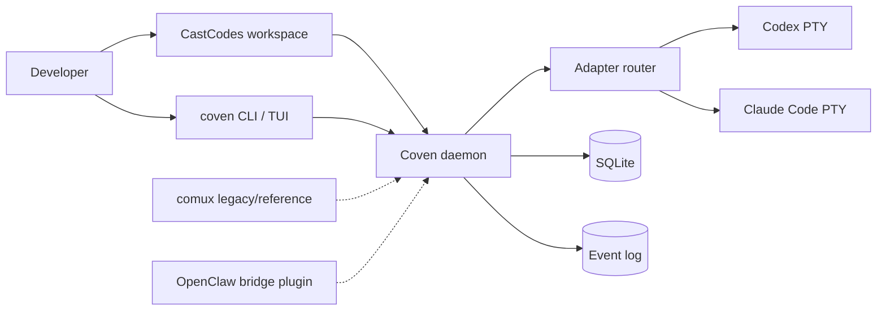

The daemon accepts same-user local IPC: a filesystem-permission-protected Unix
socket on Unix-like hosts or an owner-only named pipe on Windows. It does not
bind TCP by default.

See [Architecture](/concepts/architecture) for the full picture and [Authority boundary](/concepts/authority-boundary) for trust rules.
