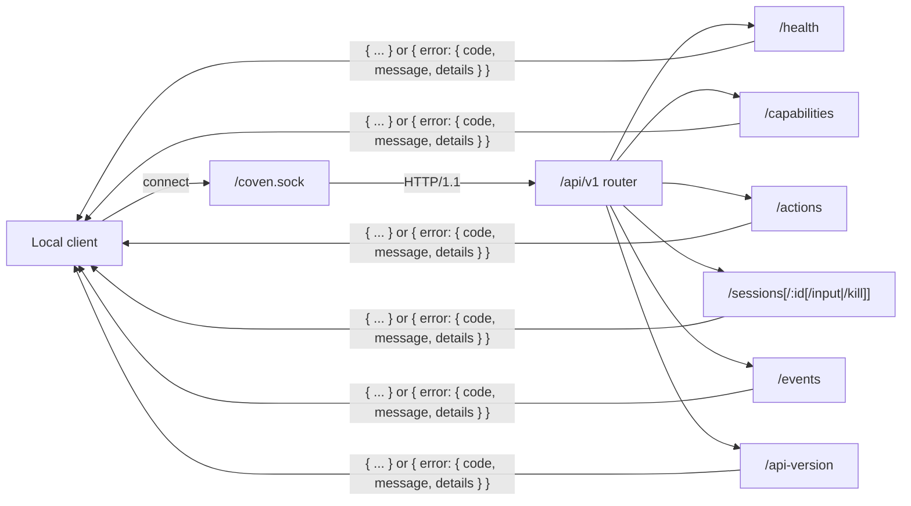

# API local de Coven

_Última actualización: 2026-05-09_

Coven expone una pequeña API HTTP sobre el socket Unix local en `<covenHome>/coven.sock`. El daemon en Rust es el límite de autoridad: los clientes pueden validar para mejorar la UX, pero el daemon sigue validando raíces de proyecto, cwd, ids de harness, ids de sesión, input y estado de sesión viva antes de actuar.



Cada ruta devuelve o bien una forma de éxito documentada o el sobre estructurado de error. Las rutas desconocidas, los ids de acción desconocidos y las versiones de API desconocidas fallan en cerrado con `invalid_request` o `not_found`.

Consulta [Autenticación y acceso local](/AUTH) para conocer la postura de auth actual. En resumen: la API del daemon no usa OAuth, JWT, bearer tokens, API keys ni cookies hoy. El acceso se basa en el socket Unix local, las credenciales del proveedor se quedan con las CLIs de harness, y cualquier exposición remota, de navegador o TCP necesita un diseño de auth separado.

## Versionado

El contrato público actual de la API es el contrato nombrado **`coven.daemon.v1`** servido bajo el prefijo de ruta `/api/v1`.

Los clientes versionados deben usar el prefijo `/api/v1`:

| Endpoint | Propósito |
|---|---|
| `GET /api/v1/api-version` | Leer la versión de API activa y las versiones compatibles |
| `GET /api/v1/health` | Comprobar la salud y metadatos del daemon |
| `GET /api/v1/capabilities` | Descubrir capabilities del daemon/plano de control y pistas de política |
| `POST /api/v1/actions` | Enrutar una acción de plano de control con forma de política |
| `GET /api/v1/sessions` | Listar sesiones activas |
| `POST /api/v1/sessions` | Lanzar una sesión |
| `GET /api/v1/sessions/:id` | Obtener una sesión |
| `GET /api/v1/events?sessionId=...` | Leer eventos de sesión |
| `POST /api/v1/sessions/:id/input` | Reenviar input a una sesión viva |
| `POST /api/v1/sessions/:id/kill` | Matar una sesión viva |

Las rutas no versionadas siguen actualmente como alias heredados durante la ventana inicial del MVP, pero los nuevos clientes no deberían depender de ellas.

Los prefijos `/api/<version>/...` desconocidos fallan en cerrado con una respuesta JSON `unsupported API version`.

## Respuesta de health

`GET /api/v1/health` devuelve la versión de la API junto con el estado del daemon:

```json
{
  "ok": true,
  "apiVersion": "coven.daemon.v1",
  "covenVersion": "0.0.0",
  "capabilities": {
    "sessions": true,
    "events": true,
    "eventCursor": "sequence",
    "structuredErrors": true
  },
  "daemon": {
    "pid": 12345,
    "startedAt": "2026-05-09T12:00:00Z",
    "socket": "/Users/example/.coven/coven.sock"
  }
}
```

Cuando no haya metadatos del daemon disponibles, `daemon` es `null`.

## Capabilities del plano de control

`GET /api/v1/capabilities` es el punto de descubrimiento para clientes de primera parte como OpenMeow. Devuelve ids de capability, propiedad del adaptador, disponibilidad, pistas de política e ids de acción. Esto evita que los clientes hardcodeen lo que el daemon puede hacer.

```json
{
  "capabilities": [
    {
      "id": "coven.control.actions",
      "label": "Coven control-plane action router",
      "adapter": "coven-daemon",
      "status": "available",
      "policy": "allow",
      "actions": ["coven.capabilities.refresh"]
    },
    {
      "id": "desktop.automation",
      "label": "Desktop automation adapters",
      "adapter": "desktop-use",
      "status": "planned",
      "policy": "requiresApproval",
      "actions": []
    }
  ]
}
```

## Acciones del plano de control

`POST /api/v1/actions` acepta un sobre de intent estilo OpenMeow. El daemon solo enruta acciones conocidas; las acciones desconocidas fallan en cerrado antes de que pueda ejecutarse cualquier adaptador.

```json
{
  "action": "coven.capabilities.refresh",
  "origin": "open-meow",
  "intentId": "intent-1",
  "args": {}
}
```

Las acciones seguras completadas inmediatamente devuelven `200` con un payload con forma de evento que los clientes pueden renderizar de forma optimista o integrar en flujos de eventos posteriores:

```json
{
  "ok": true,
  "accepted": true,
  "action": "coven.capabilities.refresh",
  "status": "completed",
  "event": {
    "kind": "capabilities.refreshed",
    "action": "coven.capabilities.refresh",
    "origin": "open-meow",
    "intentId": "intent-1",
    "payload": { "capabilities": 3 }
  }
}
```

## Reglas de compatibilidad

- Se permiten campos JSON aditivos en las respuestas de `v1`.
- Los campos requeridos existentes no deben eliminarse ni renombrarse dentro de `v1`.
- Los cambios de forma de respuesta o comportamiento que rompan compatibilidad requieren un nuevo prefijo de versión de API.
- Los clientes externos deben llamar a `/api/v1/health` antes de asumir compatibilidad.
- Los cambios en el daemon que afecten al comportamiento de `/api/v1/health`, `/api/v1/sessions`, `/api/v1/events`, input o kill deben actualizar los tests de compatibilidad de cliente en el mismo repo.
