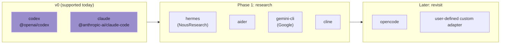

# Notas sobre futuros harnesses

Coven v0 soporta intencionalmente solo los adaptadores de Codex y Claude Code. Esta nota registra lo que la costura actual del adaptador debe preservar antes de añadir harnesses adicionales como Hermes.

OpenClaw no es un objetivo de harness de Coven en v0. La integración con OpenClaw se externaliza a través del plugin `@opencoven/coven`, que actúa como cliente del socket del daemon en Rust.

## Contrato actual del adaptador

Un adaptador de harness de Coven se resuelve a:

- un id de harness estable de Coven, como `codex` o `claude`;
- una etiqueta orientada al usuario para `coven doctor`;
- un nombre de ejecutable a detectar en `PATH`;
- argumentos fijos opcionales que deben ir antes del prompt; y
- el prompt como argumento final del comando.

Esto mantiene el runtime suficientemente genérico para CLIs que no tienen exactamente la forma de Codex o Claude Code, sin añadir harnesses no soportados prematuramente.

## Observaciones sobre Hermes

Hermes debe permanecer como objetivo de validación de fase 2 hasta que Coven tenga más uso directo de Codex/Claude/comux.

Superficie pública observada de la CLI:

- Sesión interactiva: `hermes`
- Modo TUI: `hermes --tui`
- Prompt único: `hermes chat -q "..."`
- Modo de salida programático: `hermes chat --quiet -q "..."`
- Sobreescrituras de modelo/proveedor: `hermes chat --model ...`, `hermes chat --provider ...`
- Opciones de reanudación: `--resume <session>` y `--continue [name]`
- Modo worktree: `--worktree`
- Bypass de aprobación: `--yolo`

Fuentes:

- https://hermes-agent.nousresearch.com/docs/user-guide/cli
- https://hermes-agent.nousresearch.com/docs/reference/cli-commands

## Implicaciones para Coven

Un adaptador de Hermes probablemente no debería ser una copia directa de la forma de Codex/Claude. Probablemente necesita uno de estos modos:

1. **Sesión de log de un solo disparo** usando `hermes chat --quiet -q <prompt>`.
   - Bueno para salida capturada y eventos de salida.
   - Menos útil para attach/input de larga duración porque el proceso puede salir tras la respuesta.
2. **Sesión interactiva con PTY** usando `hermes` o `hermes --tui`.
   - Mejor para attach/intervención visible para humanos.
   - Requiere probar si es posible inyectar el prompt inicial por argv o si Coven debe escribir el prompt en stdin tras el spawn.
3. **Sesión consciente de reanudación** usando `--resume` / `--continue`.
   - Potencialmente útil una vez que Coven tenga un campo de id de sesión upstream de primer nivel.
   - No debe añadirse hasta que el modelo propio de identidad de sesión de Coven sea estable.

## Decisión

No añadas Hermes a `coven doctor` o `coven run` todavía.

Por ahora, mantén la costura del adaptador capaz de expresar CLIs con args de prefijo (`chat -q <prompt>`) y revisa el adaptador real de Hermes después de que:

- las sesiones directas Coven Codex/Claude hayan tenido más uso;
- comux attach/open haya tenido uso real;
- sepamos si Hermes debe ser de un solo disparo, interactivo o consciente de reanudación dentro de Coven; y
- podamos probar contra una instalación real de Hermes.

## Panorama de candidatos a harness

Un candidato pasa de **Fase 1: investigación** al soporte público v0 solo después de superar cada etapa en la [lista de madurez de adaptadores de harness](/HARNESS-ADAPTERS#suggested-adapter-maturity-stages). La cuadrícula anterior es direccional, no una promesa.

> **Image asset prompt (to be generated and dropped into `docs/images/future-harnesses-landscape.svg`):** Draw a horizontal vector "lane" diagram 1600×600 on the OpenCoven dark background. Three lanes labelled **Supported v0**, **Research**, and **Later**. Lane chips: v0 = Codex, Claude Code (filled with `#9A8ECD`); Research = Hermes, Aider, Gemini CLI, Cline (filled with `#3D3547`, lavender border); Later = OpenCode, Custom (outline only). Add a thin lavender arrow above the lanes labelled "maturity gate". Use `DM Sans` for labels.
