# Guía de adaptadores de harness

Coven v0 soporta Codex y Claude Code. Esta guía describe la forma actual del adaptador y la barra para añadir más harnesses.

## Forma actual del adaptador

Un adaptador de harness incorporado define:

- id de harness estable de Coven;
- etiqueta orientada al usuario;
- nombre de ejecutable a detectar en `PATH`;
- forma del argumento de prompt para modo interactivo;
- forma del argumento de prompt para modo no interactivo; y
- pista de instalación/autenticación para `coven doctor`.

La implementación actual espera que el prompt sea el último argumento del comando tras cualquier args de prefijo fijo.

## Harnesses incorporados

### Codex

- Id de harness: `codex`
- Ejecutable: `codex`
- Args de prefijo interactivo: ninguno
- Args de prefijo no interactivo: `exec --skip-git-repo-check --color never`

Pista de configuración:

```sh
npm install -g @openai/codex
codex login
```

### Claude Code

- Id de harness: `claude`
- Ejecutable: `claude`
- Args de prefijo interactivo: ninguno
- Args de prefijo no interactivo: `--print`

Pista de configuración:

```sh
npm install -g @anthropic-ai/claude-code
claude doctor
```

## Requisitos del adaptador

Antes de añadir un nuevo harness, confirma:

- la CLI puede detectarse de forma segura en `PATH`;
- el prompt puede pasarse sin interpolación por shell;
- el proceso puede ejecutarse desde un cwd validado del proyecto;
- la salida puede capturarse mediante eventos de PTY/sesión;
- la autenticación se queda en el flujo local normal del proveedor del harness;
- los modos de fallo son comprensibles en `coven doctor`;
- los tests cubren la construcción del comando y el comportamiento ante ejecutable faltante.

## Lo que aún no debes añadir

Evita adaptadores genéricos de comando arbitrario hasta que Coven tenga política explícita y comportamiento de aprobación para ellos.

Los comandos arbitrarios son más peligrosos que los adaptadores de harness con nombre porque pueden difuminar la diferencia entre "ejecutar un agente de codificación en este proyecto" y "ejecutar cualquier string que un cliente envió". Mantén v0 estrecho.

## Lista de evaluación para futuros harnesses

Para un harness candidato, documenta:

- comando de instalación;
- nombre del ejecutable;
- flujo de auth local;
- comando de prompt único;
- comando interactivo;
- comando de reanudación/sesión, si existe;
- modo de salida no interactivo;
- si se necesita inyectar el prompt por stdin;
- si la CLI puede deshabilitar color/secuencias de control;
- si la CLI puede evitar riesgos de quoting de shell;
- códigos de salida conocidos;
- smoke test mínimo seguro.

## Mapeo de identidad de sesión

Algunos harnesses tienen sus propios ids de sesión upstream. El id de sesión de Coven sigue siendo el id del runtime local.

Si los ids upstream se vuelven útiles, almacénalos como metadatos en lugar de reemplazar el id propio de Coven. Los clientes deben poder confiar en un id estable de Coven para attach, eventos, archive, summon y sacrifice.

## Etapas de madurez sugeridas para el adaptador

1. **Nota de investigación** - documenta la forma de la CLI y los riesgos.
2. **Tests de construcción de comando** - prueba que la construcción de argv es segura.
3. **Detección por doctor** - añade pistas de instalación/auth.
4. **Smoke de lanzamiento** - prueba que una sesión puede ejecutarse en un proyecto temporal.
5. **Smoke de attach/replay** - prueba que los eventos pueden reproducirse.
6. **Compatibilidad de clientes** - actualiza docs y tests de integración.

No saltes de la investigación directamente al soporte público.

```mermaid
flowchart LR
  S1["1. Research note\n(public CLI shape + risks)"] --> S2
  S2["2. argv construction tests\n(no shell, prompt last)"] --> S3
  S3["3. coven doctor detection\n(install + auth hints)"] --> S4
  S4["4. Launch smoke\n(temp project, fake creds)"] --> S5
  S5["5. Attach / replay smoke\n(events round-trip)"] --> S6
  S6["6. Client compatibility\n(comux + plugin tests)"] --> Done(["Public support"])

  style S1 fill:#3D3547,stroke:#9A8ECD,color:#fff
  style S2 fill:#3D3547,stroke:#9A8ECD,color:#fff
  style S3 fill:#3D3547,stroke:#9A8ECD,color:#fff
  style S4 fill:#3D3547,stroke:#9A8ECD,color:#fff
  style S5 fill:#3D3547,stroke:#9A8ECD,color:#fff
  style S6 fill:#3D3547,stroke:#9A8ECD,color:#fff
  style Done fill:#9A8ECD,stroke:#D4B5FF,color:#1A1825
```



Un harness que se salte cualquier etapa **no** está listo para soporte público, incluso si parece funcionar en la máquina de un mantenedor.
