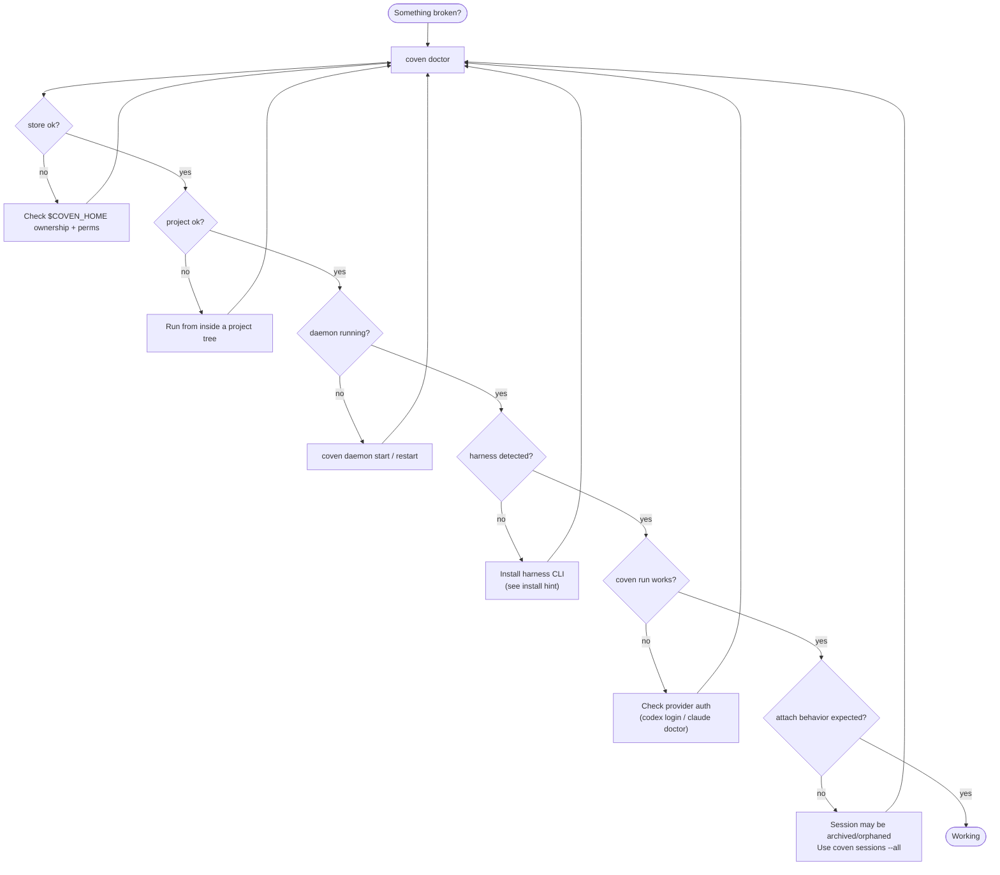

# Solución de problemas de Coven

Empieza con:

```sh
coven doctor
```

`doctor` es la forma más rápida de comprobar la preparación del almacén, el proyecto, el daemon y los harnesses.



Sigue la rama que falle. Casi cualquier problema en el resto de esta página es una de estas ramas en detalle.

## Comando `coven` no encontrado

Si usas npm:

```sh
npx @opencoven/cli doctor
pnpm dlx @opencoven/cli doctor
```

Si compilas desde fuente:

```sh
cargo run -p coven-cli -- doctor
```

Si instalaste un binario nativo, asegúrate de que su directorio esté en `PATH`.

## Harness faltante

`coven doctor` imprime pistas de instalación para cada harness incorporado.

Codex:

```sh
npm install -g @openai/codex
codex login
```

Claude Code:

```sh
npm install -g @anthropic-ai/claude-code
claude doctor
```

Luego reintenta:

```sh
coven doctor
```

## Daemon no disponible

Arráncalo o reinícialo:

```sh
coven daemon start
coven daemon status
coven daemon restart
```

Si un cliente no puede conectarse, verifica que esté usando el mismo `COVEN_HOME` que la CLI.

## Salud y presión del sistema

Si las sesiones se sienten lentas, el daemon es lento al iniciar o `coven doctor` tiene éxito pero el trabajo del harness se atasca, la máquina subyacente puede estar bajo presión de CPU, memoria o disco.

`coven pc` muestra un informe local del sistema sin lanzar un harness. Todas las operaciones de lectura son libres de efectos secundarios:

```sh
coven pc                  # full report: CPU, memory, disk, top processes
coven pc status           # one-line health summary
coven pc top --n 10       # top-N processes by CPU usage
coven pc disk             # disk usage breakdown
```

Las operaciones de relief mutan el estado del sistema y requieren una puerta explícita `--confirm`:

```sh
coven pc kill <pid> --confirm     # SIGTERM with PID identity re-check
coven pc cache clear --confirm    # clear ~/Library/Caches + /Library/Caches
```

`coven pc` es actualmente primero para macOS. Consulta [Diagnósticos y relief](GETTING-STARTED.md#diagnostics-and-relief) en Empezar para la referencia completa del comando.

## Sesiones en ejecución obsoletas

Si un daemon se detuvo mientras había sesiones en ejecución, esos registros pueden convertirse en `orphaned` en el siguiente arranque del daemon.

Usa:

```sh
coven sessions --all
```

Luego ve los logs, archiva el registro o sacrifícalo si ya no es útil.

## La sesión no acepta input

El input solo funciona para sesiones vivas propiedad del daemon.

Si la sesión está completada, fallida, archivada u huérfana, attach funciona como replay/visualización de logs en lugar de input en vivo.

## `cwd` rechazado

Coven rechaza directorios de trabajo que se resuelvan fuera de la raíz de proyecto.

Usa una ruta dentro del proyecto:

```sh
coven run codex "inspect package" --cwd packages/cli
```

No uses trucos de symlink ni rutas padre para escapar del límite del proyecto.

## Versión de API rechazada

Los nuevos clientes deben usar `/api/v1`.

Comprueba la compatibilidad del daemon:

```text
GET /api/v1/health
```

Si el cliente espera una API más nueva que la que expone el daemon, actualiza Coven o el cliente para que sus versiones soportadas se solapen.

## `coven sessions` imprimió una tabla en lugar de abrir el explorador

Coven abre el explorador solo en un terminal interactivo.

Forzar el modo explorador:

```sh
coven sessions --manage
```

Forzar el modo tabla:

```sh
coven sessions --plain
```

## Confusión con archive, summon y sacrifice

- Archive oculta una sesión no en ejecución pero conserva los eventos.
- Summon restaura una sesión archivada a la lista activa.
- Sacrifice borra permanentemente una sesión no en ejecución y sus eventos.

Usa el explorador interactivo cuando sea posible:

```sh
coven sessions --all --manage
```

## Fallo del escaneo de secretos

Ejecuta:

```sh
python scripts/check-secrets.py
```

Si falla, elimina el secreto del árbol de trabajo. Si un secreto entró en el historial de git, rota la credencial antes de reescribir el historial o publicar.

No pegues valores de secretos detectados en issues, logs, docs o chat.

## Las comprobaciones del contribuidor fallan tras ediciones solo de docs

Como mínimo, ejecuta:

```sh
python scripts/check-secrets.py
git diff --check
```

Para cambios de código, ejecuta la puerta completa:

```sh
cargo fmt --check
cargo clippy --workspace --all-targets -- -D warnings
cargo test --workspace --locked
python scripts/check-secrets.py
```
