El comando orientado al usuario es siempre `coven`. Los paquetes wrapper como `@opencoven/cli`, `@opencoven/cli-macos` y `@opencoven/cli-linux-x64` instalan el mismo binario.

```mermaid
flowchart TB
  Root["coven"] --> TUI["tui (default)"]
  Root --> Doctor["doctor"]
  Root --> Daemon["daemon"]
  Root --> Run["run"]
  Root --> Sessions["sessions"]
  Root --> Attach["attach"]
  Root --> Summon["summon"]
  Root --> Archive["archive"]
  Root --> Sacrifice["sacrifice"]
  Root --> Patch["patch"]
  Root --> Pc["pc (macOS-first)"]

  Daemon --> DStart["start"]
  Daemon --> DStatus["status"]
  Daemon --> DRestart["restart"]
  Daemon --> DStop["stop"]

  Run --> RCodex["codex &lt;prompt&gt;"]
  Run --> RClaude["claude &lt;prompt&gt;"]

  Sessions --> SPlain["--plain"]
  Sessions --> SJson["--json"]
  Sessions --> SAll["--all"]
  Sessions --> SManage["--manage"]

  Patch --> POpenclaw["openclaw &lt;prompt&gt;"]

  Pc --> PcStatus["status [--json]"]
  Pc --> PcTop["top --n N"]
  Pc --> PcDisk["disk"]
  Pc --> PcKill["kill &lt;pid&gt; --confirm"]
  Pc --> PcCache["cache clear --confirm"]
```

## Nivel superior

| Comando | Acción |
|---|---|
| `coven` | Abre el menú interactivo amigable para principiantes. |
| `coven tui` | Abre explícitamente la TUI de comandos slash. |
| `coven doctor` | Detecta las CLIs de harness compatibles e imprime pistas de instalación. |
| `coven daemon start/status/restart/stop` | Gestiona el daemon local. |
| `coven run <harness> <prompt>` | Lanza una sesión de harness limitada al proyecto. Ids de harness actuales: `codex`, `claude`. |
| `coven sessions` | Abre el explorador de sesiones; soporta `--plain`, `--json`, `--all` y `--manage`. |
| `coven attach <session-id>` | Reproduce/sigue la salida de la sesión y reenvía input cuando esté viva. |
| `coven summon <session-id>` | Restaura una sesión archivada y luego la reproduce/sigue. |
| `coven archive <session-id>` | Oculta una sesión no en ejecución preservando los eventos. |
| `coven sacrifice <session-id> --yes` | Borra permanentemente una sesión no en ejecución. |
| `coven patch openclaw <prompt>` | Bucle de rescate local de OpenClaw. No hace commit ni push. |
| `coven pc` | Diagnóstico primero para macOS y operaciones de relief con `--confirm` explícito. |

## Flags comunes por comando

| Comando | Flags |
|---|---|
| `coven run` | `--cwd <path>`, `--title <text>`, `--json`, `--detach` |
| `coven sessions` | `--plain`, `--json`, `--all`, `--manage` |
| `coven attach` | `--follow` (por defecto), `--no-follow` (solo replay) |
| `coven sacrifice` | `--yes` (requerido) |
| `coven daemon start` | `--coven-home <path>` (sobrescribe `$COVEN_HOME`) |
| `coven pc kill` | `--confirm` (requerido) |
| `coven pc cache clear` | `--confirm` (requerido) |
| `coven pc top` | `--n <N>`, `--verbose` |
| `coven pc status` | `--json` |

## Convenciones de flags

- **Comandos limitados al proyecto** aceptan `--cwd <path>` para un directorio de lanzamiento dentro de la raíz de proyecto.
- **Comandos amigables para pipes** aceptan `--plain` para tablas y `--json` para salida de máquina.
- **Comandos destructivos** requieren `--yes` (o `--confirm` para relief de `coven pc`).
- **Comandos que tocan el daemon** imprimen pistas de instalación/reparación cuando el socket falta.

## Códigos de salida

| Código | Significado |
|---|---|
| `0` | Éxito. |
| `1` | Error genérico de CLI (argv erróneo, subcomando desconocido). |
| `2` | Error de validación (cwd fuera de raíz, id de harness desconocido). |
| `3` | Daemon no disponible (socket faltante o no saludable). |
| `4` | Acción destructiva rechazada (falta `--yes` / `--confirm`, o el objetivo está vivo). |
| `>=10` | Reservado para futuros códigos de salida estructurados; las builds actuales pueden no emitirlos aún. |

El comando `coven attach` sale con el código de salida de la sesión subyacente cuando la sesión ya no está viva, así los scripts pueden encadenar `coven run … && coven attach <id>` y observar el propio estado del harness.

## Relacionado

- [Empezar](/GETTING-STARTED)
- [TUI de Coven](/start/coven-tui)
- [Ciclo de vida de la sesión](/SESSION-LIFECYCLE)
- [Guía de adaptadores de harness](/HARNESS-ADAPTERS)
- [Solución de problemas](/TROUBLESHOOTING)
