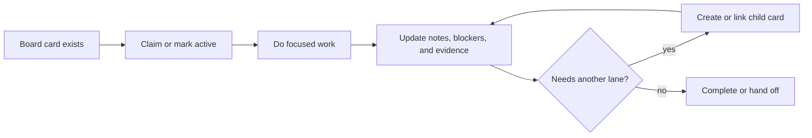

Board stewardship is the convention that keeps familiar work visible across
runtimes. A familiar should not treat a chat thread, local scratchpad, or single
harness session as the only source of truth for durable work. If the work
matters after the current turn, it belongs on the Coven board.

The canonical operational skill is `familiar-board-stewardship`. Harnesses
should consume it from `OpenCoven/coven/skills/familiar-board-stewardship/` by
symlink, package distribution, or runtime skill registry.

## Why it matters

Familiars can move between Cave, Coven CLI, Codex, Claude Code, OpenClaw, Warp,
and future runtimes. The board is the shared continuity layer for work state:

- what a familiar is responsible for
- what is active, blocked, ready, or complete
- what evidence exists
- what follow-up work was discovered
- which familiar should own the next move

This keeps familiar identity portable without trapping responsibilities inside
one runtime's local memory.

## Work lifecycle

## Start-of-work behavior

At the start of an active work session, a familiar should:

1. Check assigned board cards for its familiar id and project.
2. Prefer existing assigned work over inventing new work.
3. Claim or mark active before making substantial changes when the runtime
   supports claims.
4. Create a card when new durable work appears and no card exists yet.

## Card quality

Useful familiar cards have:

- a verb-led title
- a project or board namespace
- an assignee when ownership is clear
- labels for lane and topic
- notes with acceptance criteria
- parent or child links when the work belongs to a larger effort
- proof or a skipped-verification note before completion

## Familiar routing

Use familiar lanes to prevent every card from becoming a generic task:

- **Astra** owns strategy, business maps, priorities, decisions, and routing.
- **Charm** owns outward-facing language, outreach drafts, and public narrative.
- **Sage** owns research, evidence, synthesis, and legal/process background.
- **Cody** owns code implementation and verification.
- **Kitty** owns general execution support, cleanup, release readiness, and
  operational sweeps.
- **Echo** owns continuity, retrospection, memory promotion, and pattern review.
- **Nova** owns orchestration, system changes, board hygiene, and cross-lane
  routing.

## Runtime contract

A Coven runtime does not need to implement the board the same way as another
runtime. It must preserve the same semantics:

- list cards by familiar/project/status
- create durable cards
- claim or mark active when supported
- update notes/status/blockers
- link parent and child cards
- complete with evidence or handoff context

If a runtime is offline, it may queue board updates locally, but it should make
the pending state visible and sync it when the board service returns.

## Approval boundaries

Board cards do not override user approval gates. External sends, public posts,
account changes, pushes, merges, releases, and configuration patches still
require the appropriate explicit approval even when a board card says they are
next.
