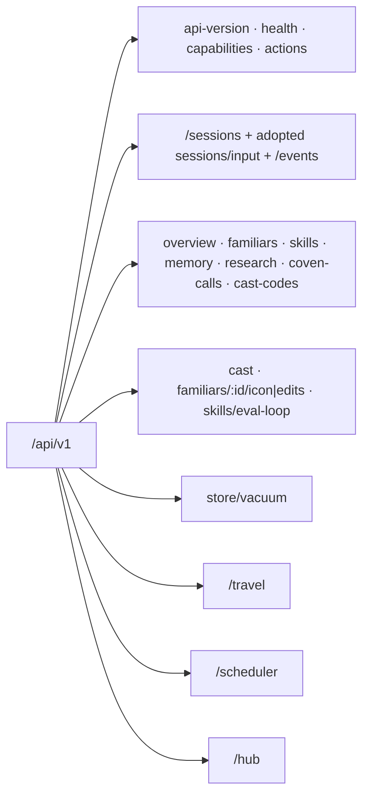

The Coven daemon exposes its public API as HTTP over same-user local IPC. On
Unix-like hosts, this is `<COVEN_HOME>/coven.sock`; on Windows, it is an
owner-only named pipe selected by `COVEN_HOME`. Health and `coven daemon status`
report the active endpoint, so clients must not construct a Windows pipe name
from the Unix convention. The active contract is **`coven.daemon.v1`** served
under `/api/v1`. This page is the canonical endpoint index — every route the
daemon serves is listed here.



All error responses use the structured envelope documented in the [API contract](/API-CONTRACT#structured-error-envelope): `{ "error": { "code", "message", "details" } }`. Unknown routes, action ids, and API versions fail closed. Clients negotiate the named `coven.daemon.v1` contract with `GET /api/v1/health`, then check every capability required by the operation. Boolean operation-group flags (`sessions`, `events`, `travel`, `scheduler`, `hub`, `executorDispatch`, `sessionHandoff`, `sessionLaunchPolicy`, `afs`, `afsCommit`, `afsCommitDryRun`) are advertised in the health `capabilities` block — treat a group as unavailable unless health advertises it. `executionBindingContracts` advertises standalone O2 support. The exact O3 value in `requestAdoptionContracts` advertises the composite adopted launch/input contract, including its mandatory per-request exact O2 proof; the bundled adopted client gates on this O3 field rather than independently checking both arrays. Capabilities advertise availability and never grant permission.

## Contract and discovery

| Method | Path | Purpose | Success |
|---|---|---|---|
| GET | `/api/v1/api-version` | Read the legacy route-family token. | `{ apiVersion: "v1", supportedApiVersions: ["v1"] }` |
| GET | `/api/v1/health` | Daemon reachability, version, capabilities, pid, hub summary, event-writer state, and local storage pressure. | `{ ok, apiVersion, covenVersion, capabilities, daemon, hub, eventWriter, storage }` |
| GET | `/api/v1/capabilities` | Control-plane capability catalog with policy hints and action ids. | `{ capabilities: [...] }` |
| GET | `/api/v1/capabilities/harnesses` | Aggregate of harness-native capability manifests plus Coven skills (`?refresh=1` re-scans). | `{ coven_skills, harness_capabilities, scanned_at }` |
| GET | `/api/v1/capabilities/:harness` | One harness's capability manifest (`?refresh=1` re-scans). | manifest object · `404 harness_not_found` |
| POST | `/api/v1/actions` | Route a known control-plane action id (intent envelope). | Legacy actions: `{ ok, accepted, status, event }`; versioned Automations commands: `{ ok, accepted, status, result?, event? }` · typed mapped errors |

The unversioned `coven.automations.create`, `.update`, `.delete`, `.list`, and
`.get` action ids retain their original permissive request parsing and event
response shapes for legacy-managed definitions. Once a definition is created
or revised through the versioned authority API, legacy update cannot overwrite
it and legacy delete reports it as already absent, preserving CAS and revision
history. Legacy delete/recreate remains wire-compatible while internally
retaining a monotonic revision fence against stale v1 commands.
Transactional definition clients use
`coven.automations.definition.create.v1`,
`coven.automations.definition.revise.v1`, and
`coven.automations.definition.tombstone.v1`: every mutation requires
`adoptionKey`, and revise/tombstone require `expectedRevision`. Exact replays
return the stored `result` without a second event. The corresponding
`.get.v1` and `.list.v1` actions expose authority revisions; `.list.v1` accepts
`includeTombstoned: true` to include retained tombstones.

The health `capabilities` object currently contains all 16 fields:
`sessions`, `events`, `travel`, `scheduler`, `hub`, `executorDispatch`,
`eventCursor`, `structuredErrors`, `sessionHandoff`, `sessionLaunchPolicy`,
`afs`, `afsMount`, `afsCommit`, `afsCommitDryRun`,
`executionBindingContracts`, and `requestAdoptionContracts`. The
`sessionLaunchPolicy` field is `true` only over owner-gated local IPC and is
always `false` over TCP; Host and Origin allowlists do not elevate TCP
authority. `daemon` is either `null` or
`{ pid, startedAt, socket, processCreationTime? }`, where the socket is under
the active local IPC endpoint; the optional `hub` field is a control-plane
summary. `processCreationTime` is a Windows-only decimal string containing the
full 64-bit process FILETIME fingerprint.
The optional `eventWriter` field reports the daemon-owned persistence queue,
including its state, exact queued events/bytes, capacity, dropped output,
connection, transaction, commit, and last-error counters.
The optional `storage` field is `{ status, databaseBytes, walBytes,
oldestRetainedEventAt, lastPruneAt, pruneAgeSeconds, lastCheckpointAt,
checkpointAgeSeconds, writerBacklogEvents, writerBacklogBytes, freeDiskBytes,
maintenanceBlocked, lastMaintenanceError? }`. `status` is `ok`, `warning`,
`critical`, or `degraded`; clients should surface `critical` and `degraded`
before storage exhaustion rather than treating a reachable daemon as healthy.
`writerBacklogEvents` and `writerBacklogBytes` mirror the same live queue
snapshot reported by `eventWriter`.

## Sessions and events

| Method | Path | Purpose | Body / query | Success | Errors |
|---|---|---|---|---|---|
| GET | `/api/v1/sessions` | List sessions. | — | `SessionRecord[]` | — |
| POST | `/api/v1/sessions` | Launch an unbound project-scoped harness session. A bound request is rejected and must use the adopted route. `launchPolicy` requires `capabilities.sessionLaunchPolicy === true`; its initial exact contract is `{ approval: "never", sandbox: "workspace-write", addDirs?: string[] }` for Codex `nonInteractive`, with every additional directory absolute, existing, canonicalized, and explicitly listed (including an external mission workspace when named). The field is owner-local-IPC-only; TCP returns `403 forbidden`. | `{ projectRoot, cwd?, harness, prompt, title?, launchMode?, launchPolicy?, conversation?, conversationId? }` | `201 SessionRecord` | `400 invalid_request`, `request_adoption_required`, `request_adoption_invalid`; `403 forbidden`; `500 launch_failed` |
| POST | `/api/v1/adopted-sessions` | Durably adopt and launch a bound session. | Normal launch fields plus complete `executionBinding` and closed `requestAdoption` metadata. | `201 SessionRecord` first adoption; `200 SessionRecord` exact replay | O2 errors; `400 request_adoption_required`, `request_adoption_invalid`, `request_adoption_unsupported`; `409 request_adoption_conflict`; synchronous post-adoption HTTP errors carry marker-only `{"adopted":true,"delivery":"not_asserted"}` details |
| POST | `/api/v1/sessions/external` | Register (or idempotently re-register) an externally launched session. `requestAdoption` rejection precedes `executionBinding` rejection. | session descriptor | `201` new / `200` existing | `400 invalid_request` for malformed JSON or missing/invalid required registration fields; `400 request_adoption_invalid` wins when both reserved members are supplied; otherwise `400 execution_binding_invalid`; `409 session_id_conflict` |
| GET | `/api/v1/sessions/:id` | Fetch one session. | — | `SessionRecord` | `404 session_not_found` |
| POST | `/api/v1/sessions/:id/complete` | Mark an external session completed. | `{ exitCode?, ... }` | updated record | `404 session_not_found`, `422 not_external_session` |
| GET | `/api/v1/sessions/:id/events` | Read redacted session events. | `?afterSeq`, `?afterEventId`, `?limit` | `{ events, nextCursor, hasMore }` | `404 session_not_found` |
| GET | `/api/v1/sessions/:id/log` | Read bounded redacted log previews. | — | `[{ ts, level, message }]` | `404 session_not_found` |
| POST | `/api/v1/sessions/:id/input` | Forward input to a live unbound session. Bound input is rejected and must use the adopted route. | `{ data }` | `202 { ok, accepted }` | `400`, `404`, `409 session_not_live`, `500 send_input_failed`; bound requests: `request_adoption_required` or invalid-location `request_adoption_invalid` |
| POST | `/api/v1/sessions/:id/adopted-input` | Durably adopt input for a bound live session before the runtime side effect. | `{ data, executionBinding, requestAdoption }` | `202 {"adopted":true,"replayed":false,"delivery":"not_asserted"}` first adoption; `200 {"adopted":true,"replayed":true,"delivery":"not_asserted"}` exact replay | O2 errors; `400 request_adoption_required`, `request_adoption_invalid`, `request_adoption_unsupported`; `409 request_adoption_conflict`; synchronous post-adoption HTTP errors retain their concrete code and carry the marker-only adoption details |
| POST | `/api/v1/sessions/:id/kill` | Kill a live session. A bound kill requires exact O2 proof; adoption is not accepted. | Bound: `{ executionBinding }`; unbound: — | `{ ok, accepted }` | `400 request_adoption_invalid` when adoption is supplied; `404`, `409 session_not_live`, `500 kill_failed` |
| POST | `/api/v1/sessions/:id/handoffs` | Validate, redact, and offer a `coven.handoff.v1` packet. | packet | `{ handoff, packet, eventCursor, workspace }` | `400`, `404`, `409`, `413 handoff_too_large` |
| GET | `/api/v1/sessions/:id/handoffs` | Read durable handoffs (`?latest=true` narrows to the latest). | `?latest=true` | `{ handoffs }` | `404` |
| POST | `/api/v1/sessions/:id/handoffs/:handoffId/claim` | Atomically claim a generation and fence source input. | `{ expectedGeneration, claimant, idempotencyKey, destinationWorkspace }` | `{ handoff, sourceInputFenced }` | `409 handoff_stale_generation`, `handoff_already_claimed`, `transcript_diverged`, `workspace_diverged` |
| POST | `/api/v1/sessions/:id/handoffs/:handoffId/ack` | Acknowledge a quiesced source cursor. | `{ claimant }` | `{ handoff }` | `409` |
| POST | `/api/v1/sessions/:id/handoffs/:handoffId/continuations` | Record a destination import and return a fixed untrusted-context prelude. | `{ destination }` | `{ continuation, packet, prompt, provenance }` | `409 source_acknowledgement_required` |
| GET | `/api/v1/sessions/:id/artifacts/:artifactId` | Read one raw (unredacted) artifact. | `?raw=1` required | raw payload | `400` (missing `raw=1`), `403 raw_artifacts_disabled`, `404` |
| GET | `/api/v1/events` | Read paginated redacted events for a session. | `?sessionId` required, `?afterSeq`, `?afterEventId`, `?limit` | `{ events, nextCursor, hasMore }` | `400 invalid_request` |

Event payloads are redacted by default; the raw artifact route requires explicit local raw-artifact persistence. See [STREAM-JSON](/STREAM-JSON) for event payload shapes.

Before either adopted POST, the bundled client calls `GET /api/v1/health` and
negotiates in a fixed three-step order. First it requires `health.apiVersion`
to be the exact string `coven.daemon.v1`.
Second it requires `health.ok === true`.
Only after both checks pass does it require
`health.capabilities.requestAdoptionContracts` to be an array containing the
exact `psyche.request_adoption.v1` string.
Missing, null, false, and non-boolean `health.ok` values all fail locally.
Any health transport, API-version, health-ok, or capability failure sends zero
POST requests and never falls back to a legacy mutation. That O3 capability
advertises the composite adopted-route contract; the client does not independently gate
these adopted methods on `executionBindingContracts`. It
does not replace proof: every adopted request must still carry a complete,
exact O2 `executionBinding` proof. Adoption is durable responsibility before a
side effect, not proof of delivery or completion. Asynchronous terminal or
event-persistence failures cannot retroactively alter an already returned
response.
Global-key, five-field launch-scope, replay ordering, retention, privacy, and
static error-field rules are normative only in the
[request-adoption contract](/API-CONTRACT#psyche-request-adoption-contract-v1).

Handoff routes are local-IPC-only and require the `sessionHandoff`
capability. They do not authenticate remote callers; a companion needs a
separately paired authenticated transport. See
[Session handoff](/daemon/session-handoff).

## Observability reads

These power `coven status`, `coven familiars`, `coven skills`, `coven memory`, `coven research`, `coven calls`, and the Cave cockpit — the CLI `--json` output is exactly these bodies (see [cli-observe](cli-observe.md)). Missing files degrade to empty lists.

| Method | Path | Purpose | Success |
|---|---|---|---|
| GET | `/api/v1/overview` | Dashboard aggregate: open sessions, roster/skill/research counts. | overview object |
| GET | `/api/v1/familiars` | Familiar roster from `familiars.toml`. | `FamiliarDto[]` |
| GET | `/api/v1/familiars/:id/ward` | One familiar's declared Ward surface (tiers, protected paths, principal binding) — the read twin of `/familiars/:id/edits`. | `{ ok, familiarId, workspace, ward }` · `400 invalid_request` / `404 familiar_not_found` / `404 ward_not_configured` / `500 ward_config_invalid` |
| GET | `/api/v1/familiars/:id/audit` | The append-only `ward_audit` ledger for one familiar, newest first — where direct and proposal-approved writes persist Gate 4 apply records. `?limit=N` (default 100, max 1000), `?event=TYPE` (e.g. `apply_audit`). | `{ ok, familiarId, records }` · `400 invalid_request` / `404 familiar_not_found` |
| GET | `/api/v1/skills` | Installed skills from `~/.coven/skills/`. | `SkillDto[]` |
| GET | `/api/v1/memory` | Familiar memory files from `~/.coven/memory/`. | memory list |
| GET | `/api/v1/memory/overview` | Memory counts plus explicit detail, verification, attestation, supersession, and mutation capability state. | overview object |
| GET | `/api/v1/memory/:id` | Validated markdown content for an opaque id returned by the memory list. | memory detail · `400 invalid_request` / `404 memory_not_found` / `413 memory_content_too_large` / `422 memory_content_invalid` / `503 memory_content_unavailable` |
| GET | `/api/v1/research` | Research loop log rows. | research list |
| GET | `/api/v1/coven-calls` | Coven Calls delegation ledger. | `{ ok, calls }` |
| GET | `/api/v1/coven-calls/:id` | One delegation call. | `{ ok, call }` · `404 call_not_found` |
| GET | `/api/v1/cast-codes` | Cast code catalog (`~?`, `~>` …). | code list |

Memory list `path` values are relative compatibility fields, never absolute
filesystem paths. Browser-facing clients should remove them from their own
DTOs. Enumeration is metadata-only and excludes non-UTF-8 path entries,
symlinks, Windows reparse points, non-files/non-directories, and entries that
disappear during the scan. Unexpected enumeration, directory-open, or metadata
errors fail the request instead of returning partial data. Overview reads no
bodies. List reads excerpts and retains a metadata-valid row with an empty
`excerpt` when its body is unreadable, invalid UTF-8, or larger than 4 MiB.
Detail reads only the selected entry from its validated no-follow handle;
content must be UTF-8 and at most 4 MiB (4,194,304 bytes). Detail responses
contain no path field. A missing or unsafe replacement before the validated
open returns `404 memory_not_found`; permission failures, unexpected open
failures, and post-open metadata/read failures return
`503 memory_content_unavailable`. Both errors expose only `memoryId` in their
details, never filesystem paths or raw I/O errors. Until the promotion privacy
and verification contracts land, the API reports those capabilities as
unavailable and returns unknown/null metadata rather than inferring a healthy
or public state.

## Cast and familiar writes

| Method | Path | Purpose | Success | Errors |
|---|---|---|---|---|
| POST | `/api/v1/cast` | Submit a cast line (status/delegation shorthand) to the cockpit session. | `202 { accepted, cast_id, echo }` | `400 invalid_request` |
| PUT | `/api/v1/familiars/:id/icon` | Update a familiar's icon glyph. | updated familiar | `400`, `404` |
| POST | `/api/v1/familiars/:id/edits` | Ward-adjudicated writes into a familiar home (Gates 1–2, fail-closed, audited). Held writes stage with deterministic Gate-3 probe evidence; applied writes append `apply_audit` rows to the `ward_audit` ledger. | edit report | `400`, `403` (ward denial), `404`, `413 ward_apply_too_large`, `413 proposal_quota_exceeded`, `507 ward_audit_capacity_exceeded` |

Direct multi-edit requests stage every cleared Tier-2/Tier-3 change before
commit and share one rollback boundary. Direct writes and proposal approvals
share one commit-through-Gate-4 serialization boundary, so ledger order matches
filesystem commit order across both pathways. A commit failure that is fully
rolled back returns `500 ward_apply_failed` with `writeApplied: false`. If all
writes commit but randomized backup cleanup fails, Coven
persists the complete Gate-4 audit report before returning `500
ward_apply_cleanup_failed` with
`writeApplied: true` and `retrySafe: false`. A proven rollback with incomplete
staging/backup cleanup returns `500 ward_apply_rollback_cleanup_failed` with
`writeApplied: false`, the affected `targets`, and `retrySafe: false`. If
rollback cannot be proven, the response is `500 ward_apply_ambiguous` with
`writeApplied: null`, affected `targets`, and `retrySafe: false`; clients must
inspect state rather than blindly retry.

If the files commit but the Gate-4 transaction cannot be persisted, the
endpoint returns `500 audit_persist_failed` with `writeApplied: true`,
`retrySafe: false`, and the complete per-change `audit` records in `changes`.
Those returned records are the recoverable audit outcome required for the
committed write; they are not a claim that the ledger append succeeded.
Clients must retain/escalate that response and reconcile the ledger rather
than replaying the file edit.

Every submitted Ward request accepts at most 32 edits, including Tier-0/Tier-1
edits that will be held or staged and Tier-2/Tier-3 edits eligible for direct
apply. Proposed contents may total at most 16 MiB (16,777,216 bytes). During
direct apply, proposal approval, and recovery, existing-file before-images
consume the same 16 MiB aggregate retained-content budget; no single
before-image may exceed 16 MiB.

Transport framing bounds the initial JSON parse before this handler runs:
loopback TCP accepts at most 1 MiB and the local Unix-socket/Windows-pipe
transport accepts at most 4 MiB. Immediately after extracting the body’s
borrowed edit array, the handler checks the edit count and proposed byte total.
That check precedes `FileEdit` allocation, content cloning, Ward/Gate-2
adjudication, gate-store access, probe execution, and proposal staging, so the
transport-bounded parse cannot fan out into attacker-sized follow-on work.

Approved and recovered on-disk proposals are untrusted and are checked again
before full envelope deserialization, staged-content decoding, or any target
open/staging. The pending edits, `materialized_diff.surfaces`,
`decisionState.beforeImages`, and derived replay-byte collections each pass
their own 32-entry/16 MiB bound first. Materialized `after` bytes are then
matched exactly by surface identity and content against `pending.edits`;
persisted before-images are included in the logical apply aggregate. This
prevents duplicated Phase-5 fields from amplifying a small pending edit into an
unbounded typed allocation.

The generic proposal-envelope parser retains its 406,847,488-byte (388 MiB)
syntactic ceiling, derived from the 16 MiB content policy, worst-case
tagged-string/decimal-byte-array expansion, and 4 MiB of structural overhead.
Active pending storage is intentionally much smaller: no individual pending
proposal and no aggregate pending set may exceed the 64 MiB global pending
quota described below. Metadata rejects either ceiling before allocating the
body, and the subsequent bounded read catches concurrent growth.
Decision-state rewrites use compact JSON so valid proposals do not gain
avoidable formatting amplification.

One existing edit can retain three file descriptors through finalization (the
before-image, installed staging inode, and displaced backup), so 32 bounds the
worst case at 96 descriptors and leaves substantial daemon headroom under the
portable low 256-descriptor soft limit common on macOS and Linux.

After validation, direct preparation borrows the proposed buffers instead of
cloning them. Existing targets are rejected from logical metadata length before
allocation when possible, so sparse files over the limit are too large even if
their allocated disk blocks are small. The subsequent read is also capped,
covering growth after metadata inspection.

This is a retained-content budget rather than a hard whole-process heap limit.
Bounded reads and installed/displaced-byte verification use one fixed 64 KiB
stack scratch buffer at a time, plus constant-size SHA-256 state and, when
needed, one 64-character digest; verification never allocates a file-sized
`Vec`. A limit failure occurs before staging or commit and returns `413
ward_apply_too_large` with `writeApplied: false`. Approval leaves the pending
proposal (or durable recovery claim) intact and performs no partial write.
Details identify `directBatchEdits` (including `attemptedEdits` and `maxEdits`),
`existingBeforeImageBytes` (including `target`, `observedBytes`, and
`maxBytes`), `directBatchRetainedBytes` (including `attemptedBytes` and
`maxBytes`), or `proposalEnvelopeBytes` for the encoded on-disk cap. The
`directBatch*` labels are retained for wire compatibility but apply to all Ward
edits and approved/recovered proposals. Operators should shrink or archive an
oversized existing target; clients should split an over-count or
aggregate-heavy request. A globally oversized pending envelope instead returns
`proposal_quota_exceeded`; list/scheduler maintenance quarantines it out of the
active queue, after which the operator can inspect or remove the quarantine
artifact. Retry only after changing the target, request, or pending capacity
that exceeded the reported limit.

## Ward proposals (threads)

Held Ward writes stage at `~/.coven/pending/` for the principal —
Tier-0 authority degradations and Tier-1 coherence holds, distinguished by
`reviewKind` (`authority` / `coherence`). See
[cli-ward](cli-ward.md) and `docs/design/ward-gate3-coherence.md`.

| Method | Path | Purpose | Success | Errors |
|---|---|---|---|---|
| GET | `/api/v1/threads/weaves` | Per-familiar weave/authority state (degraded configs reported inline). | weave entries | — |
| GET | `/api/v1/threads/proposals` | Owner-local cursor-paginated pending proposals with compact `probeSummary` evidence. `limit` defaults to and is capped at 64; pass the opaque `nextCursor` as `cursor`. Invalid files are reported once as `degraded` and quarantined. | `{ proposals, limit, hasMore, nextCursor }` | `400 invalid_request`, `403 transport_forbidden` |
| GET | `/api/v1/threads/proposals/:id` | Owner-local detail for one pending proposal with `probeSummary` and full per-surface `probes`. | `{ proposal }` | `400 invalid_request`, `403 transport_forbidden`, `404 proposal_not_found` |
| POST | `/api/v1/threads/proposals/:id/approve` | Re-validate and atomically apply a staged authority or coherence proposal. Pending decisions require `{ expectedRevision, note? }`; take the exact revision from the GET detail response. `HumanApprovalWithRationale` paths require a non-empty `note`. Owner-local IPC only. | decision report | `400`, `403 transport_forbidden`, `404`, `409`, `413 ward_apply_too_large`, `413 proposal_quota_exceeded`, `507 ward_audit_capacity_exceeded` |
| POST | `/api/v1/threads/proposals/:id/reject` | Reject/veto and remove a staged proposal (audited). Pending decisions require `{ expectedRevision, note? }`; take the exact revision from the GET detail response. Owner-local IPC only. | decision report | `400`, `403 transport_forbidden`, `404`, `409`, `507 ward_audit_capacity_exceeded` |

Proposal metadata includes familiar identity, target paths, writer
fingerprints, hashes, and probe diagnostics, so reads and mutations both
require owner-local IPC. Automatic expiry/apply and interrupted-decision
recovery are internal daemon work and have no TCP route. Any loopback TCP
request under `/api/v1/threads/proposals` fails with stable
`403 transport_forbidden` before UUID parsing, pending-file lookup, claim
creation, target access, or audit append. The response includes
`details: { requiredAuthority: "owner_local_ipc", writeApplied: false }`.
Host/Origin allowlists do not elevate TCP authority.

### Pending-proposal capacity and bounded maintenance

The active `~/.coven/pending/` store admits at most **64 proposals** totaling
at most **64 MiB (67,108,864 bytes)** of actual serialized file bytes. Pending
`.json` files and durable `.json.approve.deciding` /
`.json.reject.deciding` claims both count. The limits are deliberately far
below "hundreds of MiB per item times a large queue": local request bodies are
already capped at 4 MiB, so 64 MiB leaves room for several maximum-size local
submissions or a broad backlog of ordinary reviews while bounding disk use and
aggregate parse cost. The same admission path applies to owner-local IPC and
the optional loopback TCP listener.

Admission serializes creators with both an in-process mutex and an
OS-backed lock file. While holding that lock Coven reconciles count and logical
bytes from the actual directory, uses checked arithmetic, and includes the
exact final serialized bytes before atomically renaming the sibling staging
file into place. Approval-claim and recovery-state rewrites replace the old
file in the same byte accounting. Rejection and expiry retain a bounded
per-file terminal rewrite escape hatch so a queue already at or above quota can
still be audited and drained; those paths never mutate a target and consume the
claim immediately after the terminal audit. No fragile persisted counter is
trusted, so restart reconciliation is automatic. Approval, rejection, veto,
expiry, terminal retry cleanup, operator deletion, and quarantine release
capacity as soon as their active file leaves the pending directory.

Quota refusal is the stable `413 proposal_quota_exceeded` contract. Details
carry `limit: pendingProposalCount` with `currentCount`, `attemptedCount`, and
`maxCount`, or `limit: pendingProposalBytes` with `currentBytes`,
`incomingBytes`, `attemptedBytes`, and `maxBytes`. Both forms include
`writeApplied: false` and `retrySafe: true`. A proposal larger than the entire
64 MiB quota is rejected before publication; sibling staging files are cleaned
and no target mutation occurs.

List pages use deterministic on-disk filename ordering so the opaque cursor can
advance without parsing the full backlog. At most the requested 1–64 files are
opened and parsed in one request. The scheduler similarly processes at most
**16 proposal or recovery-claim files per 30-second tick** and persists its
round-robin cursor, so human-only entries cannot starve later automatic work.

Pending proposals expire after **30 days**. Expiry follows the durable decision
path: Coven records a `proposal_rejected` audit row with decision `expired`,
removes the active file, and never applies its target. An interrupted expiry
persists an internal decision request and resumes safely on a later tick.

### Durable audit capacity

The append-only `ward_audit` ledger has a durable default capacity of
**256 MiB (268,435,456 charged bytes)**. Charges are deterministic: exact
serialized SQLite field lengths plus a conservative four-page per-row overhead.
The capacity row and in-flight reservations live in `coven.sqlite3`, so daemon
restart cannot forget committed use or hand reserved bytes to a competing
writer. Admission uses `BEGIN IMMEDIATE`; the reservation is acquired while the
same process-wide Ward write/audit lock is held, before Gate-4 validation,
proposal publication, claim creation, or target mutation. The connection-local
insert trigger debits that durable reservation in the same SQLite transaction
as each audit row, so concurrent writers cannot over-admit.

SQLite WAL behavior is bounded separately. Writable connections checkpoint
after roughly **4 MiB**, retain at most **16 MiB** after reset, and Ward
admission enforces a durable **128 MiB** WAL ceiling after attempting
`PASSIVE` and, when necessary, `TRUNCATE` checkpointing. A long-lived reader
that pins the WAL therefore causes a fail-closed admission error rather than
unbounded growth.

Capacity refusal is stable `507 ward_audit_capacity_exceeded`. Details include
`resource` (`ledger` or `wal`), `limitBytes`, `usedBytes`, `requiredBytes`,
`availableBytes`, `writeApplied`, and `retrySafe`. Normal admission failures
return `writeApplied: false` before proposal publication or file mutation.
Recovery paths that may already have committed bytes report
`writeApplied: null`; existing exceptional post-commit responses continue to
report `writeApplied: true` and include the complete returned per-change audit
outcome rather than claiming rollback.

Coven never deletes, truncates, or compacts `ward_audit` evidence. When capacity
is exhausted, stop the daemon, take and verify a consistent SQLite backup of
`coven.sqlite3` (including committed WAL content), and use
`coven ward audit <familiar> --json` as a bounded human-readable verification
view. Then raise the operator-controlled
`coven_ward_audit_capacity.limit_bytes` in the stopped database; raise
`wal_limit_bytes` only when the storage budget permits. Retain the backup as
the archive before restarting. Coven has no automatic audit prune path, and
operators must not delete rows from `ward_audit`; append-only triggers reject
updates and deletes.

Before JSON parsing, list, detail, approval, recovery, and scheduler paths
require a regular file and preflight logical metadata size. Invalid,
non-regular, corrupt, or globally oversized scheduler/list candidates move to
`~/.coven/pending/quarantine/` and leave the hot path. Quarantined bytes are not
active quota, but they still consume disk; operators should inspect the daemon
recovery log, retain any evidence they need, and remove archived quarantine
files on their normal storage-retention schedule.

Probe evidence is additive sidecar data, so the underlying
`coven_threads_core::PendingProposal` remains backward-readable. A missing
probe sidecar (older pending files), no matching `[[probe]]`, or a probe
runtime error is reported as `unscored`; it is never treated as a pass.
Stale, malformed, or internally inconsistent sidecars are likewise demoted to
`unscored` with `probeEvidenceDegraded`, after deterministic recomputation
against staged targets and contents, the current baseline and Gate-2
resolution, and the declared probe set.

For `reviewKind: "coherence"`, approval re-runs Gates 1–2 and the deterministic
probes, skips the threads validator (Tier-1 surfaces are deliberately not
woven), and conditionally writes only if the captured before-image still
matches the re-probed baseline. Missing, malformed, stale, or inconsistent
probe evidence returns `409`, leaves the proposal pending, and writes nothing.
A first approval attempt never treats matching proposed bytes as proof that
Coven already applied them; that idempotent shortcut is restricted to a
persisted recovery intent, which is also bound to the Gate-2-resolved surface.
Known no-write failures and proven rollbacks clear that recovery state before
returning; failures that may have committed preserve it for safe replay. The
Ward's final path adjudication must still equal the persisted resolution.
A valid `failed` or `unscored` probe result is advisory: an explicit principal
approval may still apply it. Rejection remains available when evidence is stale
and returns `probeSummary` plus `probeEvidenceDegraded`; it never applies the
staged edit. On approval, any logged edits in the proposal append their
`apply_audit` rows atomically with baseline advancement and the terminal
`proposal_approved` row.

## Skills: eval-loop

| Method | Path | Purpose | Success | Errors |
|---|---|---|---|---|
| GET | `/api/v1/skills/eval-loop/:familiarId` | Eval-loop skill state for a familiar. | `{ ok, state }` | `404 skill_not_active` |
| POST | `/api/v1/skills/eval-loop/:familiarId/run` | Enqueue an eval-loop run (`{ track? }`, default `synthesis`). | `202 { ok, runId, track }` | `400`, `409 run_in_progress` |
| DELETE | `/api/v1/skills/eval-loop/:familiarId/run-lock` | Clear a stale run lock (`{ force? }`). | `{ ok, cleared, familiarId }` | `409 lock_not_stale` |

## Store

| Method | Path | Purpose | Success |
|---|---|---|---|
| POST | `/api/v1/store/vacuum` | Rebuild the event FTS index and compact the SQLite store (CLI: [cli-vacuum](cli-vacuum.md)). | `{ ok, eventIndexRebuilt, integrityCheck }` · `500` on repair failure |

`eventIndexRebuilt` reports whether the `events_fts` index was present and rebuilt — the rebuild always runs when the index exists, so `true` does not imply the index was stale. `false` means the store has no `events_fts` table to rebuild.

## Travel (advertised by `capabilities.travel`)

The `GET /travel/state` read route backs `coven travel state --client <id>` ([cli-observe](cli-observe.md)); the write routes are machine-to-machine.

| Method | Path | Purpose | Success | Errors |
|---|---|---|---|---|
| POST | `/api/v1/travel/profiles` | Generate a signed, compressed offline travel profile for a familiar. | `201` profile envelope (`profileId`, `expiresAt`, `staleAfter`, `permissions`, `contentHash`, `profileBlob`) | `400 invalid_request` |
| POST | `/api/v1/travel/deltas` | Upload offline deltas recorded against a profile (`?defer=1` to queue). | delta acceptance | `404 travel_profile_not_found`, `409 source_hub_mismatch`, `409 travel_profile_expired` |
| GET | `/api/v1/travel/state` | Client sync state (`?clientId`, `?profileId`). | `{ state, profileId, pendingDeltaBytes, hubReachable, profileFreshness, travelExecutionAllowed, validStates }` | `400`, `404` |

## Scheduler (advertised by `capabilities.scheduler`)

The read routes back `coven scheduler decision <id>` and `coven scheduler loop <id>` ([cli-observe](cli-observe.md)); the write routes are machine-to-machine.

| Method | Path | Purpose | Success | Errors |
|---|---|---|---|---|
| POST | `/api/v1/scheduler/decisions` | Place a job on an eligible node by capability and queue pressure. | decision record | `400`, `409` (no eligible node) |
| GET | `/api/v1/scheduler/decisions/:id` | Fetch one placement decision. | decision record | `404` |
| POST | `/api/v1/scheduler/redispatch` | Re-route a persistent loop's job (`{ loopId, jobId, ... }`). | decision record | `400`, `404`, `409` |
| GET | `/api/v1/scheduler/loops/:id` | Persistent loop state incl. preserved subqueue and node availability. | loop state object | `404` |

## Hub control plane (advertised by `capabilities.hub`)

The hub is the only side that initiates executor contact (`coven.executor.v1`); see [cli-executor](cli-executor.md) and [HUB-OPERATIONS](/HUB-OPERATIONS). Read routes back `coven hub status/nodes/jobs/routing/dispatch` ([cli-observe](cli-observe.md)).

| Method | Path | Purpose |
|---|---|---|
| GET | `/api/v1/hub/status` | Hub role, hubId, node availability, queue depths. |
| POST | `/api/v1/hub/nodes` | Register or re-register an executor node. |
| GET | `/api/v1/hub/nodes` | List registered nodes. |
| GET | `/api/v1/hub/nodes/:id` | Fetch one registered node. |
| POST | `/api/v1/hub/nodes/:id/health` | Record an executor health report (holds/resumes its subqueue). |
| POST | `/api/v1/hub/nodes/:id/poll` | Poll executor availability outbound over its dispatch transport. |
| POST | `/api/v1/hub/nodes/:id/dispatch` | Dispatch a job outbound to a stateless executor. |
| GET | `/api/v1/hub/dispatches/:jobId` | Fetch a persisted dispatch record (job spec + result envelope). |
| POST | `/api/v1/hub/jobs` | Enqueue a job on the persistent global queue. |
| GET | `/api/v1/hub/jobs` | List jobs (`?state=queued\|assigned\|held\|completed\|failed\|cancelled`). |
| GET | `/api/v1/hub/jobs/:id` | Fetch one job with its routing entry. |
| POST | `/api/v1/hub/jobs/:id/assign` | Assign a job to an executor from the node registry. |
| POST | `/api/v1/hub/jobs/:id/complete` | Mark a job completed/failed/cancelled. |
| GET | `/api/v1/hub/routing` | Read the persistent routing table. |

Full hub request/response shapes live in the [API contract](/API-CONTRACT).

## Always begin with health

```http
GET /api/v1/health
```

The response provides the active named `apiVersion`, all 16 health
`capabilities` fields, and optional daemon metadata (`pid`, `startedAt`, and
`socket`) plus the optional hub summary. Treat a dependent operation as
unavailable until its required capability fields have been checked.

See the [public API guide](https://docs.opencoven.ai/docs/reference/api) for response examples and architecture notes, and the [API contract](/API-CONTRACT) for stable shapes, versioning, and failure envelopes.

## Related

- [Public API guide](https://docs.opencoven.ai/docs/reference/api)
- [API contract](/API-CONTRACT)
- [Authentication and local access](/AUTH)
- [Client integration](/CLIENT-INTEGRATION)
