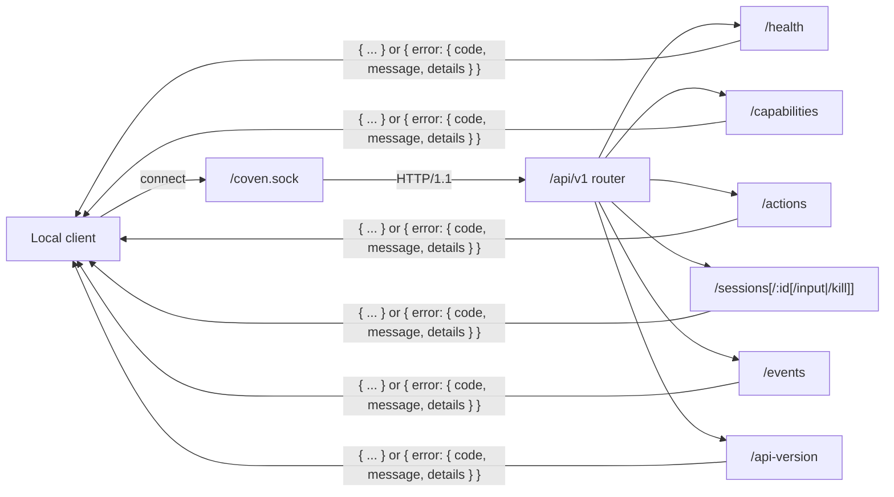

# Локальный API Coven

_Последнее обновление: 2026-05-09_

Coven предоставляет небольшой HTTP API через локальный Unix socket по адресу `<covenHome>/coven.sock`. Демон на Rust — это граница авторитета: клиенты могут валидировать для UX, но демон всё равно валидирует корни проекта, cwd, id harness'а, id сессии, input и состояние живой сессии перед действием.



Каждый маршрут возвращает либо задокументированную форму успеха, либо структурированный конверт ошибки. Неизвестные маршруты, неизвестные id действий и неизвестные версии API — все отказываются в закрытом виде с `invalid_request` или `not_found`.

См. [Аутентификация и локальный доступ](/AUTH) для текущей позы auth. Кратко: API демона сегодня не использует OAuth, JWT, bearer-токены, API-ключи или cookies. Доступ основан на локальном Unix-socket, учётные данные провайдера остаются с CLI harness'ов, а любое удалённое, браузерное или TCP-предоставление требует отдельного дизайна auth.

## Версионирование

Текущий публичный контракт API — это именованный контракт **`coven.daemon.v1`**, обслуживаемый под префиксом маршрута `/api/v1`.

Версионированные клиенты должны использовать префикс `/api/v1`:

| Endpoint | Назначение |
|---|---|
| `GET /api/v1/api-version` | Прочитать активную версию API и поддерживаемые версии |
| `GET /api/v1/health` | Проверить здоровье и метаданные демона |
| `GET /api/v1/capabilities` | Обнаружить capabilities демона/плоскости управления и подсказки политики |
| `POST /api/v1/actions` | Маршрутизировать действие плоскости управления в форме политики |
| `GET /api/v1/sessions` | Перечислить активные сессии |
| `POST /api/v1/sessions` | Запустить сессию |
| `GET /api/v1/sessions/:id` | Получить одну сессию |
| `GET /api/v1/events?sessionId=...` | Прочитать события сессии |
| `POST /api/v1/sessions/:id/input` | Переслать input в живую сессию |
| `POST /api/v1/sessions/:id/kill` | Убить живую сессию |

Неверсионированные маршруты в настоящее время остаются как legacy-алиасы в течение раннего окна MVP, но новые клиенты не должны на них полагаться.

Неизвестные префиксы `/api/<version>/...` отказываются в закрытом виде с JSON-ответом `unsupported API version`.

## Ответ health

`GET /api/v1/health` возвращает версию API вместе со статусом демона:

```json
{
  "ok": true,
  "apiVersion": "coven.daemon.v1",
  "covenVersion": "0.0.0",
  "capabilities": {
    "sessions": true,
    "events": true,
    "eventCursor": "sequence",
    "structuredErrors": true
  },
  "daemon": {
    "pid": 12345,
    "startedAt": "2026-05-09T12:00:00Z",
    "socket": "/Users/example/.coven/coven.sock"
  }
}
```

Когда метаданные демона недоступны, `daemon` равен `null`.

## Capabilities плоскости управления

`GET /api/v1/capabilities` — это точка обнаружения для first-party клиентов, таких как OpenMeow. Возвращает id capabilities, владение адаптера, доступность, подсказки политики и id действий. Это предотвращает hardcoding клиентов того, что может делать демон.

```json
{
  "capabilities": [
    {
      "id": "coven.control.actions",
      "label": "Coven control-plane action router",
      "adapter": "coven-daemon",
      "status": "available",
      "policy": "allow",
      "actions": ["coven.capabilities.refresh"]
    },
    {
      "id": "desktop.automation",
      "label": "Desktop automation adapters",
      "adapter": "desktop-use",
      "status": "planned",
      "policy": "requiresApproval",
      "actions": []
    }
  ]
}
```

## Действия плоскости управления

`POST /api/v1/actions` принимает конверт intent в стиле OpenMeow. Демон маршрутизирует только известные действия; неизвестные действия отказываются в закрытом виде до того, как любой адаптер сможет выполниться.

```json
{
  "action": "coven.capabilities.refresh",
  "origin": "open-meow",
  "intentId": "intent-1",
  "args": {}
}
```

Безопасные действия, завершённые немедленно, возвращают `200` с payload в форме события, который клиенты могут отрисовать оптимистично или встроить в более поздние потоки событий:

```json
{
  "ok": true,
  "accepted": true,
  "action": "coven.capabilities.refresh",
  "status": "completed",
  "event": {
    "kind": "capabilities.refreshed",
    "action": "coven.capabilities.refresh",
    "origin": "open-meow",
    "intentId": "intent-1",
    "payload": { "capabilities": 3 }
  }
}
```

## Правила совместимости

- Дополнительные поля JSON разрешены в ответах `v1`.
- Существующие обязательные поля не должны удаляться или переименовываться внутри `v1`.
- Изменения формы ответа или поведения, нарушающие совместимость, требуют нового префикса версии API.
- Внешние клиенты должны вызывать `/api/v1/health` перед предположением о совместимости.
- Изменения демона, влияющие на поведение `/api/v1/health`, `/api/v1/sessions`, `/api/v1/events`, input или kill, должны обновлять тесты совместимости клиента в том же репозитории.
