# Руководство по адаптерам harness'ов

Coven v0 поддерживает Codex и Claude Code. Это руководство описывает текущую форму адаптера и планку для добавления большего количества harness'ов.

## Текущая форма адаптера

Встроенный адаптер harness'а определяет:

- стабильный id harness'а Coven;
- метку, ориентированную на пользователя;
- имя исполняемого файла для обнаружения в `PATH`;
- форму аргумента prompt для интерактивного режима;
- форму аргумента prompt для неинтерактивного режима; и
- подсказку установки/аутентификации для `coven doctor`.

Текущая реализация ожидает, что prompt будет последним аргументом команды после любых фиксированных prefix args.

## Встроенные harness'ы

### Codex

- Id harness'а: `codex`
- Исполняемый файл: `codex`
- Prefix args в интерактивном режиме: нет
- Prefix args в неинтерактивном режиме: `exec --skip-git-repo-check --color never`

Подсказка по настройке:

```sh
npm install -g @openai/codex
codex login
```

### Claude Code

- Id harness'а: `claude`
- Исполняемый файл: `claude`
- Prefix args в интерактивном режиме: нет
- Prefix args в неинтерактивном режиме: `--print`

Подсказка по настройке:

```sh
npm install -g @anthropic-ai/claude-code
claude doctor
```

## Требования к адаптеру

Перед добавлением нового harness'а подтверди:

- CLI можно безопасно обнаружить в `PATH`;
- prompt можно передать без интерполяции shell;
- процесс может выполняться из проверенного cwd проекта;
- вывод можно захватить через события PTY/сессии;
- аутентификация остаётся в нормальном локальном потоке провайдера harness'а;
- режимы отказа понятны в `coven doctor`;
- тесты покрывают построение команды и поведение при отсутствии исполняемого файла.

## Что пока не добавлять

Избегай универсальных адаптеров произвольных команд, пока у Coven не появится явная политика и поведение одобрения для них.

Произвольные команды более опасны, чем именованные адаптеры harness'ов, потому что они могут размыть разницу между "запустить кодирующего агента в этом проекте" и "выполнить любую строку, которую отправил клиент". Сохраняй v0 узким.

## Контрольный список оценки будущего harness'а

Для кандидата в harness задокументируй:

- команду установки;
- имя исполняемого файла;
- локальный поток auth;
- команду одноразового prompt;
- интерактивную команду;
- команду возобновления/сессии, если есть;
- режим неинтерактивного вывода;
- нужно ли инъецировать prompt через stdin;
- может ли CLI отключать цвет/управляющие последовательности;
- может ли CLI избегать опасностей quoting shell;
- известные коды выхода;
- минимальный безопасный smoke-тест.

## Отображение идентичности сессии

Некоторые harness'ы имеют собственные id upstream-сессий. Id сессии Coven остаётся id локального runtime.

Если id upstream становятся полезными, храни их как метаданные, а не заменяй собственный id Coven. Клиенты должны иметь возможность полагаться на стабильный id Coven для attach, событий, archive, summon и sacrifice.

## Предлагаемые этапы зрелости адаптера

1. **Заметка по исследованию** - задокументировать форму CLI и риски.
2. **Тесты построения команды** - доказать, что построение argv безопасно.
3. **Обнаружение через doctor** - добавить подсказки по установке/auth.
4. **Smoke запуска** - доказать, что сессия может выполняться во временном проекте.
5. **Smoke attach/replay** - доказать, что события можно воспроизводить.
6. **Совместимость с клиентами** - обновить docs и интеграционные тесты.

Не прыгай из исследования сразу в публичную поддержку.

```mermaid
flowchart LR
  S1["1. Research note\n(public CLI shape + risks)"] --> S2
  S2["2. argv construction tests\n(no shell, prompt last)"] --> S3
  S3["3. coven doctor detection\n(install + auth hints)"] --> S4
  S4["4. Launch smoke\n(temp project, fake creds)"] --> S5
  S5["5. Attach / replay smoke\n(events round-trip)"] --> S6
  S6["6. Client compatibility\n(comux + plugin tests)"] --> Done(["Public support"])

  style S1 fill:#3D3547,stroke:#9A8ECD,color:#fff
  style S2 fill:#3D3547,stroke:#9A8ECD,color:#fff
  style S3 fill:#3D3547,stroke:#9A8ECD,color:#fff
  style S4 fill:#3D3547,stroke:#9A8ECD,color:#fff
  style S5 fill:#3D3547,stroke:#9A8ECD,color:#fff
  style S6 fill:#3D3547,stroke:#9A8ECD,color:#fff
  style Done fill:#9A8ECD,stroke:#D4B5FF,color:#1A1825
```



Harness, пропускающий любой этап, **не** готов к публичной поддержке, даже если кажется, что он работает на машине мейнтейнера.
