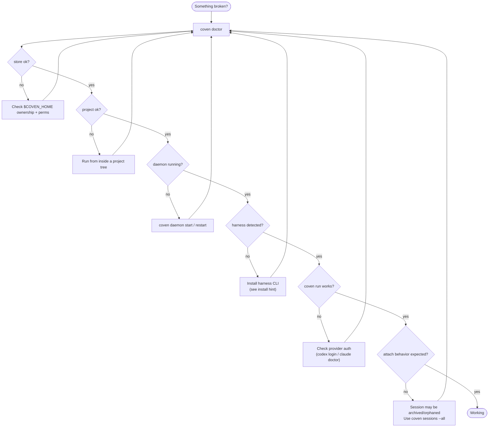

# Решение проблем Coven

Начни с:

```sh
coven doctor
```

`doctor` — это самый быстрый способ проверить готовность хранилища, проекта, демона и harness'а.



Следуй неуспешной ветке. Почти каждая проблема в остальной части этой страницы — это одна из этих ветвей подробно.

## Команда `coven` не найдена

Если используешь npm:

```sh
npx @opencoven/cli doctor
pnpm dlx @opencoven/cli doctor
```

Если собираешь из исходников:

```sh
cargo run -p coven-cli -- doctor
```

Если ты установил нативный бинарник, убедись, что его каталог в `PATH`.

## Harness отсутствует

`coven doctor` печатает подсказки по установке для каждого встроенного harness'а.

Codex:

```sh
npm install -g @openai/codex
codex login
```

Claude Code:

```sh
npm install -g @anthropic-ai/claude-code
claude doctor
```

Затем повтори:

```sh
coven doctor
```

## Демон недоступен

Запусти или перезапусти его:

```sh
coven daemon start
coven daemon status
coven daemon restart
```

Если клиент не может подключиться, проверь, что он использует тот же `COVEN_HOME`, что и CLI.

## Здоровье и давление системы

Если сессии ощущаются медленными, демон медленно стартует или `coven doctor` успешен, но работа harness'а тормозит, базовая машина может находиться под давлением CPU, памяти или диска.

`coven pc` показывает локальный отчёт системы без запуска harness'а. Все операции чтения свободны от побочных эффектов:

```sh
coven pc                  # full report: CPU, memory, disk, top processes
coven pc status           # one-line health summary
coven pc top --n 10       # top-N processes by CPU usage
coven pc disk             # disk usage breakdown
```

Операции облегчения изменяют состояние системы и требуют явного шлюза `--confirm`:

```sh
coven pc kill <pid> --confirm     # SIGTERM with PID identity re-check
coven pc cache clear --confirm    # clear ~/Library/Caches + /Library/Caches
```

`coven pc` в настоящее время macOS-first. См. [Диагностика и облегчение](GETTING-STARTED.md#diagnostics-and-relief) в Начать для полной справки по командам.

## Устаревшие выполняющиеся сессии

Если демон остановился, пока сессии выполнялись, эти записи могут стать `orphaned` при следующем запуске демона.

Используй:

```sh
coven sessions --all
```

Затем просмотри логи, заархивируй запись или принеси её в жертву, если она больше не полезна.

## Сессия не принимает input

Input работает только для живых сессий, принадлежащих демону.

Если сессия завершена, неуспешна, архивирована или осиротевшая, attach работает как replay/просмотр логов, а не как живой input.

## `cwd` отвергнут

Coven отвергает рабочие каталоги, которые разрешаются вне корня проекта.

Используй путь внутри проекта:

```sh
coven run codex "inspect package" --cwd packages/cli
```

Не используй symlink-трюки или родительские пути, чтобы выйти за границу проекта.

## Версия API отвергнута

Новые клиенты должны использовать `/api/v1`.

Проверь совместимость демона:

```text
GET /api/v1/health
```

Если клиент ожидает более новый API, чем предоставляет демон, обнови Coven или клиент, чтобы их поддерживаемые версии пересекались.

## `coven sessions` напечатал таблицу вместо открытия браузера

Coven открывает браузер только в интерактивном терминале.

Принудительно открыть режим браузера:

```sh
coven sessions --manage
```

Принудительно использовать табличный режим:

```sh
coven sessions --plain
```

## Путаница с archive, summon и sacrifice

- Archive скрывает не выполняющуюся сессию, но сохраняет события.
- Summon восстанавливает архивную сессию в активный список.
- Sacrifice навсегда удаляет не выполняющуюся сессию и её события.

Используй интерактивный браузер, когда возможно:

```sh
coven sessions --all --manage
```

## Сбой сканирования секретов

Запусти:

```sh
python scripts/check-secrets.py
```

Если не удаётся, удали секрет из рабочего дерева. Если секрет попал в историю git, ротируй учётные данные перед перезаписью истории или публикацией.

Не вставляй найденные значения секретов в issue, логи, docs или чат.

## Проверки контрибьютора падают после правок только в docs

Как минимум запусти:

```sh
python scripts/check-secrets.py
git diff --check
```

Для изменений кода запусти полный шлюз:

```sh
cargo fmt --check
cargo clippy --workspace --all-targets -- -D warnings
cargo test --workspace --locked
python scripts/check-secrets.py
```
