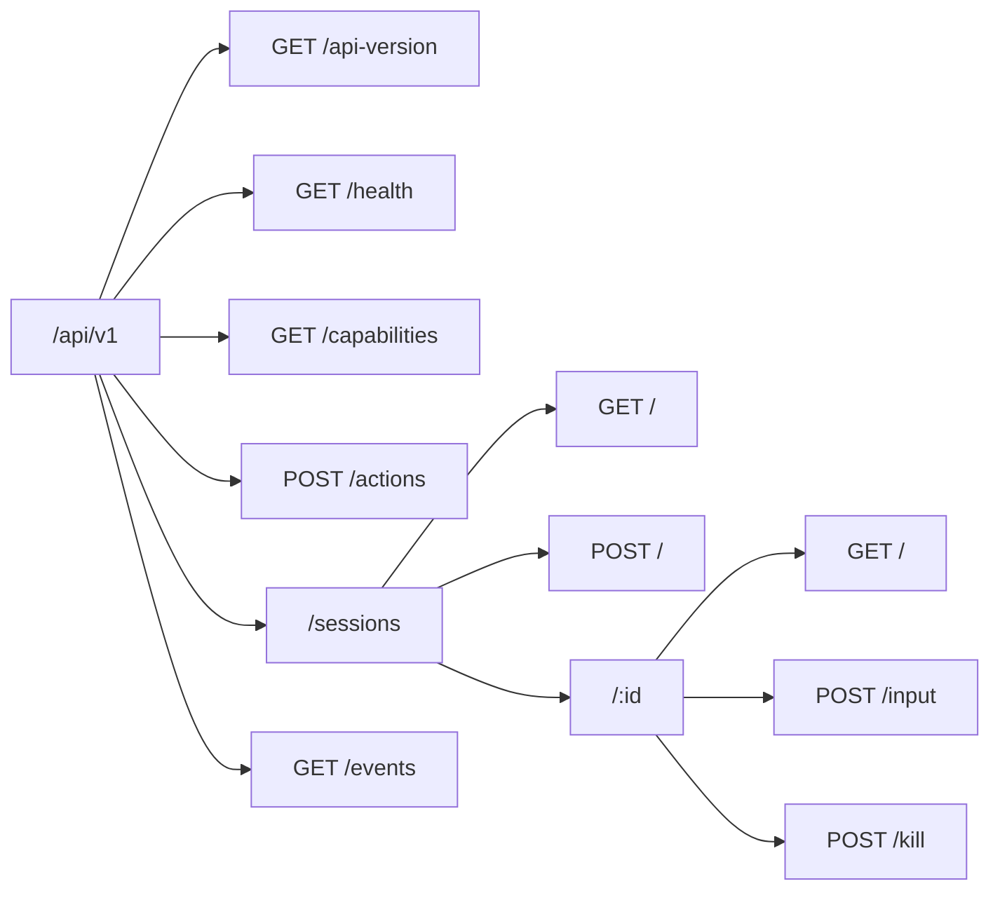

Демон Coven предоставляет свой публичный API как HTTP через Unix socket под `<covenHome>/coven.sock`. Активный контракт — **`coven.daemon.v1`**, обслуживаемый под `/api/v1`.



## Endpoint'ы

| Метод | Путь | Назначение | Тело | Успех | Ошибки |
|---|---|---|---|---|---|
| GET | `/api/v1/api-version` | Активная версия API + поддерживаемые версии. | — | `{ apiVersion, supportedApiVersions }` | — |
| GET | `/api/v1/health` | Доступность демона, версия, capabilities, pid. | — | `{ ok, apiVersion, covenVersion, capabilities, daemon }` | `503 runtime_unavailable` |
| GET | `/api/v1/capabilities` | Каталог capabilities с подсказками политики. | — | `{ capabilities: [...] }` | — |
| POST | `/api/v1/actions` | Маршрутизировать известный id действия плоскости управления. | `{ action, origin, intentId, args }` | `{ ok, accepted, status, event }` | `400 invalid_request` (неизвестное действие) |
| GET | `/api/v1/sessions` | Перечислить активные сессии. | — | `SessionRecord[]` | — |
| POST | `/api/v1/sessions` | Запустить сессию harness'а, ограниченную проектом. | `{ projectRoot, cwd?, harness, prompt, title? }` | `SessionRecord` | `400 project_root_violation`, `400 invalid_request`, `500 pty_spawn_failed` |
| GET | `/api/v1/sessions/:id` | Получить одну сессию. | — | `SessionRecord` | `404 session_not_found` |
| POST | `/api/v1/sessions/:id/input` | Переслать input в живую сессию. | `{ data }` | `{ ok, accepted }` | `404 session_not_found`, `409 session_not_live` |
| POST | `/api/v1/sessions/:id/kill` | Убить живую сессию. | — | `{ ok, accepted }` | `404 session_not_found`, `409 session_not_live` |
| GET | `/api/v1/events` | Прочитать пагинированные события сессии. | — (`?sessionId`, `?afterSeq`, `?afterEventId`, `?limit`) | `{ events, nextCursor, hasMore }` | `400 invalid_request` |

Все ответы об ошибках используют структурированный конверт, задокументированный в [Контракт API](/API-CONTRACT#structured-error-envelope).

## Всегда начинай с health

```http
GET /api/v1/health
```

Ответ говорит тебе активную `apiVersion`, `capabilities` демона и работающий pid/uptime. Рассматривай остальную часть API как неопределённую, пока не прочитаешь эти поля.

См. [Локальный API Coven](/API) для примеров ответов и [Контракт API](/API-CONTRACT) для стабильных форм и конвертов сбоев.

## Связанное

- [Локальный API Coven](/API)
- [Контракт API](/API-CONTRACT)
- [Аутентификация и локальный доступ](/AUTH)
- [Интеграция клиентов](/CLIENT-INTEGRATION)
