Команда, ориентированная на пользователя, — это всегда `coven`. Wrapper-пакеты, такие как `@opencoven/cli`, `@opencoven/cli-macos` и `@opencoven/cli-linux-x64`, устанавливают один и тот же бинарник.

```mermaid
flowchart TB
  Root["coven"] --> TUI["tui (default)"]
  Root --> Doctor["doctor"]
  Root --> Daemon["daemon"]
  Root --> Run["run"]
  Root --> Sessions["sessions"]
  Root --> Attach["attach"]
  Root --> Summon["summon"]
  Root --> Archive["archive"]
  Root --> Sacrifice["sacrifice"]
  Root --> Patch["patch"]
  Root --> Pc["pc (macOS-first)"]

  Daemon --> DStart["start"]
  Daemon --> DStatus["status"]
  Daemon --> DRestart["restart"]
  Daemon --> DStop["stop"]

  Run --> RCodex["codex &lt;prompt&gt;"]
  Run --> RClaude["claude &lt;prompt&gt;"]

  Sessions --> SPlain["--plain"]
  Sessions --> SJson["--json"]
  Sessions --> SAll["--all"]
  Sessions --> SManage["--manage"]

  Patch --> POpenclaw["openclaw &lt;prompt&gt;"]

  Pc --> PcStatus["status [--json]"]
  Pc --> PcTop["top --n N"]
  Pc --> PcDisk["disk"]
  Pc --> PcKill["kill &lt;pid&gt; --confirm"]
  Pc --> PcCache["cache clear --confirm"]
```

## Верхний уровень

| Команда | Действие |
|---|---|
| `coven` | Открывает удобное для новичков интерактивное меню. |
| `coven tui` | Явно открывает TUI slash-команд. |
| `coven doctor` | Обнаруживает поддерживаемые CLI harness'ов и печатает подсказки по установке. |
| `coven daemon start/status/restart/stop` | Управляет локальным демоном. |
| `coven run <harness> <prompt>` | Запускает сессию harness'а, ограниченную проектом. Текущие id harness'ов: `codex`, `claude`. |
| `coven sessions` | Открывает браузер сессий; поддерживает `--plain`, `--json`, `--all` и `--manage`. |
| `coven attach <session-id>` | Воспроизводит/следит за выводом сессии и пересылает input, когда жива. |
| `coven summon <session-id>` | Восстанавливает архивную сессию, затем воспроизводит/следит за ней. |
| `coven archive <session-id>` | Скрывает не выполняющуюся сессию, сохраняя события. |
| `coven sacrifice <session-id> --yes` | Навсегда удаляет не выполняющуюся сессию. |
| `coven patch openclaw <prompt>` | Локальный цикл спасения OpenClaw. Не делает commit или push. |
| `coven pc` | macOS-first диагностика и операции облегчения с явным `--confirm`. |

## Общие флаги по команде

| Команда | Флаги |
|---|---|
| `coven run` | `--cwd <path>`, `--title <text>`, `--json`, `--detach` |
| `coven sessions` | `--plain`, `--json`, `--all`, `--manage` |
| `coven attach` | `--follow` (по умолчанию), `--no-follow` (только replay) |
| `coven sacrifice` | `--yes` (обязательный) |
| `coven daemon start` | `--coven-home <path>` (переопределяет `$COVEN_HOME`) |
| `coven pc kill` | `--confirm` (обязательный) |
| `coven pc cache clear` | `--confirm` (обязательный) |
| `coven pc top` | `--n <N>`, `--verbose` |
| `coven pc status` | `--json` |

## Соглашения по флагам

- **Команды, ограниченные проектом** принимают `--cwd <path>` для каталога запуска внутри корня проекта.
- **Команды, дружественные к pipe** принимают `--plain` для таблиц и `--json` для машинного вывода.
- **Разрушительные команды** требуют `--yes` (или `--confirm` для облегчения `coven pc`).
- **Команды, затрагивающие демон** печатают подсказки по установке/восстановлению, когда socket отсутствует.

## Коды выхода

| Код | Значение |
|---|---|
| `0` | Успех. |
| `1` | Общая ошибка CLI (плохой argv, неизвестная подкоманда). |
| `2` | Ошибка валидации (cwd вне корня, неизвестный id harness'а). |
| `3` | Демон недоступен (socket отсутствует или нездоров). |
| `4` | Разрушительное действие отвергнуто (отсутствует `--yes` / `--confirm`, или цель жива). |
| `>=10` | Зарезервировано для будущих структурированных кодов выхода; текущие сборки могут их ещё не выдавать. |

Команда `coven attach` выходит с кодом выхода базовой сессии, когда сессия больше не жива, поэтому скрипты могут пайпить `coven run … && coven attach <id>` и наблюдать собственный статус harness'а.

## Связанное

- [Начать](/GETTING-STARTED)
- [TUI Coven](/start/coven-tui)
- [Жизненный цикл сессии](/SESSION-LIFECYCLE)
- [Руководство по адаптерам harness'ов](/HARNESS-ADAPTERS)
- [Решение проблем](/TROUBLESHOOTING)
