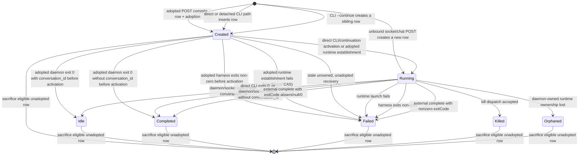

Harness-session rows use the same state vocabulary regardless of which harness is driving them.



## State definitions

Classify the row kind before interpreting its status. Synthetic `active` rows can appear in raw store or list output, but `active` is not a harness-session state.

| Harness-session status | Ledger-terminal? | Meaning |
|---|---|---|
| `created` | No | Ledger row exists before runtime ownership. For an adopted launch, an exit may persist authoritative `idle` or a terminal status before activation; the later `created -> running` compare-and-set returns false and preserves it. A definitive runtime-establishment failure conditionally transitions only a still-`created` row to `failed`; transition-persistence failure leaves retained ambiguity. Generic stale recovery moves only unowned, unadopted, unreserved rows to `failed`; adopted/reserved rows are retained. |
| `running` | No | Reported live state. Inspect whether the row is external before inferring Coven runtime ownership. |
| `idle` | No | A daemon/socket-managed, conversation-grouped session (`conversation_id` present) exited successfully and is waiting for more work. For an adopted row, the exit writer may persist `idle` from `created` or `running`; it is authoritative but nonterminal. CLI and socket/chat continuation create a new row. |
| `completed` | Yes | A direct CLI run persisted a successful harness result (even when `conversation_id` is present), a daemon-managed session without `conversation_id` exited successfully, or an externally registered running session was completed with an absent, `null`, or zero `exitCode`. |
| `failed` | Yes | Launch or execution failed, including a persisted adopted runtime-establishment failure, or an externally registered running session was completed with a nonzero `exitCode`. |
| `killed` | Yes | Terminal in the current ledger. This status is not proof that process termination was acknowledged. |
| `orphaned` | Yes | Runtime ownership was lost and the outcome remains unresolved. |

Archive visibility is stored separately in `archived_at`; it is not a status and therefore does not appear in the lifecycle graph. Archive may set this overlay on a non-running session, including an adopted/reserved row or one with `created` or `idle` status, and summon clears it. Both operations preserve the harness-session status and retention evidence.

On a clean exit, only the daemon/socket-managed path in `daemon.rs` converts a successful harness result to `idle`, and only when `conversation_id` is present. Its event writer updates either an active `created` or `running` row, so a fast adopted conversational exit can persist `created → idle` before the request handler's activation compare-and-set. A direct CLI run persists the harness result, normally `completed`, even when its row has `conversation_id`; a daemon-managed row without `conversation_id` also persists as `completed` after a clean exit. Automatic CLI `coven run <harness> --continue` selects the latest non-archived row for the same project root and harness. Explicit CLI `coven run <harness> --continue <ID>` performs a direct id or conversation lookup and may select an archived row, but rejects a source from another harness. Both forms create a fresh, initially unarchived sibling row grouped by the selected row's `conversation_id`, or by its ledger id when no conversation id exists. The selected row is never reopened or rewritten, so its status, exit code, archive overlay, and timestamps remain persisted evidence. Socket/chat continuation through `POST /api/v1/sessions` also creates a new row, but shares grouping only when the caller explicitly supplies the same `conversationId`; a resume hint does not derive that id automatically.

For an externally registered `running` session, `POST /api/v1/sessions/:id/complete` records the caller-owned outcome: an absent, `null`, or zero `exitCode` moves the row to `completed`, while a nonzero `exitCode` moves it to `failed`. This completion path does not give the daemon runtime ownership. External running sessions remain exempt from daemon orphan recovery, and daemon input and kill requests remain rejected.

## Launch

```bash
coven run codex "describe this repo"
```

Socket client launch (a separate entry path):

```http
POST /api/v1/sessions
Content-Type: application/json

{
  "projectRoot": "/absolute/path",
  "cwd": "/absolute/path/subdir",
  "harness": "codex",
  "prompt": "describe this repo"
}
```

For the unbound socket path, the daemon inserts a new row as `running` before launching the runtime; a successful request returns `201 SessionRecord`, while a launch failure transitions that new row from `running` to `failed`. The new row shares a prior conversation's grouping only when the caller explicitly supplies the same `conversationId`; a resume hint alone does not derive it. The prior row is unchanged. A new direct CLI `coven run` inserts a `created` row, transitions it to `running` only when direct execution activates, and launches the harness. CLI continuation follows the same created-to-running activation path on a fresh sibling row while preserving the selected row exactly. A detached CLI run records the row but spawns no harness and establishes no runtime ownership, so it remains `created`. When an activated harness exits, the direct CLI persists its result, normally `completed` on success, on the new row. The Rust authority layer validates `projectRoot` and `cwd` on each entry path before spawning the PTY. See [Authority boundary](/concepts/authority-boundary).

Adopted `POST /api/v1/adopted-sessions` instead commits a `created` row and
its launch adoption in one transaction before runtime work. Runtime ownership
invokes a terminal-safe `created -> running` compare-and-set exactly once,
immediately after cancellation registration and before initial prompt delivery.
The exit writer may first move `created` or `running` to authoritative
nonterminal `idle` for a successful conversation-grouped session, terminal
`completed` for a successful ungrouped session, or terminal `failed` for a
failed exit. A later activation CAS that finds one of those statuses returns
false and never overwrites it. A definitive runtime-establishment failure
separately conditionally compare-and-sets only `created -> failed`, preserving
an `idle` or terminal winner; publication failure leaves retained ambiguity
and never authorizes relaunch. The synchronous failure remains
`500 launch_failed` with marker-only
`{"adopted":true,"delivery":"not_asserted"}` details. Exact replay returns the
current persisted row—`created`, `running`, `idle`, or terminal `completed`,
`failed`, `killed`, or `orphaned`—and never launches again. Generic
stale-created recovery excludes every launch adoption and historical attempt
reservation.

Adoption evidence survives normal status changes, archive, summon, event
retention, and restart. A crash in the postcommit-to-runtime window remains
ambiguous for O4/O7; O3 retains evidence and performs no automatic
redispatch. The post-adoption marker is available only on synchronous HTTP
failures returned after commit. Asynchronous exit-event/status-persistence
failures are logged and cannot revise an already returned response. Neither
path claims delivery or completion.

## Attach

```bash
coven attach <session-id>
```

`attach` streams output from the event log (replay) and then follows live output. Input is forwarded to the PTY. Use `Ctrl-]` to detach without killing the session.

## Archive / summon / sacrifice

These rituals control stored-session visibility and deletion:

<Columns>
  <Card title="Archive" href="/rituals/archive" icon="archive">
    Hide a non-running session. Reversible. Events preserved.
  </Card>
  <Card title="Summon" href="/rituals/summon" icon="moon-star">
    Clear an archived session's visibility overlay and restore it to the active list with its unchanged status, then replay/follow it.
  </Card>
  <Card title="Sacrifice" href="/rituals/sacrifice" icon="flame">
    Permanently delete an eligible non-running, unadopted session, visible or archived. Adopted/reserved sessions are retained. Requires `--yes`.
  </Card>
</Columns>

Retained evidence produces:
`session adoption evidence is retained; sacrifice is unavailable until an
approved retention/fence contract resolves it`. No retention/fence release
exists in O3.

## Orphan recovery

When the daemon starts, it recovers stale unowned rows:

1. Reads the session ledger.
2. Marks only stale unowned `created` rows without launch-adoption or historical reservation evidence as `failed`.
3. Marks stale daemon-owned `running` rows as `orphaned`, preserving their unresolved outcome. Externally registered running sessions are exempt because the daemon does not own their lifecycle.
4. Refuses to re-attach to a PTY it no longer owns.

See [Orphan recovery](/daemon/orphan-recovery).

## Related

- [Events](/sessions/events)
- [comux JSON sessions](/sessions/comux-json)
- [Rituals](/rituals)
- [CLI: coven sessions](/reference/cli-sessions)
