Every Coven harness session uses the same status vocabulary, regardless of which harness is driving it.

```mermaid
stateDiagram-v2
  [*] --> Created: POST /api/v1/sessions
  Created --> Running: daemon spawns PTY
  Created --> Failed: launch fails / stale unowned recovery
  Running --> Idle: conversational turn completes; reusable
  Running --> Completed: harness exits 0
  Running --> Failed: harness exits non-zero
  Running --> Killed: kill request accepted and persisted
  Running --> Orphaned: recovery cannot prove ownership
  Completed --> Completed: archive sets / summon clears archived_at
  Failed --> Failed: archive sets / summon clears archived_at
  Killed --> Killed: archive sets / summon clears archived_at
  Orphaned --> Orphaned: archive sets / summon clears archived_at
  Completed --> [*]: coven sacrifice --yes
  Failed --> [*]: coven sacrifice --yes
  Killed --> [*]: coven sacrifice --yes
  Orphaned --> [*]: coven sacrifice --yes
```



## State definitions

| Status | Terminal in the current ledger | Meaning |
|---|---:|---|
| `created` | No | Durable row exists; no live runtime has been established. Recovery moves a stale unowned row to `failed`. |
| `running` | No | A daemon-owned or registered external runtime is live. |
| `idle` | No | A conversational turn completed and the session remains reusable. |
| `completed` | Yes | Runtime completion was successful. |
| `failed` | Yes | Launch or runtime completion failed. |
| `killed` | Yes | A kill request was accepted and persisted; this is not proof of acknowledged process termination. |
| `orphaned` | Yes | Recovery cannot prove ownership of a row previously marked running. |

Archive visibility is stored separately in `archived_at` and does not change
the lifecycle status. Synthetic Cast quest-anchor rows may use `active`; that
store value is not a harness-session state and must be classified by row kind
before interpreting status.

## Launch

```bash
coven run codex "describe this repo"
```

Equivalent socket call:

```http
POST /api/v1/sessions
Content-Type: application/json

{
  "projectRoot": "/absolute/path",
  "cwd": "/absolute/path/subdir",
  "harness": "codex",
  "prompt": "describe this repo"
}
```

The Rust daemon revalidates `projectRoot` and `cwd` before spawning the PTY. See [Authority boundary](/concepts/authority-boundary).

## Attach

```bash
coven attach <session-id>
```

`attach` streams output from the event log (replay) and then follows live output. Input is forwarded to the PTY. Use `Ctrl-]` to detach without killing the session.

## Archive / summon / sacrifice

These are the three rituals around non-running sessions. Archive and summon
change `archived_at` without changing the lifecycle status:

<Columns>
  <Card title="Archive" href="/rituals/archive" icon="archive">
    Hide a non-running session. Reversible. Events preserved.
  </Card>
  <Card title="Summon" href="/rituals/summon" icon="moon-star">
    Restore an archived session to the active list with its original terminal status, then replay/follow it.
  </Card>
  <Card title="Sacrifice" href="/rituals/sacrifice" icon="flame">
    Permanently delete. Refuses live sessions. Requires `--yes`.
  </Card>
</Columns>

## Orphan recovery

If the daemon restarts while a daemon-owned PTY was marked `running`, recovery
marks the session `orphaned`. On startup, the daemon:

1. Reads the session ledger.
2. Marks previously `running` daemon-owned rows as `orphaned` when ownership cannot be proved.
3. Marks stale unowned `created` rows as `failed`.
4. Refuses to re-attach to a dead PTY.

See [Orphan recovery](/daemon/orphan-recovery).

## Related

- [Events](/sessions/events)
- [comux JSON sessions](/sessions/comux-json)
- [Rituals](/rituals)
- [CLI: coven sessions](/reference/cli-sessions)
