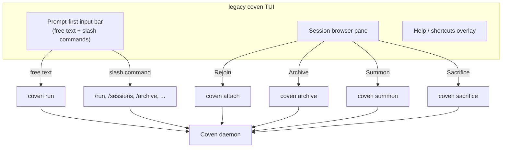

This page describes the older in-process **prompt-first TUI**, internally
branded **Cast**. It is a deprecated, temporary compatibility surface, not the
current recommended interactive UI.

By default, `coven`, `coven chat`, and `coven tui` open the managed Coven
interactive UI powered by `coven-code`. On its first interactive run, Coven
offers to install the pinned engine if it is missing. To use the legacy TUI
described below, explicitly set `COVEN_LEGACY_TUI=1`. This fallback will be
removed.

With that compatibility setting enabled, typed input flows through Cast's spell
parser: every spell is classified, surfaced as a plan card, and run through the
safety gate before any side effect. Plain text is treated as a task for the
default harness; `/run <harness> "<task>"`, `/codex ...`, and `/claude ...`
route directly to a named harness.

## Legacy behavior

| Situation | Best surface |
|---|---|
| Maintaining a temporary legacy workflow | Legacy TUI (`COVEN_LEGACY_TUI=1 coven`) |
| One-off task in a known project | `coven run <harness> "<task>"` |
| Scripting, piping, machine-readable output | `coven sessions --json`, `--plain` |
| Long-running attach/replay | TUI's session browser, or `coven attach <id>` |
| Quick health check | `coven doctor` |

The legacy TUI is a thin presentation layer. Every action it offers maps to an
underlying CLI verb or local IPC API call — the Rust daemon remains the authority.

## Anatomy



The TUI never bypasses the daemon. Project root, cwd, and harness id are revalidated server-side on every launch.

## Legacy input modes

The prompt bar accepts three input shapes interchangeably:

1. **Free-form task text** — anything that does **not** start with `/`. Pressing `Enter` launches the default harness against the current project.

   ```text
   fix the failing tests
   review the diff in packages/cli
   ```

2. **Slash commands** — start with `/` and route to a specific verb.

   ```text
   /run codex "audit this repo"
   /run claude "polish the help text" --title "Help polish"
   /sessions
   /archive session-1
   /help
   ```

3. **Arrow-key navigation** — `↑` / `↓` cycle through the **Commands rail** on the launcher (a windowed list of slash commands, 6 visible at a time with a `N of 14` scroll hint). Pressing `Enter` with an **empty** prompt dispatches the selected slash command; pressing `Enter` with text dispatches the typed spell through Cast.

## Legacy slash command reference

The launcher exposes 14 slash commands in the Commands rail. The Cast parser additionally accepts harness-direct verbs (`/codex`, `/claude`) and natural-language equivalents (e.g. `sessions`, `doctor`, `help`, `quit`).

| Command | What it does |
|---|---|
| `/start` | Setup check and a safe first command. Runs `coven doctor` and points at the next step. |
| `/help` | Show natural-language and slash-command examples. |
| `/tui` | Re-render this launcher palette explicitly. |
| `/doctor` | Check store, project, and harness readiness (`coven doctor`). |
| `/daemon` | Report whether the local Coven daemon is awake (`coven daemon status`). |
| `/run <harness> "<task>"` | Launch a project-scoped session. Same as `coven run`. |
| `/patch` | Open the guided OpenClaw repair room. |
| `/sessions` | Open the session browser (active sessions only). |
| `/all` | Open the session browser including archived sessions. |
| `/attach <session-id>` | Attach to (or replay) a session. |
| `/summon <session-id>` | Restore an archived session, then follow it. |
| `/archive <session-id>` | Hide a non-running session while preserving events. |
| `/sacrifice <session-id>` | Permanently delete a non-running session. Asks you to type `sacrifice` to confirm. |
| `/quit` (alias `/exit`) | Close the TUI cleanly. Equivalent to `Ctrl+C` or `Esc` at the root. |

## Legacy keyboard shortcuts

The launcher footer renders the same hint inline:

> `enter run · ↑↓ select · esc quit · ctrl+u clear`

| Keys | Action |
|---|---|
| `↑ / ↓` | Move selection within the Commands rail. |
| `Enter` | Empty prompt → dispatch the selected slash command. Non-empty → run the typed spell through Cast. |
| `Backspace` | Delete the last character of the prompt. |
| `Ctrl+U` | Clear the prompt. |
| `Esc` | Quit the launcher. |
| `Ctrl+C` | Quit immediately. |

The TUI resizes safely. Terminals as small as 80×24 remain usable; the launcher renders inside a normalized inner width (clamped to 18–96 columns) so single-rule prompts and the two-lane Commands + Snapshot body stay aligned at any size.

## Legacy session browser actions

Selecting a session and pressing `Enter` shows contextual actions. Each one is gated by session state — actions that are not safe for the current state are hidden, not greyed out, so the menu never offers a destructive verb you cannot run.

| Action | Available when | Effect |
|---|---|---|
| **Rejoin** | session is `running` | Attach to the live PTY; input is forwarded to the harness. |
| **View Log** | session is not `running` | Replay the event log (read-only). |
| **Summon** | `archived_at` is set | Restore to the active list and replay/follow. |
| **Archive** | session is not `running` and not archived | Hide from the active list; events preserved. |
| **Sacrifice** | session is not `running` | Permanent delete; requires typed confirmation. |

The map between actions and CLI verbs is documented in [Session lifecycle](/SESSION-LIFECYCLE).

## Legacy SSH and remote use

The TUI survives the usual hostile environments:

- Terminals over SSH (no local mouse/font dependencies).
- Resizing during a session (re-renders on `SIGWINCH`).
- `TERM=xterm-256color` or `screen-256color`.

It does **not** require a graphical terminal, a clipboard backend, or `tmux`. Inside `tmux` or `screen`, the launcher and session browser render cleanly — pane splits and detach still work.

## Plain-text alternative

If you prefer a non-interactive flow (CI, scripting, audit logs), skip the
legacy TUI entirely:

```bash
coven run codex "fix the failing tests"
coven sessions --plain
coven attach <session-id>
```

These verbs produce stable, scriptable output and are the same ones the TUI ultimately routes to.

## Related

- [Get started with Coven](/GETTING-STARTED)
- [Session lifecycle](/SESSION-LIFECYCLE)
- [CLI reference](/reference/cli)
- [Troubleshooting](/TROUBLESHOOTING)
