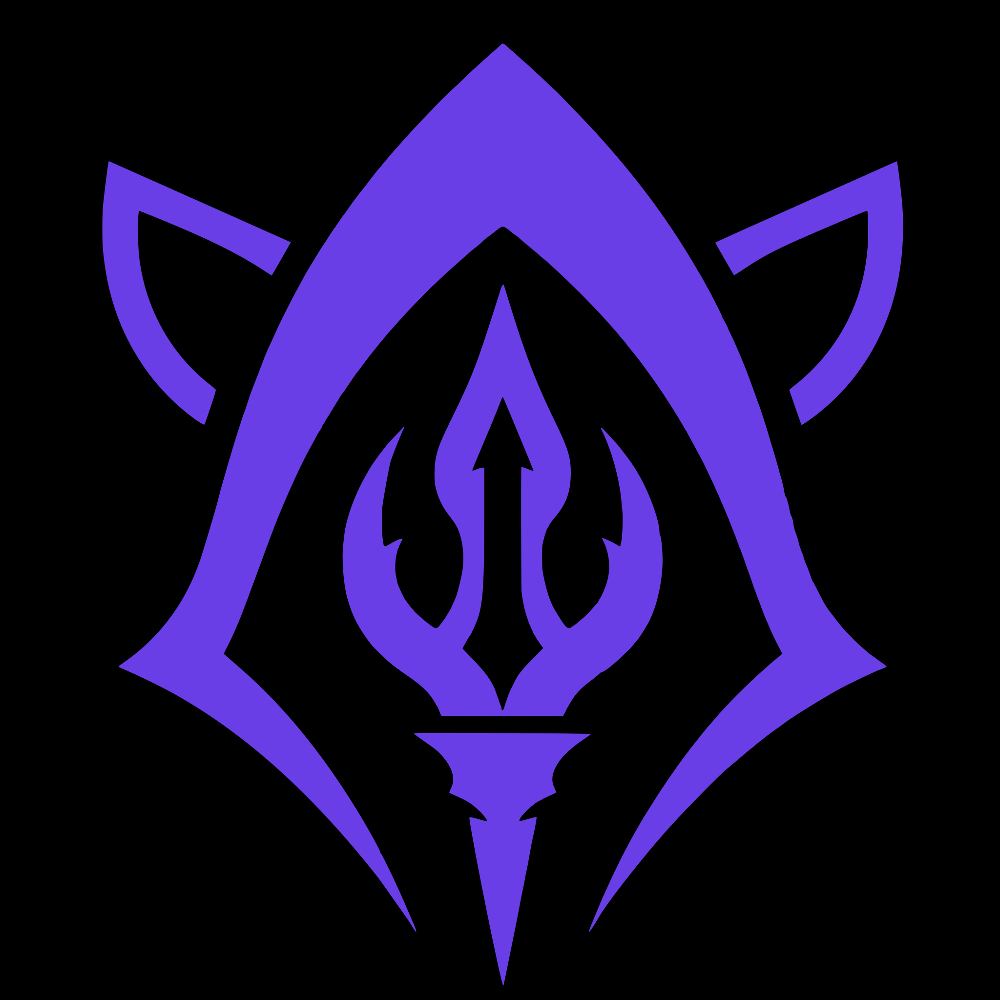

<p align="center">
  
</p>

# @opencoven/coven

OpenClaw ACP runtime bridge for local Coven daemon sessions.

This package installs an **opt-in** OpenClaw plugin with plugin id `opencoven-coven` and ACP backend id `coven`. It lets OpenClaw route ACP coding sessions through a local Coven daemon while keeping OpenClaw's direct ACPX backend as a separately configurable fallback.

OpenClaw core does not include OpenCoven or Coven. This package is the integration boundary: OpenClaw ACP runtime calls enter the plugin, and the plugin talks to the local Coven daemon over the configured Unix socket.

## Requirements

- OpenClaw `>=2026.4.26`
- A local Coven daemon with its Unix socket at `~/.coven/coven.sock` by default
- Harness auth/config handled by the harness itself, for example Codex or Claude Code

See [`../../docs/AUTH.md`](../../docs/AUTH.md) for Coven's auth and local-access model. This plugin does not receive provider credentials and does not authenticate to Coven with OAuth, JWTs, bearer tokens, API keys, or cookies. It validates the configured local socket trust anchor and then relies on the Rust daemon to enforce launch, path, harness, session, input, and kill policy.

## Install

Install the external plugin from ClawHub:

```bash
openclaw plugins install clawhub:@opencoven/coven
```

During development, install from a local checkout:

```bash
openclaw plugins install ./packages/openclaw-coven --force
```

## Configure

Minimal opt-in config:

```json5
{
  acp: {
    enabled: true,
    backend: "coven",
    defaultAgent: "codex",
  },
  plugins: {
    entries: {
      "opencoven-coven": {
        enabled: true,
        config: {
          covenHome: "~/.coven",
        },
      },
    },
  },
}
```

`allowFallback` defaults to `false`. Enable it only when you intentionally want failed/unavailable Coven launches to fall back to another ACP backend such as `acpx`.

By default, the plugin only maps OpenClaw ACP agent ids for the current Coven v0 scope: Codex and Claude Code. Future harness ids, such as Hermes, must be explicitly configured in `harnesses` after the Rust daemon supports and validates them through the generic adapter contract. Do not add special-case OpenClaw or Hermes logic to the daemon.

## Architecture

The plugin:

1. Registers an ACP runtime backend named `coven`.
2. Checks Coven daemon health through the configured Unix socket.
3. Launches sessions with `POST /api/v1/sessions`.
4. Polls `/api/v1/events?sessionId=...` for output and exit events.
5. Maps Coven events into OpenClaw ACP runtime events.
6. Records the Coven session id on the ACP runtime handle.

OpenClaw remains responsible for chat/session routing, ACP bindings, task state, and user-facing delivery. Coven owns project-scoped harness supervision, session metadata, attachability, and event history.

The plugin is a client, not a trust root. The Rust daemon must still validate project roots, cwd, harness ids, session ids, input, and kill requests before acting.

## Safety boundaries

- Disabled by default.
- Requires explicit `plugins.entries["opencoven-coven"].enabled = true` and `acp.backend = "coven"` selection.
- Does not auto-start Coven.
- Does not expose OpenClaw tools to Coven-managed harnesses.
- Restricts socket configuration to `<covenHome>/coven.sock`.
- Rejects unknown ACP agent ids unless explicitly mapped in plugin config.
- Must not be treated as permission to expose the Coven daemon socket through TCP, browser, mobile, or remote transports.

## Version compatibility

| Plugin version | Coven daemon | Notes |
|---|---|---|
| `@opencoven/coven@2026.4.28` | Coven 2026.4.x | Initial tested version pair. Fixture responses live in `src/fixtures/v2026.4/`. |

The compatibility tests in `src/compat.test.ts` verify the plugin against the fixture files for the documented daemon API version. When the Rust daemon changes a response shape for `/api/v1/health`, `/api/v1/sessions`, or `/api/v1/events`, update the matching fixture and re-run the tests.

Fixture field names follow the Rust daemon's serialization rules:
- `GET /api/v1/health` — camelCase (`apiVersion`, `supportedApiVersions`, `ok`, `daemon.pid`, `daemon.startedAt`, `daemon.socket`)
- `GET /api/v1/sessions`, `POST /api/v1/sessions`, `GET /api/v1/sessions/:id` — snake_case (`project_root`, `exit_code`, `created_at`, `updated_at`)
- `GET /api/v1/events` — snake_case (`session_id`, `payload_json`, `created_at`)

## Development notes

The source lives in the Coven repo so the bridge can mature with the Coven daemon/API. Do not add Coven or OpenCoven code back into OpenClaw core as part of normal plugin work.

Because the plugin is externalized, the Coven socket API is a compatibility contract. The plugin uses the current `/api/v1` contract and verifies `GET /api/v1/health` before launching sessions. Plugin changes should be tested against representative daemon responses, and daemon changes that affect `/api/v1/health`, `/api/v1/sessions`, `/api/v1/events`, input, or kill behavior should update this package in the same repo.
