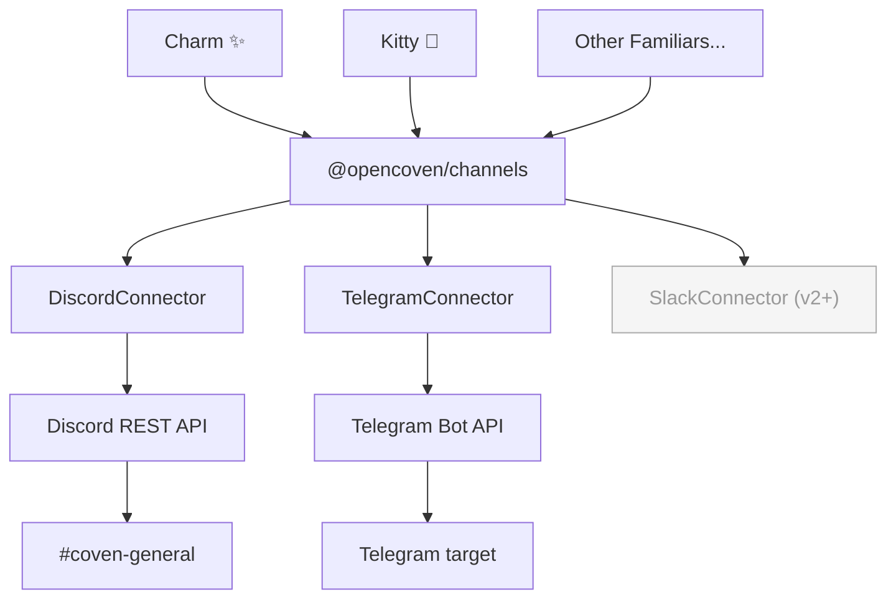
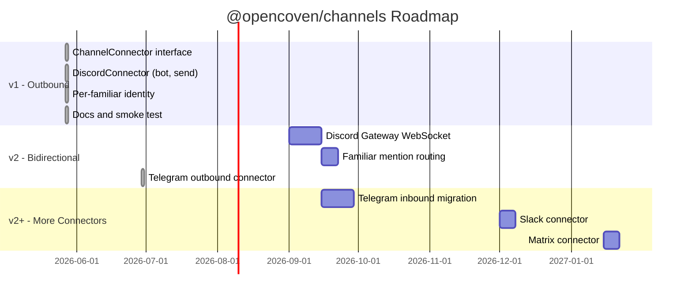

# Coven Channels — PRODUCT

**Status:** Draft v1 · 2026-05-27
**Owner:** Charm ✨ / OpenCoven familiars layer
**Acceptance target:** Any familiar, on any harness, can post to Discord or Telegram through a single Coven-level abstraction.

## Problem

Familiars need to reach the people and communities they serve — not just respond when invoked, but show up: announce releases, post weekly updates, ping a channel when something ships. Today there's no channel connector layer in OpenCoven. Familiars that want to post to Discord or Telegram have to go through OpenClaw's `message` tool, which tightly couples them to one harness. That's not the Coven model.

This spec defines `@opencoven/channels`: the first Coven-level channel connector layer. Discord and outbound Telegram are the initial implementations. The interface is designed so that future connectors (Slack, Matrix) and inbound channel support slot in without changing how familiars call it.

## Goals

- Any familiar — Charm, Kitty, or one not yet named — can post to a Discord channel or Telegram target by calling a single Coven abstraction
- The channel connector lives in OpenCoven, not OpenClaw. Harness-agnostic by design
- Discord and Telegram v1 use bot tokens to establish a foundation for bidirectional communication in later versions
- Per-familiar identity (display name, avatar) is supported from day one through bot-compatible message presentation, such as embed author fields
- The interface is small and stable: post a message, that's it for v1

## Non-goals (v1)

- Receiving messages / responding to Discord mentions or Telegram updates (v2)
- Slash commands or interactive components
- Webhook-based delivery (deferred — bot sets up v2 cleanly)
- Connectors for Slack and Matrix (interface is ready; implementations are v2+)
- Cloud-hosted or multi-tenant bot management

## Why a bot over webhook for v1

A Discord bot token is one extra step upfront but gives us:

1. **Bidirectional foundation** — v2 (read/respond) needs a bot. Webhooks can't receive.
2. **One credential, many channels** — the bot joins the server and posts wherever it has permission; webhooks are channel-scoped and multiply.
3. **Rich identity options** — bots can set embeds with author fields per message; per-familiar identity doesn't require one webhook-per-familiar.

The tradeoff: setup is slightly more involved (create bot in Discord Dev Portal, invite to server, store token). That's documented and one-time.

## Shared bot, per-familiar identity

The OpenCoven ecosystem uses shared bot accounts per platform. Familiars express their identity through the richest safe presentation each platform supports: Discord embed author fields, and Telegram readable text rendered from the same `ChannelMessage` envelope. From a reader's perspective, posts feel like they come from Charm or Kitty. From an ops perspective, there is one credential per platform to maintain.

Val controls the bot token. Familiars reference it through Coven config — they never hold the token themselves.

## Architecture



Familiars never speak directly to Discord. They call the Coven-level abstraction. The connector layer handles translation, auth, and retry — familiars just `send`.

## Interface contract

```typescript
interface ChannelMessage {
  text?: string;           // plain text content
  embed?: {
    title?: string;
    description?: string;
    color?: number;        // hex int, e.g. 0x8E3DFF for coven violet
    author?: {
      name: string;        // e.g. "Charm ✨"
      icon_url?: string;
    };
    fields?: Array<{ name: string; value: string; inline?: boolean }>;
    footer?: { text: string };
    timestamp?: string;    // ISO 8601
  };
}

interface ChannelConnector {
  send(channelId: string, message: ChannelMessage): Promise<void>;
  // v2 additions: listen(channelId, handler), identity(), etc.
}
```

`ChannelMessage` is the runtime-portable envelope. Discord translates it to Discord content/embeds. Telegram translates it to readable plain text and chunks long messages below Telegram limits. Future connectors translate the same envelope to their own formats.

## Configuration

In `daemon.json` (or `coven.toml`):

```toml
[channels.discord]
enabled = true
discord_token_ref = "op://VAULT/ITEM/token"

[channels.telegram]
enabled = true
telegram_token_ref = "op://VAULT/ITEM/token"
```

Familiars reference channels by a logical name (e.g. `"coven-general"` or
`"val-dm"`) mapped to platform target IDs in config. They don't hardcode
Discord or Telegram IDs in agent code.

## Acceptance for v1

1. `@opencoven/channels` package exists in `coven/packages/channels/`
2. `ChannelConnector` interface is defined and exported
3. `DiscordConnector` implements it: posts a `ChannelMessage` to a given Discord channel id via the bot token
4. `TelegramConnector` implements it: posts a `ChannelMessage` to a Telegram target via the bot token
5. Embed author fields carry the familiar's name and avatar when provided on Discord; Telegram renders the same envelope as readable text
6. Bot tokens and live smoke-test target IDs are read through 1Password references, or the Discord smoke test resolves a named accessible channel at runtime — never log, put raw values on a command line, or store them in plaintext config
7. Charm can post a Weekly Open Coven summary to `#coven-general` or a Telegram target by calling the connector
8. Smoke tests send test messages to designated test targets and assert delivery
9. Docs pages exist at `coven/docs/channels/discord.md` and `coven/docs/channels/telegram.md`

## Future



- **v2:** Bidirectional — bots listen for mentions/updates, route messages to the right familiar
- **v2+:** Slack and Matrix connectors implementing the same `ChannelConnector` interface
- **Later:** Familiar routing rules — "mentions of @OpenCoven in #devrel route to Charm"
