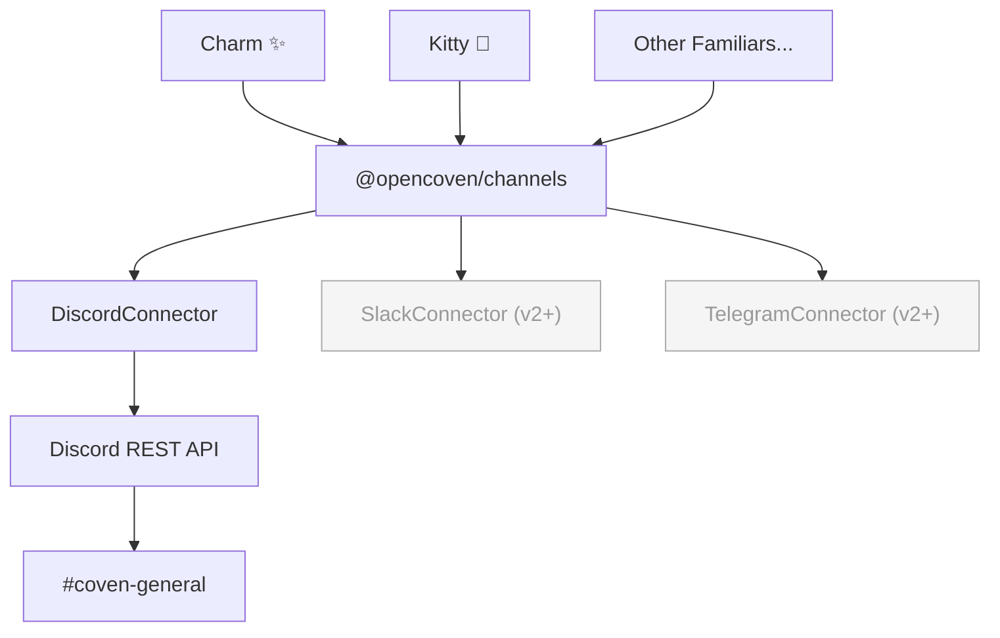
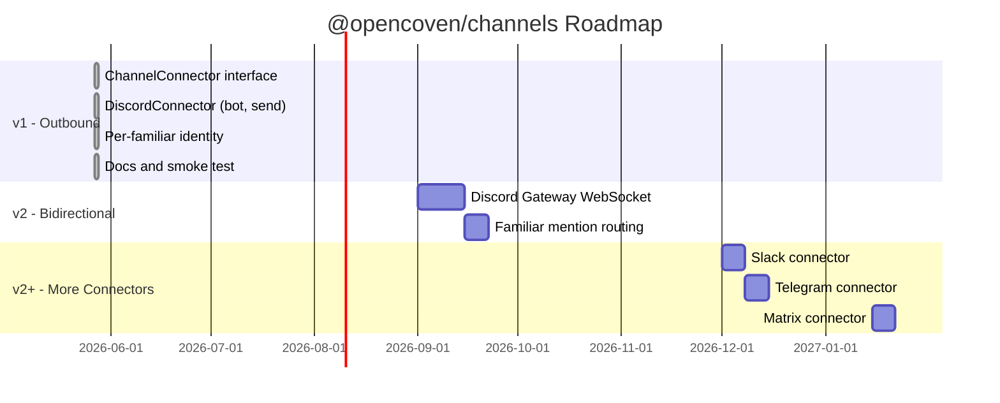

# Coven Channels — PRODUCT

**Status:** Draft v1 · 2026-05-27
**Owner:** Charm ✨ / OpenCoven familiars layer
**Acceptance target:** Any familiar, on any harness, can post to Discord through a single Coven-level abstraction.

## Problem

Familiars need to reach the people and communities they serve — not just respond when invoked, but show up: announce releases, post weekly updates, ping a channel when something ships. Today there's no channel connector layer in OpenCoven. Familiars that want to post to Discord have to go through OpenClaw's `message` tool, which tightly couples them to one harness. That's not the Coven model.

This spec defines `@opencoven/channels`: the first Coven-level channel connector layer. Discord is the initial implementation. The interface is designed so that future connectors (Slack, Telegram, Matrix) slot in without changing how familiars call it.

## Goals

- Any familiar — Charm, Kitty, or one not yet named — can post to a Discord channel by calling a single Coven abstraction
- The channel connector lives in OpenCoven, not OpenClaw. Harness-agnostic by design
- Discord v1 uses a Bot token (not a webhook) to establish a foundation for bidirectional communication in v2
- Per-familiar identity (display name, avatar) is supported from day one via Discord's `username` + `avatar_url` override on webhook-style messages, or via thread/embed author fields through the bot
- The interface is small and stable: post a message, that's it for v1

## Non-goals (v1)

- Receiving messages / responding to Discord mentions (v2)
- Slash commands or interactive components
- Webhook-based delivery (deferred — bot sets up v2 cleanly)
- Connectors for Slack, Telegram, Matrix (interface is ready; implementations are v2+)
- Cloud-hosted or multi-tenant bot management

## Why a bot over webhook for v1

A Discord bot token is one extra step upfront but gives us:

1. **Bidirectional foundation** — v2 (read/respond) needs a bot. Webhooks can't receive.
2. **One credential, many channels** — the bot joins the server and posts wherever it has permission; webhooks are channel-scoped and multiply.
3. **Rich identity options** — bots can set embeds with author fields per message; per-familiar identity doesn't require one webhook-per-familiar.

The tradeoff: setup is slightly more involved (create bot in Discord Dev Portal, invite to server, store token). That's documented and one-time.

## Shared bot, per-familiar identity

The OpenCoven ecosystem uses a single `@OpenCoven` bot. Familiars express their identity through embed author fields (name + icon_url) on each message. From a reader's perspective, posts feel like they come from Charm or Kitty. From an ops perspective, there's one bot to maintain.

Val controls the bot token. Familiars reference it through Coven config — they never hold the token themselves.

## Architecture



Familiars never speak directly to Discord. They call the Coven-level abstraction. The connector layer handles translation, auth, and retry — familiars just `send`.

## Interface contract

```typescript
interface ChannelMessage {
  text?: string;           // plain text content
  embed?: {
    title?: string;
    description?: string;
    color?: number;        // hex int, e.g. 0x8E3DFF for coven violet
    author?: {
      name: string;        // e.g. "Charm ✨"
      icon_url?: string;
    };
    fields?: Array<{ name: string; value: string; inline?: boolean }>;
    footer?: { text: string };
    timestamp?: string;    // ISO 8601
  };
}

interface ChannelConnector {
  send(channelId: string, message: ChannelMessage): Promise<void>;
  // v2 additions: listen(channelId, handler), identity(), etc.
}
```

`ChannelMessage` is the harness-agnostic envelope. The Discord connector translates it to Discord's API format. Future connectors translate the same envelope to their own formats.

## Configuration

In `daemon.json` (or `coven.toml`):

```toml
[channels.discord]
enabled = true
# bot_token read from COVEN_DISCORD_TOKEN env var or keychain; never stored plaintext in config
guild_id  = "123456789"   # optional default server
```

Familiars reference channels by a logical name (e.g. `"coven-general"`) mapped to a Discord channel id in config. They don't hardcode Discord IDs in agent code.

## Acceptance for v1

1. `@opencoven/channels` package exists in `coven/packages/channels/`
2. `ChannelConnector` interface is defined and exported
3. `DiscordConnector` implements it: posts a `ChannelMessage` to a given Discord channel id via the bot token
4. Embed author fields carry the familiar's name and avatar when provided
5. Bot token is read from environment or keychain — never logged or stored in plaintext config
6. Charm can post a Weekly Open Coven summary to `#coven-general` by calling the connector
7. A smoke test sends a test message to a designated test channel and asserts delivery
8. Docs page exists at `coven/docs/channels/discord.md`

## Future



- **v2:** Bidirectional — bot listens for mentions, routes messages to the right familiar
- **v2+:** Slack, Telegram, Matrix connectors implementing the same `ChannelConnector` interface
- **Later:** Familiar routing rules — "mentions of @OpenCoven in #devrel route to Charm"
