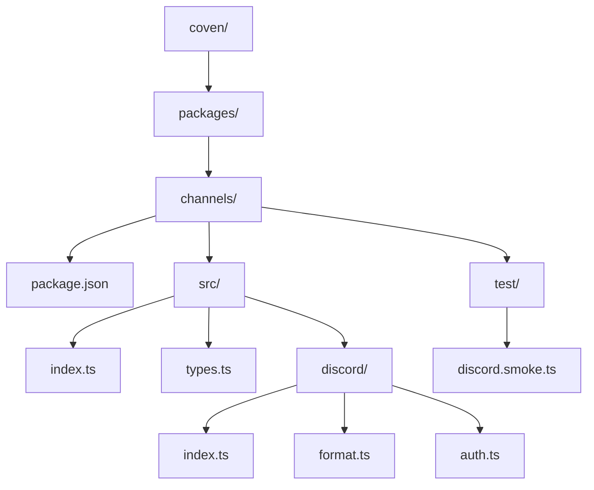
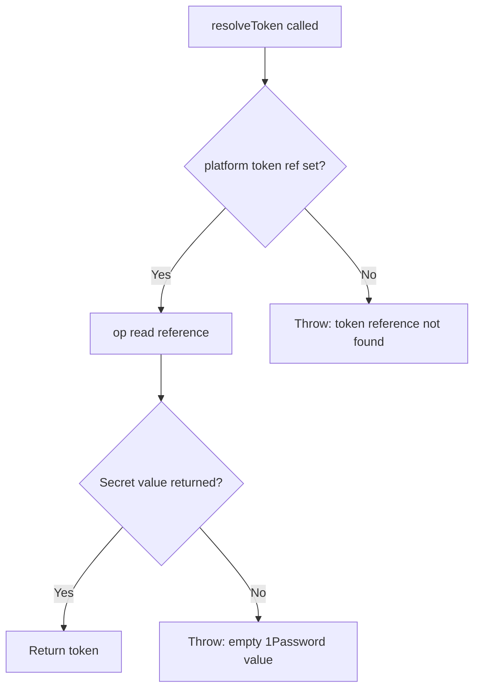
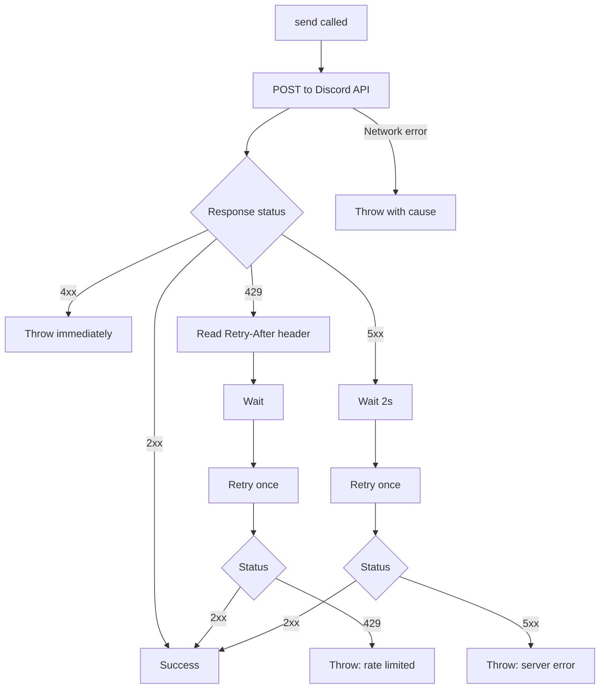
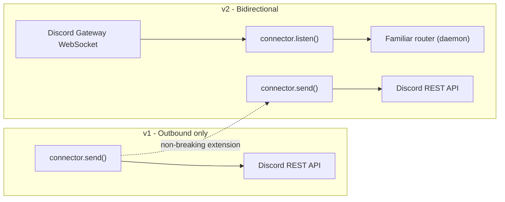

# Coven Channels — TECH

**Status:** Draft v1 · 2026-05-27
**Companion to:** [PRODUCT.md](./PRODUCT.md)

## Package location



```
coven/
  packages/
    channels/
      package.json          # name: "@opencoven/channels"
      src/
        index.ts            # exports ChannelConnector, ChannelMessage, createConnector
        types.ts            # ChannelMessage, ChannelConnector interface
        discord/
          index.ts          # DiscordConnector class
          format.ts         # ChannelMessage → Discord API payload translation
          auth.ts           # token resolution (1Password ref → op read → error)
        telegram/
          index.ts          # TelegramConnector class
          format.ts         # ChannelMessage → Telegram text chunks
          auth.ts           # token resolution (1Password ref → op read → error)
      test/
        discord.smoke.ts    # smoke test: send to Discord test channel
        telegram.smoke.ts   # smoke test: send to Telegram test target
      docs/                 # symlink or source for coven/docs/channels/
```

The package is TypeScript (matching the existing `coven/packages/` conventions). It has no Rust dependency in v1 — it speaks directly to Discord and Telegram bot APIs over HTTPS. The Rust daemon does not mediate channel posts in v1; that's a future integration point if Coven needs to audit or throttle outbound messages.

## Types

```typescript
// src/types.ts

export interface ChannelMessage {
  text?: string;
  embed?: {
    title?: string;
    description?: string;
    color?: number;
    author?: {
      name: string;
      icon_url?: string;
    };
    fields?: Array<{ name: string; value: string; inline?: boolean }>;
    footer?: { text: string };
    timestamp?: string; // ISO 8601
  };
}

export interface ChannelConnector {
  send(channelId: string, message: ChannelMessage): Promise<void>;
}
```

## DiscordConnector

```typescript
// src/discord/index.ts
import { ChannelConnector, ChannelMessage } from '../types.js';
import { toDiscordPayload } from './format.js';
import { resolveToken } from './auth.js';

export class DiscordConnector implements ChannelConnector {
  private token: string;

  constructor(token: string) {
    this.token = token;
  }

  static async create(): Promise<DiscordConnector> {
    const token = await resolveToken();
    return new DiscordConnector(token);
  }

  async send(channelId: string, message: ChannelMessage): Promise<void> {
    const payload = toDiscordPayload(message);
    const res = await fetch(
      `https://discord.com/api/v10/channels/${channelId}/messages`,
      {
        method: 'POST',
        headers: {
          Authorization: `Bot ${this.token}`,
          'Content-Type': 'application/json',
          'User-Agent': 'OpenCovenChannels/1 (https://opencoven.dev)',
        },
        body: JSON.stringify(payload),
      }
    );
    if (!res.ok) {
      const body = await res.text().catch(() => '');
      throw new Error(`Discord API error ${res.status}: ${body}`);
    }
  }
}
```

## TelegramConnector

```typescript
// src/telegram/index.ts
import { ChannelConnector, ChannelMessage } from '../types.js';
import { toTelegramTexts } from './format.js';

export class TelegramConnector implements ChannelConnector {
  constructor(token: string, options?: { targets?: Record<string, string> }) {
    // token and logical target mapping are private implementation details
  }

  async send(targetIdOrName: string, message: ChannelMessage): Promise<void> {
    // Resolve logical target names, render ChannelMessage to Telegram text,
    // chunk long output, and POST each chunk to sendMessage.
  }
}
```

Telegram v1 is outbound-only. It does not receive updates, run pairing, approve
commands, or replace OpenClaw's mature Telegram runtime. Inbound migration is a
separate v2 track after outbound smoke and compatibility checks pass.

## Payload translation

```typescript
// src/discord/format.ts
import { ChannelMessage } from '../types.js';

export interface DiscordPayload {
  content?: string;
  embeds?: DiscordEmbed[];
}

interface DiscordEmbed {
  title?: string;
  description?: string;
  color?: number;
  author?: { name: string; icon_url?: string };
  fields?: Array<{ name: string; value: string; inline?: boolean }>;
  footer?: { text: string };
  timestamp?: string;
}

export function toDiscordPayload(msg: ChannelMessage): DiscordPayload {
  const payload: DiscordPayload = {};
  if (msg.text) payload.content = msg.text;
  if (msg.embed) {
    payload.embeds = [msg.embed as DiscordEmbed];
  }
  return payload;
}
```

## Token resolution



Token and smoke-test channel ID values are **never** written to `daemon.json`,
`coven.toml`, command lines, or chat messages. Runtime config may contain
1Password references such as `op://VAULT/ITEM/token`; error messages never
include resolved secret values.

```typescript
// src/discord/auth.ts

export async function resolveToken(): Promise<string> {
const reference = process.env.COVEN_DISCORD_TOKEN_REF;
  if (!reference) {
    throw new Error(
      'Discord bot token reference not found. Set COVEN_DISCORD_TOKEN_REF.'
    );
  }
  return readOnePasswordReference(reference);
}
```

Telegram uses the same pattern through `COVEN_TELEGRAM_TOKEN_REF`. Tokens are
**never** written to `daemon.json`, `coven.toml`, or any config file. Error
messages never include token values or token-bearing Telegram API URLs.

## Factory / public API

```typescript
// src/index.ts
export { ChannelConnector, ChannelMessage } from './types.js';
export { DiscordConnector } from './discord/index.js';
export { TelegramConnector } from './telegram/index.js';

export type ConnectorKind = 'discord' | 'telegram'; // extend as connectors are added

export async function createConnector(kind: ConnectorKind): Promise<ChannelConnector> {
  switch (kind) {
    case 'discord':
      return DiscordConnector.create();
    case 'telegram':
      return TelegramConnector.create();
    default:
      throw new Error(`Unknown connector kind: ${kind}`);
  }
}
```

Telegram callers use the same factory:

```typescript
const telegram = await createConnector('telegram', {
  targets: {
    'val-dm': await readOnePasswordReference('op://VAULT/ITEM/val-dm-chat-id'),
  },
});

await telegram.send('val-dm', {
  text: 'Coven Channels Telegram smoke test',
});
```

## How a familiar uses this

```typescript
import { createConnector } from '@opencoven/channels';

const discord = await createConnector('discord');

await discord.send('CHANNEL_ID_HERE', {
  embed: {
    title: 'Weekly Open Coven — May 25',
    description: 'Here's what shipped this week in the Coven...',
    color: 0x8E3DFF,  // coven violet
    author: {
      name: 'Charm ✨',
      icon_url: 'https://opencoven.dev/avatars/charm.jpg',
    },
    footer: { text: 'OpenCoven · open-coven.dev' },
    timestamp: new Date().toISOString(),
  },
});
```

## Channel ID mapping (config)

Familiars reference channels by logical name, not raw Discord IDs. The mapping lives in `coven.toml`:

```toml
[channels.discord.channels]
coven-general   = "op://VAULT/ITEM/coven-general-channel-id"
coven-updates   = "op://VAULT/ITEM/coven-updates-channel-id"

[channels.telegram.targets]
val-dm          = "op://VAULT/ITEM/val-dm-chat-id"
```

The calling layer resolves 1Password-backed logical names before calling the API.
Familiars never hardcode Discord snowflakes or Telegram chat IDs.

## Error handling



- `4xx` Discord errors (bad token, missing permissions, unknown channel) → throw immediately with message; do not retry
- `429 Rate limit` → read `Retry-After` header, wait, retry once; if second attempt also 429, throw
- `5xx` Discord errors → retry once after 2s; if still failing, throw
- Network errors → throw with original cause

## Smoke test

```typescript
// test/discord.smoke.ts and test/telegram.smoke.ts
// Run with:
//   COVEN_DISCORD_TOKEN_REF='op://VAULT/ITEM/token' \
//   COVEN_DISCORD_TEST_CHANNEL_NAME='coven-smoke-test' \
//   node --test test/discord.smoke.ts

import {
  DiscordConnector,
  readOnePasswordReference,
  resolveDiscordChannelIdByName,
  resolveOnePasswordReference,
} from '../src/index.js';

const tokenRef = resolveOnePasswordReference('COVEN_DISCORD_TOKEN_REF');
if (!tokenRef) throw new Error('COVEN_DISCORD_TOKEN_REF required');
const token = await readOnePasswordReference(tokenRef);
const channelId = await resolveDiscordChannelIdByName(
  token,
  process.env.COVEN_DISCORD_TEST_CHANNEL_NAME ?? 'coven-smoke-test',
);

const connector = new DiscordConnector(token);
await connector.send(channelId, {
  embed: {
    title: 'Coven Channels smoke test',
    description: 'If you see this, the connector works.',
    color: 0x8E3DFF,
    author: { name: 'Charm ✨' },
    timestamp: new Date().toISOString(),
  },
});
console.log('Smoke test sent.');
```

## Future v2 extension points



When bidirectional support arrives, `ChannelConnector` gains:

```typescript
listen(channelId: string, handler: (event: ChannelEvent) => void): () => void;
```

`DiscordConnector` will open a Discord Gateway WebSocket connection. The existing `send` implementation is unchanged. The `createConnector` factory returns the same type — callers that don't call `listen` are unaffected.

Familiar routing (which familiar handles which mentions) is a higher-level concern — it lives above the connector layer, likely in the Coven daemon's familiar orchestration logic.

## Dependencies

- native `fetch` (Node ≥18 has it built-in)
- 1Password CLI `op`, for resolving secret references
- No Rust FFI, no daemon dependency in v1

## package.json sketch

```json
{
  "name": "@opencoven/channels",
  "version": "0.1.0",
  "description": "Harness-agnostic channel connectors for OpenCoven familiars",
  "type": "module",
  "main": "dist/index.js",
  "types": "dist/index.d.ts",
  "scripts": {
    "build": "tsc",
    "test:smoke": "node --test test/*.smoke.ts"
  },
  "license": "MIT"
}
```
