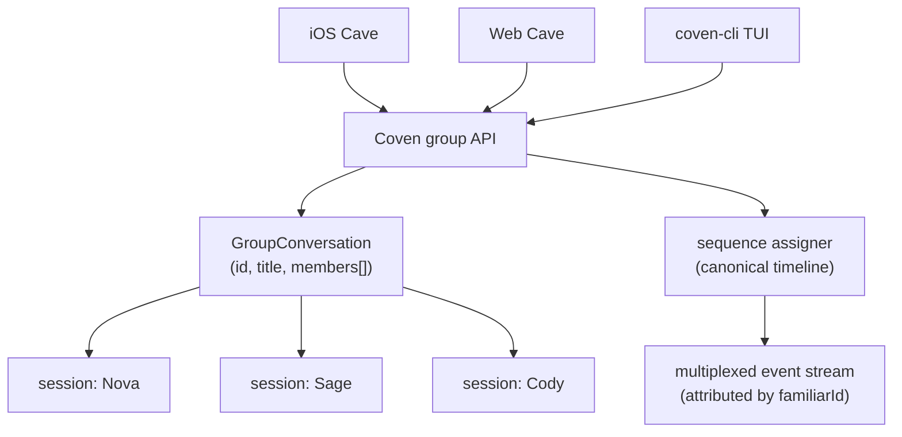
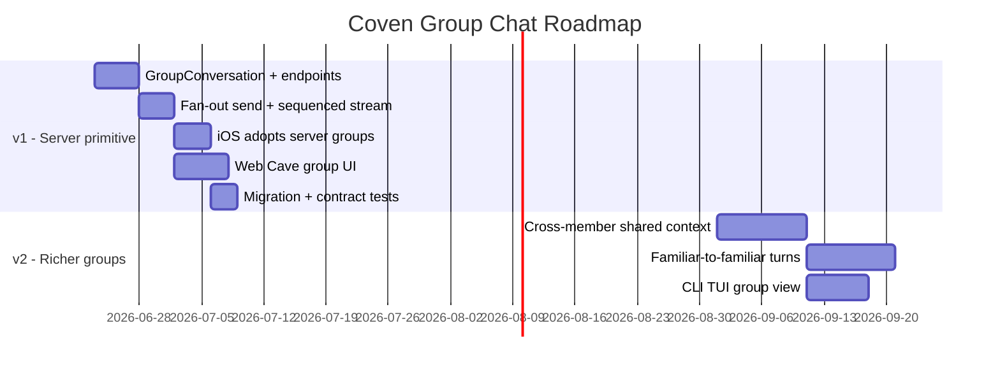

# Coven Group Chat — PRODUCT

**Status:** Draft v1 · 2026-06-23
**Owner:** Nova 🜂 (orchestration draft) → implementation routed to Cody
**Acceptance target:** A group conversation is a first-class server object. iOS, web, and CLI all create, read, and continue the same group, with one synced transcript.

## Problem

Group chat exists on exactly one surface — the iOS Cave — and only as a client-side illusion.

The server has **no multi-familiar concept**. A session is one conversation with one familiar (`/api/chat/send`, `GET/DELETE /api/chat/conversation/:id`). iOS fakes a group by holding a `sessionIds` map (familiarId → sessionId) and fanning a prompt out to N independent sessions concurrently, then streaming each reply into its own attributed bubble (`ChatThread.swift`, lines 36–40).

That illusion has three hard costs:

1. **No cross-device groups.** Group membership and the merged timeline live only in the iOS app's local persistence. Open the same account on web or another device and the group does not exist.
2. **No re-sync.** Direct chats pull-to-refresh from the server; groups cannot (`reSync` no-ops for `isGroup`) because there is no shared turn ordering across the N sessions to merge.
3. **No web / CLI parity.** Web Cave has no group UI at all — its only "group" is *projects grouping single sessions by codebase*. There is nothing on the server for web or CLI to render.

This spec defines a server-side group primitive so a group becomes one durable, synced object that every surface reads the same way.

## Goals

- A group is a real server object: stable `id`, `title`, ordered `memberFamiliarIds`, and a child session per member.
- One inbound user message fans out to every member and returns a **single multiplexed event stream**, each event attributed to the familiar that produced it.
- The server assigns a **monotonic sequence** across all group events (the user turn + each familiar's reply turn) so any client reconstructs one canonical timeline — enabling re-sync and cross-device.
- iOS, web, and CLI use the same group endpoints. No surface owns group state privately.
- Migration path: iOS's existing local `sessionIds` map adopts cleanly into a server group; no data loss.

## Non-goals (v1)

- Familiar-to-familiar turns (a familiar reacting to another familiar's reply in the same turn). v1 fan-out is **parallel and independent** — every member answers the user, not each other.
- Shared/merged context across members (each member's session keeps its own context window). Cross-member context sharing is v2.
- Human↔human group chat. Members are familiars; the user is the single human participant.
- Group-level slash commands beyond what direct chat already supports.
- Real-time presence / typing indicators across devices (the event stream already implies activity; rich presence is later).

## Why server-side, not "just port the iOS fan-out to web"

Porting the client illusion to web would duplicate the bug on a second surface: two clients, two private merged timelines, still no re-sync, still no cross-device. The fan-out logic is cheap; the **canonical ordering and durable membership** are the actual product. Those can only live in one place — the server.

## Architecture



A group owns one child session per member. A user message is appended to the group timeline once (with a sequence number), then dispatched to every member session. Each member's reply turn is folded back into the same timeline under its own sequence + `familiarId`. Every client renders the one ordered transcript.

## Interface contract

```typescript
interface GroupConversation {
  id: string;
  title: string;
  memberFamiliarIds: string[];      // ordered; drives avatar cluster + attribution
  memberSessionIds: Record<string, string>; // familiarId → child sessionId
  createdAt: string;                // ISO 8601
  updatedAt: string;
}

interface GroupEvent {
  seq: number;                      // monotonic, group-scoped — the canonical order
  role: "user" | "familiar";
  familiarId?: string;              // set when role === "familiar"
  text: string;
  streaming: boolean;
  ts: string;                       // ISO 8601
}
```

- `POST /api/groups` → create a group from `{ title?, memberFamiliarIds[] }`; server provisions a child session per member.
- `POST /api/groups/:id/send` → append the user turn, fan out to members, return an SSE stream of `GroupEvent`s (one logical sub-stream per member, interleaved, each carrying `seq` + `familiarId`).
- `GET /api/groups/:id` → the group + its full ordered timeline (backs re-sync and first load on any device).
- `PATCH /api/groups/:id` → rename, add/remove member (add provisions a session; remove archives it).
- `DELETE /api/groups/:id` → delete group + child sessions.
- `GET /api/groups` → list groups for the account.

## Acceptance for v1

1. `GroupConversation` and `GroupEvent` are defined server-side and documented in `coven/docs/API-CONTRACT.md`.
2. Creating a group provisions one child session per member familiar.
3. `send` fans out to all members concurrently and streams attributed `GroupEvent`s with correct, monotonic `seq` values.
4. `GET /api/groups/:id` returns one canonically-ordered transcript that two devices reconstruct identically.
5. iOS group re-sync (pull-to-refresh) works against `GET /api/groups/:id` — the `isGroup` no-op in `ChatThread.reSync` is removed.
6. A group created on iOS is visible and continuable on web, and vice-versa.
7. Migration: an existing iOS local group (its `sessionIds` map) can be adopted into a server group without losing message history.
8. Contract tests cover create / send / fan-out ordering / re-sync / membership change.

## Future



- **v2:** Members can see and build on each other's replies (shared context); familiar-to-familiar turn-taking; CLI group view.
- **Later:** Group-level orchestration (a "facilitator" familiar that routes the user's ask to the right member), and group templates ("Research crew", "Ship review").
