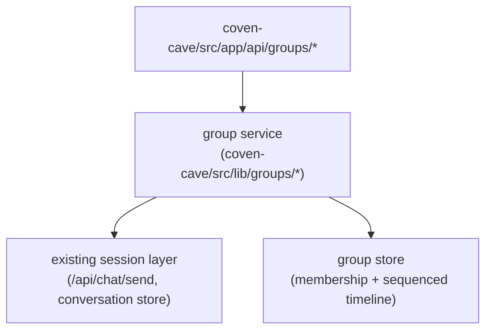
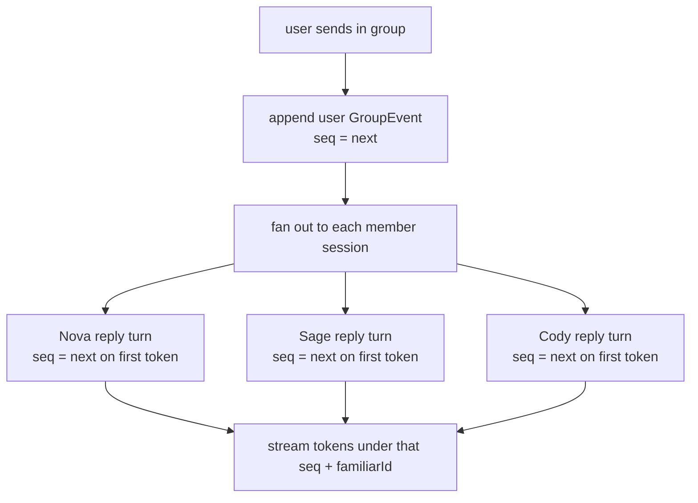
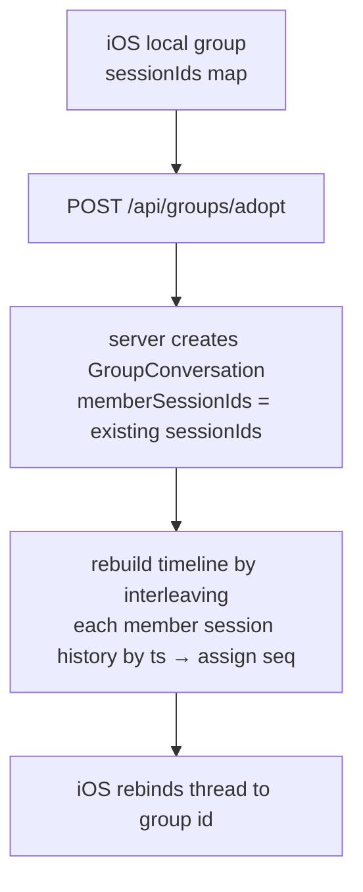

# Coven Group Chat — TECH

**Status:** Draft v1 · 2026-06-23
**Companion to:** [PRODUCT.md](./PRODUCT.md)

## Where this lives

Group chat is a **server primitive**, so the source of truth is the Coven session/daemon layer, surfaced through the Cave's API routes. The existing single-session chat plumbing is the foundation — a group is an orchestration layer *over* sessions, not a parallel system.



```
coven-cave/
  src/
    app/api/groups/
      route.ts                 # GET (list) , POST (create)
      [id]/route.ts            # GET (group + timeline), PATCH (rename/members), DELETE
      [id]/send/route.ts       # POST → fan-out, SSE stream of GroupEvent
    lib/groups/
      types.ts                 # GroupConversation, GroupEvent
      group-store.ts           # persistence: membership + sequenced timeline
      fan-out.ts               # dispatch a turn to N member sessions
      sequence.ts              # monotonic, group-scoped seq assignment
```

The single-session endpoints (`/api/chat/send`, `/api/chat/conversation/:id`) are unchanged. A group's child sessions are ordinary sessions — they remain individually addressable, which is what makes migration and "leave the group, keep the chat" cheap.

## Today's reality (what we build on)

- A session is one conversation with one familiar. `POST /api/chat/send` streams a reply; `GET /api/chat/conversation/:id` returns history; `DELETE` removes it.
- iOS fakes a group: `ChatThread` holds `sessionIds: [String: String]` (familiarId → sessionId) and `send` loops members, calling the single-session stream per member (`ChatThread.swift`). There is no server group, so `reSync` no-ops when `isGroup`.
- Web Cave has no group concept at all.

The migration target is exactly this `sessionIds` map → `GroupConversation.memberSessionIds`.

## Types

```typescript
// src/lib/groups/types.ts

export interface GroupConversation {
  id: string;
  title: string;
  memberFamiliarIds: string[];                 // ordered
  memberSessionIds: Record<string, string>;    // familiarId → child sessionId
  createdAt: string;
  updatedAt: string;
}

export interface GroupEvent {
  seq: number;                  // monotonic within the group — the canonical order
  role: "user" | "familiar";
  familiarId?: string;          // present iff role === "familiar"
  text: string;
  streaming: boolean;
  ts: string;
}
```

## Sequence assignment — the core invariant

The whole point is **one canonical order** every client agrees on. The server, not the client, owns `seq`.



- `seq` is assigned **once per turn**, at the moment a turn begins (user message appended, or a member emits its first token). Tokens for a turn stream under that fixed `seq`.
- Members answer **in parallel**; `seq` order reflects first-token arrival, which is deterministic to replay because it is persisted with the event. Two devices loading `GET /api/groups/:id` get byte-identical ordering.
- This is the single fact iOS lacks today, and it is exactly why iOS groups can't re-sync.

## Fan-out

```typescript
// src/lib/groups/fan-out.ts (sketch)
export async function* fanOut(group, userText) {
  const userEvent = await store.appendUser(group.id, userText); // assigns seq
  yield userEvent;

  // dispatch concurrently to each member's existing session
  const streams = group.memberFamiliarIds.map((fid) =>
    sendToSession(group.memberSessionIds[fid], userText, fid)
  );

  // merge member streams; each member's first token claims a seq
  for await (const ev of mergeAttributed(streams, store, group.id)) {
    yield ev; // GroupEvent with seq + familiarId, streaming flag
  }
}
```

`sendToSession` is the **existing** single-session send path. The group layer adds only: append-once user event, seq assignment, and attributed stream merge. No new model/harness wiring.

## Endpoints

| Method | Path | Body / returns |
| --- | --- | --- |
| `GET` | `/api/groups` | list account's `GroupConversation`s |
| `POST` | `/api/groups` | `{ title?, memberFamiliarIds[] }` → provisions a child session per member; returns `GroupConversation` |
| `GET` | `/api/groups/:id` | `{ group, events: GroupEvent[] }` — full ordered timeline (re-sync + first load) |
| `POST` | `/api/groups/:id/send` | `{ text }` → **SSE stream** of `GroupEvent` |
| `PATCH` | `/api/groups/:id` | rename, or add/remove member (add provisions a session; remove archives it) |
| `DELETE` | `/api/groups/:id` | delete group + child sessions |

SSE framing matches the existing chat stream conventions (`/api/chat/send`, `/api/sessions/[id]/events`) so clients reuse their stream parser — they just additionally read `seq` + `familiarId` off each event.

## Client changes

### iOS (smallest — it already has the shape)
- `ChatThread.memberSessionIds` already exists as `sessionIds`. Bind it to a server `GroupConversation.id`.
- `send` for groups calls `POST /api/groups/:id/send` instead of looping per-member client-side. The attributed bubbles already key on `familiarId` — unchanged.
- Remove the `isGroup` guard in `reSync`; point group re-sync at `GET /api/groups/:id`.

### Web Cave (new UI, existing patterns)
- Add a group thread view that renders one timeline with per-familiar attribution + avatar cluster (mirror iOS `ThreadRow` / `AvatarClusterView`).
- New-group compose reuses the familiar multiselect already present (`familiar-multiselect`).

### CLI (v2)
- TUI group view is deferred to v2; the endpoints are ready for it.

## Migration



- An `adopt` path takes an iOS group's `sessionIds` map, wraps the **already-existing** sessions in a `GroupConversation`, and backfills the timeline by interleaving each child session's history by timestamp to assign `seq`. No history is lost; sessions are reused, not recreated.
- Groups created after v1 ships are server-native from birth and skip adoption.

## Failure / edge handling

- A member session erroring mid-fan-out emits a `GroupEvent` with `streaming:false` + an error marker for that `familiarId` only; other members are unaffected (matches today's per-bubble error isolation).
- Removing a member archives its child session rather than deleting it, so its prior turns stay in the timeline (history must not gain holes).
- Re-sync while a turn is streaming is rejected (same rule as direct chat) so an in-flight reply is never clobbered.

## Dependencies

- No new harness/model wiring — reuses the existing session send + conversation store.
- Group store persistence sits alongside the existing conversation store; schema adds a group table (membership + events with `seq`) or equivalent in whatever the session store already uses.
- No Rust FFI required for v1; the daemon may later audit/throttle group fan-out (same future note as Channels).
