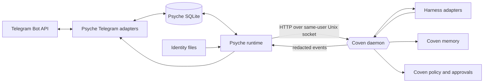

# Psyche Technical Architecture

**Status:** Proposed v1 - design approval required
**Work unit:** `coven-psy0`
**Companion to:** [Product specification](./PRODUCT.md)

## Architecture decision

Psyche ships from a standalone `OpenCoven/psyche` repository as a Rust
workspace. The long-running process is `psyched`; the operator CLI is `psyche`.
The canonical npm package is `@opencoven/psyche`. If npm needs native binary
packages, they use `@opencoven/psyche-<platform>-<arch>` and remain
implementation details of the canonical wrapper. The `@psyches/*` namespace is
outside v1.

This specification is stored in Coven until that repository exists because
Psyche's most important contract is the Coven authority boundary.

## System context



Psyche is authoritative only for its own channel ledger. The Coven daemon is
authoritative for every local execution or policy effect.

## Repository and crate boundaries

```text
psyche/
  Cargo.toml
  crates/
    psyche-core/       # versioned domain types, IDs, errors, route semantics
    psyche-config/     # strict config parsing and validation
    psyche-identity/   # no-follow identity reads, coherence checks, digests
    psyche-store/      # SQLite migrations, transactions, leases, retention
    psyche-telegram/   # Bot API client, polling, webhook, normalization
    psyche-coven/      # coven.daemon.v1 client and capability profile
    psyche-runtime/    # authorization, lanes, orchestration, delivery state
    psyche-cli/        # psyche and psyched entry points
  npm/
    psyche/            # @opencoven/psyche wrapper
    native/            # optional platform packages
  tests/
    contract/          # schema and API compatibility
    crash/             # crash-window and restart replay
    integration/       # fake Telegram and Coven services
    live/              # opt-in Telegram probes
```

Dependency direction is inward:

```text
config/identity/store/telegram/coven -> core
runtime -> core + config + identity + store + telegram + coven
cli -> runtime
```

`psyche-telegram` has no Coven knowledge. `psyche-coven` has no Telegram
knowledge. `psyche-runtime` is the only crate that joins a normalized channel
event to a Coven intent.

## Process model

- One `psyched` process may host multiple accounts.
- An account token is resolved once at startup or explicit reload and remains
  in locked process memory for the account lifetime.
- Every account pins an expected numeric Telegram bot ID. Startup and reload
  block if `getMe` returns another bot, even when the token is otherwise valid.
- One account has one active transport owner. Process-local and database leases
  prevent two Psyche workers from polling one token.
- Horizontal multi-host ownership is not a v1 feature. The database refuses to
  open from a network filesystem unless explicitly supported by a later
  storage profile.
- The webhook listener and Coven socket client are separate trust boundaries.
- Graceful shutdown stops intake, finishes the durable commit in progress,
  releases leases, records delivery ambiguity, and then exits.

## Configuration contract

The root config declares `schema_version = "psyche.config.v1"`. Unknown fields
are errors except under an explicitly versioned `extensions` table. Raw token
values are not valid configuration.

```toml
schema_version = "psyche.config.v1"
data_dir = "/path/to/psyche-data"

[coven]
socket = "/path/to/coven.sock"
required_api_version = "coven.daemon.v1"

[accounts.main]
secret_ref = "op://VAULT/ITEM/token"
expected_bot_id = "987654321"
transport = "polling"
default = true

[accounts.main.telegram]
api_root = "https://api.telegram.org"
media_max_mib = 100

[accounts.webhook]
secret_ref = "op://VAULT/ITEM/token"
expected_bot_id = "123456789"
transport = "webhook"
webhook_secret_ref = "op://VAULT/ITEM/webhook-secret"
webhook_url = "https://bot.example.invalid/telegram"
webhook_bind = "127.0.0.1:8787"

[routes.val_dm]
account = "main"
chat = "123456789"
familiar_id = "cody"
familiar_home = "/path/to/familiars/cody"
project_root = "/path/to/project"
harness = "codex"
dm_policy = "allowlist"
allow_from = ["123456789"]

[routes.dev_topics]
account = "main"
chat = "-1001234567890"
topic = "*"
familiar_id = "cody"
familiar_home = "/path/to/familiars/cody"
project_root = "/path/to/project"
harness = "codex"
group_policy = "allowlist"
group_allow_from = ["123456789"]
require_mention = true
```

`secret_ref` is passed to a configured secret-provider adapter as data, never
interpolated into a shell command. The first-party 1Password adapter invokes
`op` with argv APIs and reads the secret from stdout through a bounded pipe.

Config validation rejects:

- a raw token or token-bearing Bot API URL;
- symlinked identity files;
- relative data, project, familiar, or socket paths;
- a missing or non-numeric expected bot ID;
- multiple default accounts;
- equal-precedence route matches;
- a wildcard DM allowlist without `dm_policy = "open"`;
- empty allowlists under an allowlist policy;
- polling and webhook configuration on the same account;
- webhook mode without a distinct webhook secret reference, URL, and bind
  address;
- a webhook bound beyond loopback without an explicit public-listener flag;
- an unknown schema version, transport, policy, or streaming mode; and
- any route whose project root, identity, or Coven familiar binding cannot be
  validated.

Resolving a token for a different bot ID is not an in-place rotation. The
operator must configure a new account ID or run an explicit audited rebind
while the old account is disabled and has no active work. Rebind archives the
old cursor namespace and invalidates pairings, callback nonces, poll
correlations, cached bot identity, and unsent delivery intents before routes
can validate against the new bot.

Webhook secrets are separate provider references and must resolve to 32-256
characters from Telegram's allowed `A-Z`, `a-z`, `0-9`, `_`, and `-` alphabet.
They never reuse the bot token. Rotation resolves and validates the new secret,
updates Telegram under a fresh `telegram.account.activate` decision, then
atomically makes the new version primary. The listener accepts the prior
version for a five-minute in-flight grace period only after `setWebhook`
succeeds; a failed update leaves the old version active. Logs and health expose
only a version ID and digest prefix. Both secret buffers follow the bot-token
memory and redaction rules.

## Versioned domain schemas

All persisted envelopes carry a schema version. Additive fields may be ignored
only when their containing schema explicitly allows it. Unknown major versions
are quarantined and not dispatched.

### Normalized Telegram event

`psyche.telegram_event.v1` is a discriminated union and the durable input to
authorization and routing. Fields unavailable in a Telegram update are
represented explicitly rather than invented.

```json
{
  "schema_version": "psyche.telegram_event.v1",
  "event_id": "evt_01J...",
  "account_id": "main",
  "update_id": "123456789",
  "received_at": "2026-07-27T00:00:00Z",
  "telegram_time": "2026-07-26T23:59:59Z",
  "actor": {
    "type": "user",
    "user_id": "123456789",
    "username": "display-only",
    "is_bot": false
  },
  "locator": {
    "type": "message",
    "chat_id": "-1001234567890",
    "chat_kind": "supergroup",
    "topic": { "kind": "forum", "id": "42" },
    "message_id": "314",
    "reply_to_message_id": "300"
  },
  "content": {
    "type": "text",
    "text": "Please review this.",
    "entities": []
  },
  "raw_update_sha256": "sha256:..."
}
```

`actor.type` is one of:

- `user` with `user_id`, optional username, and bot flag;
- `chat` with `chat_id` for sender-chat, anonymous, or poll-voter-chat
  attribution; or
- `none` when Telegram supplies no actor.

`locator.type` is one of:

- `message` with chat, optional topic, and message ID;
- `poll` with Telegram poll ID;
- `inline` with inline-message or callback-query ID; or
- `update` with only the update ID for unsupported or global events.

`content.type` is a tagged enum:

- `text`, `command`, `media`, `media_group`, `location`;
- `callback`, `poll`, `poll_answer`, `reaction_change`,
  `reaction_count`;
- `message_edit`, `service_event`; and
- `unsupported`, which is persisted and acknowledged but never dispatched.

`content.type` is the event's only discriminant. Normalized v1 objects reject
unknown fields; optional fields are omitted rather than set to null unless this
section explicitly permits null. Unknown Telegram source fields remain in the
hashed raw update and do not enter a known normalized variant.

Content contracts:

- `text`: required `text` and `entities`. Each entity requires `type`,
  `offset_utf16`, and `length_utf16`; `url`, `user_id`, `language`, and
  `custom_emoji_id` are optional only for Telegram entity types that define
  them.
- `command`: required normalized `name`, exact `args_text`, optional addressed
  `bot_username`, and the original command entity. Names match
  `[a-z0-9_]{1,32}`.
- `media`: required `media_kind`, `file_id`, and `file_unique_id`; optional
  declared byte size, MIME type, original filename, width, height, duration,
  caption, caption entities, and `sticker`. `sticker` may contain emoji, set
  name, type (`regular`, `mask`, or `custom_emoji`), animated/video flags, and
  custom emoji ID. Sizes/dimensions/durations are non-negative integers.
  `media_kind` is `photo`, `animation`, `document`, `audio`, `voice`, `video`,
  `video_note`, or `sticker`.
- `media_group`: required `media_group_id`, `completion` (`complete` or
  `timed_out`), and non-empty `items`. Each item is a `media` payload plus its
  Telegram message ID; item IDs are unique and ordered by message ID.
- `location`: required finite `latitude` and `longitude`; optional horizontal
  accuracy, live period, heading, proximity radius, and `venue`. Venue requires
  title and address and may carry Telegram-supported place IDs.
- `callback`: required `callback_query_id` and exactly one of `data` or
  `game_short_name`. `data` is preserved as exact UTF-8 with a 64-byte maximum.
- `poll` and `poll_answer`: defined under
  [Poll and reaction payloads](#poll-and-reaction-payloads).
- `reaction_change` and `reaction_count`: defined under
  [Poll and reaction payloads](#poll-and-reaction-payloads).
- `message_edit`: required `edit_time` and `new_content`. `new_content` is one
  of `text`, `media`, or `location`; nested edits are invalid.
- `service_event`: required `event_type` and typed `data`. Known v1 event types
  are `member_joined`, `member_left`, `group_migrated`, `topic_created`,
  `topic_closed`, `topic_reopened`, and `message_pinned`. Unknown service types
  become `unsupported`. Their exact data is: joined numeric `user_ids`; left
  numeric `user_id`; migration `from_chat_id` and `to_chat_id`; topic creation
  `topic_id`, `name`, optional icon color/custom emoji; topic close/reopen
  `topic_id`; and pin `message_id`.
- `unsupported`: required `reason` (`unknown_update`,
  `unsupported_channel_post`, `unknown_service_event`, or `invalid_optional_shape`)
  and sorted `telegram_update_keys`; it contains no source payload values.

Normative field requirements:

| Event kind | Actor | Locator | `telegram_time` |
|---|---|---|---|
| `message`, `message_edit`, `service_event`, `media_group` | `user`, `chat`, or `none` as supplied | `message` | Required when Telegram supplies message date; otherwise null |
| `callback` | `user` | `message` or `inline` | Null unless the attached message supplies a date |
| `poll` | `none` | `poll` | Null |
| `poll_answer` | `user` or `chat` | `poll` | Null |
| `reaction_change` | `user` or `chat` | `message` | Required |
| `reaction_count` | `none` | `message` | Required |
| `unsupported` | Any supplied variant or `none` | Best available locator or `update` | Nullable |

Events without a message locator do not create a conversation turn unless they
correlate to an existing Psyche poll, callback, or delivery record. Their lane
is derived from the correlated record; otherwise it is an account-scoped
object lane and cannot inherit a chat authorization context.

Chat IDs, user IDs, message IDs, topic IDs, and update IDs are stored as
decimal strings at schema boundaries where JavaScript precision could
otherwise corrupt them.

### Identity snapshot

`psyche.identity_snapshot.v1` is computed before route activation and pinned to
each turn.

```json
{
  "schema_version": "psyche.identity_snapshot.v1",
  "familiar_id": "cody",
  "declaration_digest": "sha256:...",
  "identity_file_digest": "sha256:...",
  "identity_digest": "sha256:...",
  "soul_digest": "sha256:...",
  "role_skill_digest": "sha256:...",
  "coven_familiar_id": "cody",
  "coven_identity_digest": "sha256:...",
  "coven_ward_revision": "ward_01J...",
  "resolved_at": "2026-07-27T00:00:00Z"
}
```

`identity_file_digest` covers the exact `IDENTITY.md` bytes.
`identity_digest` is the aggregate over all named identity inputs. The snapshot
stores digests and identifiers, not a second mutable copy of the identity. Turn
construction reads the validated file handles and verifies the digests again
immediately before the Coven request. The route activates only when every
per-input digest and `identity_digest == coven_identity_digest`.

Coven returns the canonical comparison as `coven.identity_binding.v1`:

```json
{
  "schema_version": "coven.identity_binding.v1",
  "familiar_id": "cody",
  "inputs": {
    "declaration": "sha256:...",
    "identity": "sha256:...",
    "soul": "sha256:...",
    "role_skill": "sha256:..."
  },
  "identity_digest": "sha256:...",
  "ward_revision": "ward_01J..."
}
```

Missing or additional protected inputs, digest disagreement, an unknown schema
version, or a changed Ward revision blocks route activation.

### Familiar identity rebind

An intentional change to any protected familiar identity input is a controlled
security migration, not a permissive reload. File watching may detect the
change, but detection only moves every affected route to `blocked` with
`identity_changed`; it grants no authority to adopt the new identity.

Reactivation requires the operator to invoke the versioned
`coven.familiar.identityRebind.v1` control action through
`coven.control.actions` using a current `coven.operatorIdentity.v1` context.
Coven is authoritative for policy and approval. The request contains:

- canonical familiar ID and project binding;
- old and proposed `psyche.identity_snapshot.v1` input and aggregate digests;
- old and proposed Ward revisions;
- affected route and conversation IDs;
- every `coven_adoption_unknown` client intent ID under the old binding;
- a human-supplied reason and client intent ID; and
- a digest of the exact proposed rebind record.

Psyche first stops new admissions for the affected routes and waits for every
lane to reach a durable local boundary. A rebind is rejected while a known turn
submission, output adoption, approval, callback, or Telegram delivery remains
active. A `delivery_unknown` must first use its normal audited resolution path.
A `coven_adoption_unknown` row is already a durable local boundary, but it does
not authorize rebind locally: Coven must atomically resolve or quarantine every
listed intent, fence the old familiar/identity/Ward binding from new input, and
guarantee that no adopted old-bound session can continue before allowing the
rebind. If Coven cannot prove that fence, the route remains blocked.

After Coven returns an adopted allow result bound to every request field and
the old-binding fence, Psyche atomically archives the old
route-to-conversation bindings, invalidates pairings and callback nonces whose
policy/identity binding changed, records the old/new snapshots, intent
dispositions, and Coven correlation IDs in the audit ledger, and activates the
new snapshot. Existing Coven sessions remain permanently bound to the old
identity digest and Ward revision; they may be inspected or terminated but
never resumed or receive input under the new identity. The next accepted turn
creates a new conversation generation and session binding.

Lost rebind responses use the same client-intent adoption lookup discipline as
turns. An inconclusive result leaves the route blocked; Psyche never repeats
the action with another digest or locally declares the new identity active.

### Coven turn intent

`psyche.coven_turn.v1` is an internal request record, not a replacement for the
Coven API:

```json
{
  "schema_version": "psyche.coven_turn.v1",
  "intent_id": "intent_01J...",
  "operation": "launch",
  "event_id": "evt_01J...",
  "conversation_key": "conv_01J...",
  "action_class": "telegram.turn.dispatch",
  "requester": {
    "type": "telegram_user",
    "account_id": "main",
    "user_id": "123456789"
  },
  "familiar_id": "cody",
  "identity_digest": "sha256:...",
  "ward_revision": "ward_01J...",
  "project_root": "/path/to/project",
  "harness": "codex",
  "surface": {
    "account_id": "main",
    "chat_id": "-1001234567890",
    "topic_kind": "forum",
    "topic_id": "42",
    "relationship": "reply_same_topic"
  },
  "event_digest": "sha256:...",
  "authorization": {
    "decision_id": "decision_01J...",
    "effect_digest": "sha256:...",
    "request_digest": "sha256:...",
    "policy_revision": "policy_01J...",
    "ward_revision": "ward_01J...",
    "expires_at": "2026-07-27T00:05:00Z"
  },
  "session_request": {
    "project_root": "/path/to/project",
    "cwd": "/path/to/project",
    "harness": "codex",
    "prompt": "Typed current message and bounded observed context.",
    "familiar_id": "cody",
    "familiar_identity_digest": "sha256:...",
    "familiar_ward_revision": "ward_01J...",
    "conversation": { "mode": "init", "id": "conv_01J..." }
  },
  "session_request_digest": "sha256:...",
  "expires_at": "2026-07-27T00:05:00Z",
  "state": "ready",
  "submit_attempt": 0
}
```

The prompt sent to Coven contains normalized current-message content and
bounded observed context. It does not contain a competing persona, hidden
permission grant, bot token, or untrusted text represented as system
instruction. `operation` is `launch` or `input`; input records additionally
name the existing session. The encrypted `turn_intents` row stores this exact
request and all bindings before network submission.

### Coven authorization request and decision

Capability presence is discovery only. Psyche sends
`psyche.coven_authorization.v1` in the `args` of the advertised
`coven.psyche.authorize` action before every effect:

```json
{
  "schema_version": "psyche.coven_authorization.v1",
  "intent_id": "intent_01J...",
  "action_class": "telegram.reply.send",
  "requester": {
    "type": "familiar_session",
    "session_id": "session-1",
    "familiar_id": "cody",
    "caused_by_intent_id": "intent_01J..."
  },
  "surface": {
    "channel": "telegram",
    "account_id": "main",
    "chat_id": "-1001234567890",
    "chat_kind": "supergroup",
    "topic_kind": "forum",
    "topic_id": "42",
    "relationship": "reply_same_topic"
  },
  "binding": {
    "type": "familiar_effect",
    "familiar_id": "cody",
    "identity_digest": "sha256:...",
    "ward_revision": "ward_01J...",
    "project_root": "/path/to/project"
  },
  "effect": {
    "schema_version": "psyche.telegram_effect.v1",
    "type": "send_message",
    "format": "html",
    "text": "Review complete.",
    "reply_to_message_id": "314",
    "buttons": [],
    "link_preview": { "enabled": true }
  },
  "claimed_effect_digest": "sha256:...",
  "claimed_request_digest": "sha256:...",
  "expires_at": "2026-07-27T00:05:00Z"
}
```

`requester.type` is `telegram_user` for inbound turn dispatch and pairing
requests, `familiar_session` for model-originated replies/actions, and
`telegram_approver` for Telegram approval decisions. `local_operator` carries
only an opaque, unexpired `operator_context_id` minted by Coven; Psyche may not
self-assert a principal ID. The corresponding numeric user ID, account, and
callback binding are required for Telegram actors.

`coven.operatorIdentity.v1` lets the local `psyche` CLI request
`coven.operator_context.v1` over the same-user socket:

```json
{
  "schema_version": "coven.operator_context.v1",
  "operator_context_id": "operator_01J...",
  "principal_id": "principal-local-owner",
  "auth_strength": "same_user_local",
  "expires_at": "2026-07-27T00:10:00Z"
}
```

Coven derives the principal and revalidates the context on every action.
Required CLI sends, polls, buttons, pins, force-document sends, and local
pairing approvals use `local_operator`. Missing operator identity capability
disables those commands and blocks Telegram parity release.

`telegram.account.activate` is the only non-per-effect decision. Its requester
is `operator_config`; its surface contains account ID, expected numeric bot ID,
transport mode, and API root; and its binding contains Coven client identity
and the full account config digest instead of familiar/project fields. It
permits only the listed protocol administration needed to receive updates or
fetch media for a locally ACL-admitted event; it cannot send message content,
typing, callback answers, reactions, or other familiar-visible effects. Psyche
renews it on config reload and at least daily. All other action classes require
the full actor/session, familiar, identity, Ward, project, and conversation
surface binding shown above.

The account-activation request and response use
`binding.type = "account_activation"` with `coven_client_id`, `account_id`,
`expected_bot_id`, `transport`, `api_root`, and `config_digest`. Every other
request and decision uses `binding.type = "familiar_effect"`. Unknown binding
types or fields are denied.

Every send-like request has a target `relationship`:

- `reply_same_dm`, `reply_same_group`, or `reply_same_topic`;
- `cross_chat`; or
- `broadcast`.

Psyche supplies a claimed relationship. Coven derives it from the originating
event/session, target surface, and optional broadcast batch, rejects a
mismatch, and returns the derived value in the decision binding. Generic media,
sticker, location, poll, and pin action classes therefore cannot hide whether
their target is a DM reply, public group/topic reply, cross-chat send, or
broadcast.

Known v1 action classes are:

- `telegram.account.activate`, which alone covers `getMe`, `getUpdates`,
  webhook setup/cleanup, command-menu synchronization, and Telegram file
  metadata/download for one exact account configuration;
- `telegram.turn.dispatch`, `telegram.reply.send`,
  `telegram.group_reply.send`, `telegram.broadcast.send`,
  `telegram.cross_chat.send`;
- `telegram.chat_action.send`, `telegram.callback.answer`;
- `telegram.artifact.admit`;
- `telegram.message.edit`, `telegram.message.delete`,
  `telegram.message.react`, `telegram.poll.create`,
  `telegram.message.pin`;
- `telegram.media.send`, `telegram.sticker.send`,
  `telegram.location.send`;
- `telegram.topic.create`, `telegram.topic.edit`;
- `telegram.pairing.prompt`, `telegram.pairing.approve`;
- `telegram.approval.prompt`; and
- `telegram.approval.resolve`;
- `telegram.delivery.resolve_unknown`.

Each action class accepts exactly one `psyche.telegram_effect.v1` type:

| Action class | `effect.type` | Required effect fields |
|---|---|---|
| `telegram.account.activate` | `account_activation` | account ID, expected bot ID, transport, API root, webhook/command config digest |
| `telegram.artifact.admit` | `admit_artifact` | source event/surface, media metadata and byte hash, prospective turn intent, project/familiar/identity/Ward binding, expiry |
| `telegram.turn.dispatch` | `turn` | complete `psyche.telegram_event.v1`, route ID, conversation key, ordered Coven artifact IDs, exact session-request digest |
| `telegram.reply.send`, `telegram.group_reply.send`, `telegram.broadcast.send`, `telegram.cross_chat.send` | `send_message` | format, exact text, target relationship, and materialized link-preview object; optional reply/quote metadata and buttons |
| `telegram.chat_action.send` | `chat_action` | Telegram chat action and bounded duration |
| `telegram.callback.answer` | `callback_answer` | callback query ID, optional exact text, alert flag, cache seconds |
| `telegram.message.edit` | `edit_message` | message ID and exactly one of new text/caption/buttons; text edits also carry materialized link-preview policy |
| `telegram.message.delete` | `delete_message` | message ID |
| `telegram.message.react` | `set_reaction` | message ID, ordered typed reactions |
| `telegram.poll.create` | `create_poll` | question, 1-12 options, anonymity, multi-answer, duration |
| `telegram.message.pin` | `pin_message` | message ID and notification flag |
| `telegram.media.send` | `send_media` | media kind, ordered Coven artifact IDs with hash/size/type, caption, force-document flag |
| `telegram.sticker.send` | `send_sticker` | Telegram file ID |
| `telegram.location.send` | `send_location` | coordinates and optional venue |
| `telegram.topic.create` | `create_topic` | name and optional icon fields |
| `telegram.topic.edit` | `edit_topic` | topic ID and explicit rename/icon/close/reopen mutation |
| `telegram.pairing.prompt` | `pairing_prompt` | pairing request ID, numeric sender, DM surface, expiry |
| `telegram.pairing.approve` | `pairing_decision` | pairing request ID, numeric sender, DM scope, approve/reject |
| `telegram.approval.prompt` | `approval_prompt` | Coven approval ID, action digest, redacted summary, destination, expiry |
| `telegram.approval.resolve` | `approval_decision` | Coven approval ID, action digest, approve/reject, callback nonce hash |
| `telegram.delivery.resolve_unknown` | `resolve_delivery_unknown` | original delivery/effect/attempt IDs, `abandon`/`retry`/`send_clarification`, explicit duplicate-risk acknowledgement |

All effect variants reject unknown fields. Fields listed as exact are included
verbatim in policy evaluation; binary media is represented only by
Coven-owned artifact IDs and hashes. The outer surface and binding must equal
the effect's target and authority fields. For `turn`, `session_request_digest`
is computed over the exact prompt, project root, cwd, harness, familiar
ID/identity/Ward binding, and conversation descriptor that will be submitted to
the session API.

`send_message.link_preview` and text-bearing `edit_message.link_preview`
contain `enabled` plus optional `url`, `prefer_small_media`,
`prefer_large_media`, and `show_above_text`. Mutually exclusive size
preferences are invalid. Psyche materializes the route's declared default into
every send and cumulative/final streaming edit before digesting, so Telegram
never receives an undigested preview policy. Caption-only and button-only edits
omit the object.

A send-like effect created to resolve an unknown delivery must include:

```json
{
  "recovery": {
    "root_delivery_id": "del_root",
    "parent_delivery_id": "del_unknown",
    "unknown_effect_digest": "sha256:...",
    "unknown_attempt_id": "attempt_01J...",
    "resolution_decision_id": "decision_resolve_01J...",
    "resolution_effect_digest": "sha256:...",
    "duplicate_risk_acknowledged": true
  }
}
```

The recovery object is part of the effect digest. Coven verifies the resolution
decision and ancestry before authorizing the new physical send. It is forbidden
on a delivery that has no unknown parent.

Unknown action classes, effect types, or class/effect combinations are denied.
Psyche computes `claimed_effect_digest` as SHA-256 over RFC 8785 canonical JSON
of `effect`. It computes `claimed_request_digest` over the complete request with
that field omitted. Coven independently parses the typed effect, recomputes
both digests, rejects disagreement, evaluates the actual fields, and returns
only its computed values.

Coven returns `coven.psyche_decision.v1`:

```json
{
  "schema_version": "coven.psyche_decision.v1",
  "decision_id": "decision_01J...",
  "intent_id": "intent_01J...",
  "action_class": "telegram.reply.send",
  "outcome": "allow",
  "request_digest": "sha256:...",
  "effect_digest": "sha256:...",
  "binding": {
    "type": "familiar_effect",
    "familiar_id": "cody",
    "identity_digest": "sha256:...",
    "ward_revision": "ward_01J...",
    "project_root": "/path/to/project",
    "account_id": "main",
    "chat_id": "-1001234567890",
    "topic_kind": "forum",
    "topic_id": "42",
    "relationship": "reply_same_topic"
  },
  "policy_revision": "policy_01J...",
  "expires_at": "2026-07-27T00:05:00Z",
  "approval_id": null
}
```

`outcome` is `allow`, `deny`, or `requires_approval`. Psyche proceeds only on
`allow` after verifying every echoed binding, request digest, action class, and
effect digest, including the Ward revision and expiry. `requires_approval` must
include an opaque `approval_id`; it does not authorize the effect. A later
approval decision produces a new allow decision for the same effect digest.
Decisions are single-effect and cannot authorize a different message part,
target, or mutation.

### Delivery intent

`psyche.delivery.v1` records one logical Telegram effect:

```json
{
  "schema_version": "psyche.delivery.v1",
  "delivery_id": "del_01J...",
  "intent_id": "intent_01J...",
  "action_class": "telegram.reply.send",
  "account_id": "main",
  "chat_id": "-1001234567890",
  "topic": { "kind": "forum", "id": "42" },
  "relationship": "reply_same_topic",
  "effect": {
    "schema_version": "psyche.telegram_effect.v1",
    "type": "send_message",
    "format": "html",
    "text": "Review complete.",
    "reply_to_message_id": "314",
    "buttons": [],
    "link_preview": { "enabled": true }
  },
  "effect_digest": "sha256:...",
  "authorization": {
    "decision_id": "decision_01J...",
    "request_digest": "sha256:...",
    "policy_revision": "policy_01J...",
    "ward_revision": "ward_01J...",
    "expires_at": "2026-07-27T00:05:00Z",
    "state": "reserved"
  },
  "logical_response_id": "response_01J...",
  "logical_part": 0,
  "state": "ready",
  "attempt_count": 0,
  "telegram_message_id": null
}
```

The canonical effect object and its digest are immutable. One decision ID
authorizes exactly one physical Bot API request.
`delivery_authorizations.decision_id` is globally unique, and each row moves
once from `reserved` to `consumed` in the same transaction that records the
physical attempt ID and moves its delivery to `sending`. A consumed decision
can never be attached to another delivery or attempt. Each formatted chunk,
preview create/edit/delete, and fallback is a separate effect, decision, and
delivery row linked by `logical_response_id` and ordered by `logical_part`. A
renewed decision for the same unsent/retryable effect is appended to
`delivery_authorizations` and becomes current; it does not rewrite the effect
or any prior decision record. Each append-only authorization stores its own
request digest because intent ID and expiry change on renewal.
`delivery_intents` points to the current authorization row.
Recovery rows additionally persist acyclic `recovery_root_id`,
`recovery_parent_id`, and `resolution_decision_id` foreign keys.

States are:

```text
ready -> sending -> sent
                -> retryable
                -> delivery_unknown
                -> failed
ready -> failed
ready -> abandoned
retryable -> sending
retryable -> failed
retryable -> dead_letter
retryable -> abandoned
delivery_unknown -> abandoned
delivery_unknown -> resolving_unknown
resolving_unknown -> compensated
resolving_unknown -> delivery_unknown
```

`sent`, `failed`, `dead_letter`, `abandoned`, and `compensated` are terminal.
`delivery_unknown` requires a policy-specific operator or compensating decision;
it is never silently converted to `sent`. Authorization denial, mismatch, or
expiry before a send uses `ready/retryable -> failed`. Attempt/age exhaustion
uses `retryable -> dead_letter`. Acquiring a retry lease and incrementing the attempt
counter occur in the same transaction as `retryable -> sending`, and that
transaction requires a fresh Coven decision for the same immutable
effect/surface. The decision attached to `ready` is marked consumed by the first
`ready -> sending` transaction, even if the process later proves no bytes were
written. A crash before that transaction leaves the decision unused and
reusable only while it remains unexpired. Every later retry, including after
429, 5xx, or a proven pre-write network failure, uses a new decision. A denied
or mismatched renewal moves to `failed` without calling Telegram.

Unknown delivery resolution requires a `local_operator` or authorized
`telegram_approver` request and an allow decision for
`telegram.delivery.resolve_unknown`. `abandon` records that no retry will be
attempted. `retry` or `send_clarification` moves to `resolving_unknown` and
creates a new immutable effect/delivery row with `recovery_of` pointing to the
unknown delivery; the new physical send requires its own normal action decision
and includes the resolution decision ID plus duplicate-risk acknowledgement.
The original becomes `compensated` only after the recovery delivery reaches
`sent`. A recovery that fails before transmission returns the original to
`delivery_unknown`. If the recovery itself becomes unknown, it is a separate
unknown delivery and the original remains `resolving_unknown` until that child
is explicitly resolved. Resolution propagates transactionally up the acyclic
chain: a child reaching `sent` or `compensated` marks every unresolved ancestor
`compensated`; a child reaching `abandoned`, `failed`, or `dead_letter` returns
its parent to `delivery_unknown` and applies the same rule upward; an unknown or
resolving child keeps ancestors `resolving_unknown`. These rules leave no
parent permanently stranded.

### Poll and reaction payloads

`content.type = "poll"`:

```json
{
  "type": "poll",
  "poll_id": "poll-id",
  "question": "Ship it?",
  "options": [
    { "option_id": 0, "text": "Yes", "voter_count": 2 },
    { "option_id": 1, "text": "No", "voter_count": 0 }
  ],
  "total_voter_count": 2,
  "is_closed": false,
  "is_anonymous": false,
  "allows_multiple_answers": false
}
```

`content.type = "poll_answer"`:

```json
{
  "type": "poll_answer",
  "poll_id": "poll-id",
  "option_ids": [0]
}
```

The actor carries the voter user/chat. Option IDs are distinct integers in the
range present in the correlated poll. Polls contain 1-12 options under Bot API
10.2. Empty `option_ids` means the vote was retracted.

Reaction changes and aggregate counts are distinct variants:

```json
{
  "type": "reaction_change",
  "old_reactions": [{ "type": "emoji", "emoji": "👍" }],
  "new_reactions": [{ "type": "custom_emoji", "custom_emoji_id": "..." }]
}
```

```json
{
  "type": "reaction_count",
  "counts": [
    { "reaction": { "type": "paid" }, "total_count": 1 },
    { "reaction": { "type": "emoji", "emoji": "👍" }, "total_count": 4 }
  ]
}
```

`reaction_change` uses a `user` or `chat` actor as supplied.
`reaction_count` uses actor `none`. Reaction values are tagged `emoji`,
`custom_emoji`, or `paid`; unknown value types make the content
`unsupported`, not text. Counts are non-negative, and duplicate normalized
reaction keys are invalid.

### Error envelope

CLI, admin socket, and internal boundary errors use `psyche.error.v1`:

```json
{
  "schema_version": "psyche.error.v1",
  "error": {
    "code": "coven_capability_missing",
    "message": "The configured route requires a Coven capability that is not advertised.",
    "retryable": false,
    "correlation_id": "corr_01J...",
    "details": {
      "capability": "coven.approvals.v1"
    }
  }
}
```

Callers branch on `code`, never `message`. Details must not contain secrets,
message bodies, callback values, raw local I/O errors, or absolute paths unless
the local CLI explicitly requests a privileged diagnostic view.

## Coven capability profile

At startup Psyche calls `GET /api/v1/health`, requires
`apiVersion == "coven.daemon.v1"`, then calls `GET /api/v1/capabilities`.
Psyche never assumes an endpoint is authorized merely because it exists.

### Required to activate any route

| Capability | Required behavior |
|---|---|
| `sessions: true` | Launch, resume/input, inspect, and terminate daemon-owned sessions. |
| `events: true` | Read redacted session events. |
| `eventCursor: "sequence"` | Resume event consumption from a monotonic cursor. |
| `structuredErrors: true` | Branch on stable daemon error codes. |
| `coven.familiars.identityBinding.v1` | Return the canonical familiar ID, protected-input digests, aggregate identity digest, and Ward revision. |
| `coven.sessions.familiarBinding.v1` | Bind and return familiar ID, identity digest, and Ward revision on sessions. |
| `coven.sessions.idempotency.v1` | Adopt launch/input once by client intent ID and expose adoption lookup. |
| `coven.psyche.authorize.v1` | Return a per-effect `coven.psyche_decision.v1`; capability presence alone grants nothing. |
| `coven.control.actions` | Accept only advertised versioned action IDs through the daemon policy boundary, including `coven.familiar.identityRebind.v1`; absence of that action blocks route activation as `coven_capability_missing`. |

The current Coven API exposes familiar reads and familiar-bound session
records, but not all of these are advertised in the health capability block.
Production Psyche remains blocked until Coven advertises the complete profile;
route probing or successful HTTP status is not a substitute for capability
discovery.

### Feature-gated capabilities

| Capability | Psyche behavior when absent |
|---|---|
| `coven.memory.read` | Omit Coven memory context; report the route degraded if its declaration requires memory. |
| `coven.memory.write` | Disable memory mutations; never write familiar memory directly. |
| `coven.approvals.v1` | Reject approval-required actions and Telegram approval decisions. |
| `coven.artifacts.channelInput.v1` | Persist but reject media turns; comprehensive Telegram release remains blocked. |
| `coven.artifacts.outputRead.v1` | Disable outbound Coven artifacts/media; comprehensive Telegram release remains blocked. |
| `coven.operatorIdentity.v1` | Disable local operator sends, polls, buttons, pins, force-document actions, and pairing decisions; comprehensive Telegram release remains blocked. |
| Action class omitted from `coven.psyche.authorize.v1` | Disable that exact reply or mutation class. |

Feature-gated means the feature fails closed, not that Psyche invents a local
fallback. Advertising a capability or action class means Coven can evaluate
it; Psyche still requires an unexpired matching allow decision for each effect.
A route may remain ready for plain replies only if turn dispatch and routine
reply authorization are both advertised and decided per request.

## Coven session protocol

1. Resolve and pin `psyche.identity_snapshot.v1`.
2. For each media item, apply local ACL/size/origin checks, download and hash
   the quarantined bytes under `telegram.account.activate`, obtain an allow
   decision for `telegram.artifact.admit`, and upload through
   `coven.artifacts.channelInput.v1`. Persist the returned opaque artifact IDs.
3. Build the exact prompt/session request using those artifact IDs and compute
   its digest.
4. Obtain an `allow` decision for `telegram.turn.dispatch`; its `turn` effect
   contains the ordered artifact IDs and exact session-request digest.
5. In one SQLite transaction, insert the complete `psyche.coven_turn.v1` into
   `turn_intents` with state `ready`, exact request JSON, client intent ID,
   request/event/effect digests, decision binding, artifact IDs, and expiry.
6. Atomically move `ready -> submitting`, increment `submit_attempt`, and submit
   `POST /api/v1/sessions` with canonical `projectRoot`, optional
   in-root `cwd`, allowlisted `harness`, prompt, `familiarId`,
   `familiarIdentityDigest`, `familiarWardRevision`, `clientIntentId`,
   `requestDigest`, `authorizationDecisionId`, `authorizationEffectDigest`,
   title, and a conversation resume/init descriptor. Input requests carry the
   same idempotency, authorization, and identity fields. Coven revalidates the
   unexpired decision and recomputes the session request digest before adoption.
7. Require Coven's idempotency store to scope `clientIntentId` to Psyche's
   client identity. Repeating the same ID and request digest returns the
   original adoption; repeating the ID with another digest returns
   `409 intent_conflict`.
8. On restart, timeout, or disconnect, every `submitting` row first queries
   `GET /api/v1/intents/:clientIntentId`. After authoritative
   `404 intent_not_found`, retry the exact stored request only while its
   decision remains valid. If expired, mark it failed and create a new
   authorization and client intent; never reuse the old ID with a new digest.
   If lookup is unavailable or inconclusive, mark the row
   `coven_adoption_unknown`, block its lane, and do not submit again.
9. Require the returned session/adoption record's `project_root`,
   `familiar_id`, `familiar_identity_digest`, `familiar_ward_revision`,
   `client_intent_id`, `request_digest`, `authorization_decision_id`, and
   `authorization_effect_digest` to equal the request. A mismatch is
   `coven_binding_mismatch`, the session is killed, and the route is blocked.
10. Read `GET /api/v1/sessions/:id/events?afterSeq=...`. For each returned event,
   derive its ordered effect plan and, in one SQLite transaction, insert a
   `session_output_adoptions` row keyed by `(session_id, seq)`, insert each
   immutable `output_effects` row keyed by `(session_id, seq, effect_index)`,
   and advance the session cursor to `seq`. An event with no effect still gets
   an adoption row and cursor advance.
11. After that transaction commits, obtain a separate matching Coven allow
    decision for each durable output effect before creating its ready delivery
    intent. Replay uses the unique keys and creates neither lost nor duplicate
    effects.
12. Forward later turns only when the session remains live, the same identity
   snapshot is valid, and idempotent input adoption is available.
13. Treat session terminal events as authoritative. Psyche does not infer
    completion from Telegram delivery.

The idempotency extension is a production prerequisite, not a claim about the
current daemon. `GET /api/v1/intents/:clientIntentId` returns
`coven.intent_adoption.v1` with `accepted`, `applied`, or `terminal` state plus
the bound resource ID and request digest. Coven retains adoption keys for at
least Psyche's 30-day deduplication window.

```json
{
  "schema_version": "coven.intent_adoption.v1",
  "client_intent_id": "intent_01J...",
  "request_digest": "sha256:...",
  "state": "accepted",
  "resource": {
    "type": "session",
    "id": "session-1"
  },
  "familiar_id": "cody",
  "familiar_identity_digest": "sha256:...",
  "familiar_ward_revision": "ward_01J...",
  "authorization_decision_id": "decision_01J...",
  "authorization_effect_digest": "sha256:..."
}
```

Psyche uses daemon-managed sessions, not external sessions, because Coven must
own the process lifecycle.

## Identity resolution algorithm

The identity resolver:

1. canonicalizes `familiar_home` and verifies it is an operator-approved root;
2. opens the directory with a no-follow handle;
3. opens the familiar declaration, `IDENTITY.md`, and `SOUL.md` relative to that
   handle;
4. rejects symlinks, reparse points, non-regular files, ownership mismatches,
   files over 4 MiB, and invalid UTF-8;
5. parses the declaration with duplicate-key rejection and a fixed depth/size
   budget;
6. resolves role and skill references only under approved roots;
7. normalizes identifiers without normalizing prose;
8. checks familiar ID, principal, roles, governance, and protected-surface
   declarations for contradiction;
9. hashes the exact bytes and validated metadata; and
10. fetches `coven.identity_binding.v1` and compares every protected-input
    digest, resolved role/skill digest, aggregate identity digest, familiar ID,
    and Ward revision.

Each input digest is SHA-256 over exact file bytes or RFC 8785 canonical JSON
for resolved structured role/skill data. The aggregate identity digest is
SHA-256 over RFC 8785 canonical JSON containing the schema version, familiar
ID, and sorted named input digests. Ward revision is compared and bound
separately to policy decisions. Psyche and Coven use the same published test
vectors; same ID with different bytes is a mismatch.

Psyche reloads identity only between turns. A detected change blocks new work
until a complete new snapshot validates; an in-flight turn retains its pinned
snapshot and may deliver only to its original surface.

## Durable ingress

### Polling

1. Call `getUpdates` with the last committed next offset.
2. For each update, normalize enough metadata to derive account and update ID.
3. In one SQLite transaction, insert the raw update, normalized event, dedupe
   key, and next offset.
4. Commit.
5. Make the event eligible for a lane worker.
6. Use the committed next offset on the following poll.

The offset never advances on parse, storage, or commit failure. Invalid but
well-formed updates are durably classified `unsupported` so one poison update
cannot block the account indefinitely.

### Webhook

1. Enforce connection, header-count, body-size, and read-time limits.
2. Verify exactly one Telegram secret header with constant-time comparison.
3. Parse JSON under depth and size limits.
4. Commit the raw update, normalized event, and dedupe key.
5. Return 2xx only after commit.
6. Return non-2xx on authentication, validation, or storage failure.

The listener defaults to loopback. Public binding requires an explicit flag
and documented reverse-proxy trust configuration. The HTTP response reveals no
storage path or parse detail.

### Deduplication and ordering

The ingress uniqueness key is `(account_id, update_id)`. Duplicate delivery
returns the original durable acceptance result and creates no new turn.

The lane key is:

```text
account_id + chat_id + effective_topic_kind + effective_topic_id
```

Forum and DM topic kinds are distinct. Non-topic chats use a fixed `none`
component. Reaction updates that lack topic metadata use the chat's documented
fallback lane and never guess an originating topic.

The General forum topic has the canonical internal representation
`{ "kind": "forum", "id": "1", "is_general": true }` and remains a distinct
route, lane, and conversation. For message-producing methods (`sendMessage`,
media, poll, sticker, location, and replies), Psyche omits `message_thread_id`
when targeting General because Telegram rejects thread ID 1 on those sends.
Edits target an existing message ID and never synthesize thread metadata. For
`sendChatAction`, Psyche includes
`message_thread_id = 1` so typing appears in General. Inbound General-topic
updates normalize to topic ID 1 whether Telegram supplies the explicit thread
ID or the General-topic marker. No non-General topic may use this omission as a
fallback.

One worker owns a lane lease at a time. Different lanes may progress
concurrently. A lane event is complete at Coven turn adoption, not after model
settlement; the active conversation state then serializes later input as
required by the Coven session contract.

## Authorization pipeline

Local channel admission runs before prompt construction. Coven turn
authorization runs only after the exact prompt/session request is immutable:

```text
account enabled
  -> update type allowed
  -> resolve exactly one route by account/chat/topic precedence
  -> actor is a human or explicitly allowed bot
  -> apply that route's DM/group/chat and numeric sender policy
  -> apply that route's topic and mention/command activation policy
  -> valid identity snapshot
  -> admit media artifacts, if any
  -> build and digest exact prompt/session request
  -> matching Coven per-turn allow decision
  -> dispatch
```

Every denial is persisted with a stable reason code and redacted identifiers.
Unauthorized message content is not copied into group history. Pairing requests
are accepted only in DMs and expire after one hour.

Callback decisions additionally bind:

- bot account;
- numeric Telegram sender;
- chat and topic;
- originating message;
- opaque callback nonce;
- Coven approval ID and action digest;
- allowed decision set; and
- expiry.

The nonce is single-use. Coven revalidates the decision; passing Psyche checks
does not make it approved.

## Conversation and context model

The stable conversation key is a hash of:

```text
familiar_id | account_id | chat_id | topic_kind | topic_id
```

Stored context separates:

- current triggering content;
- current reply/quote metadata;
- observed parent-message content;
- bounded DM or group history;
- service events; and
- derived media text.

Current context always outranks stale ancestry. Group history is rolling, not
destructively cleared after a reply. Context limits apply by UTF-8 bytes,
message count, and age. Text derived from voice, OCR, stickers, or images is
tagged as untrusted machine output.

## Output and streaming

### Text formatting

Psyche parses model output into an original intermediate representation and
renders Telegram HTML. It escapes all model text by default and emits only
allowlisted entities. Psyche renders and chunks the complete non-streaming
delivery plan before authorization; every physical Telegram request becomes
its own immutable effect and decision. If Telegram rejects entities or
captions, Psyche creates a new plain-text effect and obtains a new decision
before one fallback attempt. A quote-specific 400 similarly creates a new
normal-reply effect and decision. Topic metadata is never removed as a retry
strategy.

Text is split below Telegram's 4096-character limit with a configurable default
of 4000. Splitting preserves Unicode scalar boundaries, entity validity,
reply/topic metadata, and deterministic part numbers. One decision cannot
authorize more than one chunk.

### Streaming state machine

```text
idle -> debouncing -> preview_sent -> editing -> finalized
                                  \-> cleanup -> fallback_sent
```

- Token-sized deltas are coalesced before the first preview.
- One preview message owns one logical answer.
- Every preview create, cumulative edit, final edit, and cleanup delete is a
  separate typed effect with its own Coven decision and delivery row.
- A short text final edits the preview in place.
- A long final uses the preview as the first chunk and sends only remaining
  chunks.
- Media or quote constraints may skip preview mode and use normal final
  delivery.
- A failed final edit triggers one normal final delivery only when the system
  cannot confirm the preview contains the final content.
- Cleanup failures are visible but do not produce another answer.

Raw provider reasoning is never streamed. Tool progress uses stable,
operator-safe labels unless Coven explicitly supplies approved display text.

## Outbound reliability

Before any familiar- or user-visible Bot API mutation, Psyche persists the
canonical effect, obtains a matching unexpired Coven allow decision for the
exact action class, effect digest, and surface, then persists the complete
delivery/decision binding and attempt number. Every retry after entering
`sending` obtains a fresh decision, even when the previous attempt received a
retryable Telegram response. The bounded
protocol-administration calls listed under
`telegram.account.activate` use that account decision instead. All Telegram API
clients sharing a token use one token-scoped limiter.

| Telegram result | Classification | Behavior |
|---|---|---|
| 2xx with valid result | success | Persist returned message ID and terminal `sent`. |
| 400 entity/caption/quote compatibility error | recoverable once | Build a new safe-fallback effect for the same surface and obtain a new Coven decision before sending. |
| 401 or 404 on account identity endpoint | fatal account auth | Block account until secret/config changes. |
| 403 | permanent target denial | Fail delivery and expose redacted target reason. |
| 409 polling conflict | fatal transport conflict | Stop poller; operator recovery required. |
| 429 with `retry_after` | retryable | Honor Telegram delay within an operator-set maximum; retain lane order. |
| 5xx on read-only/account protocol operation | retryable | Exponential backoff with jitter and bounded attempts/age. |
| 5xx after any bytes of a familiar-visible mutation may have been written | ambiguous | Mark `delivery_unknown`; a proxy/server error does not prove rejection. |
| Network failure proven before request write | retryable | Retry under the normal policy. |
| Timeout/reset after request may have reached Telegram | ambiguous | Mark `delivery_unknown`; do not claim exactly-once delivery. |
| Malformed non-JSON error body | classified by status plus read/write state | Preserve bounded redacted diagnostics; never assume Telegram JSON or rejection. |

Retry defaults are 8 attempts and 24 hours, requiring both an attempt threshold
and an age threshold before dead-lettering. A worker refreshes its lease while
waiting. Outbound `retry_after` is not clamped to an unrelated generic retry
ceiling.

## Media pipeline

Media transfer requires `coven.artifacts.channelInput.v1`. After local channel
ACL admission and an allow decision for `telegram.artifact.admit`, Psyche
streams a multipart request to `POST /api/v1/artifacts/channel-input` over the
Coven Unix socket. The metadata part is `psyche.channel_artifact.v1`; the binary
part is the exact quarantined file bytes:

```json
{
  "schema_version": "psyche.channel_artifact.v1",
  "artifact_intent_id": "artifact_intent_01J...",
  "turn_intent_id": "intent_01J...",
  "artifact_authorization_decision_id": "decision_01J...",
  "artifact_effect_digest": "sha256:...",
  "event_id": "evt_01J...",
  "familiar_id": "cody",
  "identity_digest": "sha256:...",
  "ward_revision": "ward_01J...",
  "project_root": "/path/to/project",
  "source": {
    "channel": "telegram",
    "account_id": "main",
    "chat_id": "-1001234567890",
    "topic_kind": "forum",
    "topic_id": "42"
  },
  "media_type": "image/jpeg",
  "size_bytes": 1024,
  "sha256": "sha256:...",
  "request_digest": "sha256:...",
  "expires_at": "2026-07-28T00:00:00Z"
}
```

Coven streams into a Coven-owned private artifact store, verifies size/hash and
all familiar/project/Ward bindings, and returns
`coven.channel_artifact.v1`:

```json
{
  "schema_version": "coven.channel_artifact.v1",
  "artifact_id": "artifact_01J...",
  "artifact_intent_id": "artifact_intent_01J...",
  "turn_intent_id": "intent_01J...",
  "artifact_authorization_decision_id": "decision_01J...",
  "artifact_effect_digest": "sha256:...",
  "event_id": "evt_01J...",
  "request_digest": "sha256:...",
  "sha256": "sha256:...",
  "size_bytes": 1024,
  "media_type": "image/jpeg",
  "familiar_id": "cody",
  "identity_digest": "sha256:...",
  "ward_revision": "ward_01J...",
  "project_root": "/path/to/project",
  "source": {
    "channel": "telegram",
    "account_id": "main",
    "chat_id": "-1001234567890",
    "topic_kind": "forum",
    "topic_id": "42"
  },
  "expires_at": "2026-07-28T00:00:00Z"
}
```

Psyche passes only the opaque artifact ID to the session prompt/intent. It never
passes a local file path. `request_digest` is SHA-256 over RFC 8785 canonical
metadata with that field omitted; the metadata includes the byte hash, every
project/familiar/Ward/source binding, both intent IDs, the artifact-admission
decision/effect digest, and expiry. Coven
recomputes the metadata digest and streamed-byte hash. Repeating the same
client-scoped `artifact_intent_id` and request digest returns the original
artifact; any field or byte change returns `409 intent_conflict`. Psyche
verifies every echoed response field before use. Coven expiry may shorten but
never extend Psyche's requested lifetime. Without the capability, no media
bytes or path enter Coven and the media parity release gate cannot pass.

1. Persist Telegram file identifiers and declared metadata.
2. Ask Telegram for the file path using the account client.
3. Validate the download origin against the configured Bot API root, allowing
   private addressing only when that exact origin is explicitly configured as
   loopback and rejecting origin-changing redirects.
4. Stream into a private temporary file with byte and time limits.
5. Verify actual size, file type, and decompression budget.
6. Upload the quarantined bytes through
   `coven.artifacts.channelInput.v1` and retain only its opaque artifact ID.
7. Delete it according to retention policy.

No inbound filename becomes a filesystem path. Archives are not extracted by
Psyche. SVG, HTML, and active documents are treated as files, never rendered in
an operator web view without a separate sandbox.

Media-group correlation waits a bounded interval for adjacent items with the
same group ID, then emits one event. Late items become a follow-up event in the
same lane.

### Outbound Coven artifacts

Outbound media requires `coven.artifacts.outputRead.v1`. A Coven session event
references an opaque artifact ID. Psyche first reads bounded metadata from
`GET /api/v1/sessions/:sessionId/artifacts/:artifactId/metadata`:

```json
{
  "schema_version": "coven.output_artifact.v1",
  "artifact_id": "artifact_01J...",
  "session_id": "session-1",
  "familiar_id": "cody",
  "identity_digest": "sha256:...",
  "ward_revision": "ward_01J...",
  "project_root": "/path/to/project",
  "sha256": "sha256:...",
  "size_bytes": 1024,
  "media_type": "image/png",
  "expires_at": "2026-07-28T00:00:00Z"
}
```

The `telegram.media.send` effect contains this complete immutable artifact
reference. After Coven allows that exact effect, Psyche requests bytes with
`POST /api/v1/sessions/:sessionId/artifacts/:artifactId/read`:

```json
{
  "schema_version": "psyche.output_artifact_read.v1",
  "decision_id": "decision_01J...",
  "effect_digest": "sha256:...",
  "artifact_id": "artifact_01J...",
  "session_id": "session-1",
  "expected_sha256": "sha256:...",
  "expected_size_bytes": 1024,
  "expected_media_type": "image/png"
}
```

Coven revalidates the decision, session, familiar, project, identity, Ward,
expiry, and artifact reference, then streams `application/octet-stream` over
the Unix socket with the immutable metadata in authenticated response headers.
Psyche enforces the configured size limit while streaming and verifies the
exact hash, size, and type before Telegram upload. Bytes never cross a local
path boundary. A mismatch is `coven_artifact_rejected`; missing capability
blocks required outbound media parity.

## Storage model

SQLite runs in WAL mode with foreign keys enabled and migrations applied under
an exclusive startup lock.

| Table | Purpose |
|---|---|
| `accounts` | Non-secret account identity, transport state, health, and lease. |
| `ingress_updates` | Raw accepted update, hash, schema version, retention time. |
| `events` | Normalized event, authorization state, lane, and disposition. |
| `poll_offsets` | Next Telegram polling offset per account. |
| `lane_leases` | Time-bounded ordered-worker ownership. |
| `routes` | Validated config revision and identity digest, not secret values. |
| `conversations` | Conversation key to Coven conversation/session metadata. |
| `turn_intents` | Encrypted exact launch/input requests, idempotency IDs, authorization bindings, submit state, and adoption result. |
| `session_output_adoptions` | Atomic Coven event-sequence adoption and cursor state. |
| `output_effects` | Immutable effects keyed by session, event sequence, and effect index before authorization. |
| `observed_messages` | Bounded reply and history context for messages Psyche saw. |
| `pairings` | DM-scoped request/approval state keyed by numeric sender. |
| `delivery_intents` | Immutable typed outbound effects, digests, current decision, and terminal/ambiguous state. |
| `delivery_authorizations` | Append-only, globally decision-unique bindings with reserved/consumed state, physical attempt ID, and expiry history. |
| `delivery_attempts` | Redacted attempt classifications and timing. |
| `message_map` | Logical delivery parts to Telegram message IDs. |
| `callback_nonces` | One-time typed callback bindings and expiry. |
| `audit_events` | Redacted security/operator records and Coven correlation IDs. |

Raw update JSON and normalized content must be encrypted with an OS-keystore
protected data key whenever the supported profile is available. If it is
unavailable, production startup requires the explicit operator acknowledgement
defined in the threat model; absent acknowledgement, startup blocks. Database
keys, token values, and secret-provider output are never stored in SQLite.

## Error semantics

Stable v1 error codes:

| Code | Retryable | Meaning |
|---|---:|---|
| `config_invalid` | No | Strict config validation failed. |
| `secret_unavailable` | Yes | Secret provider could not resolve the reference. |
| `telegram_unauthorized` | No | Telegram rejected account credentials. |
| `telegram_bot_identity_mismatch` | No | `getMe` returned a different numeric bot ID than the account pin. |
| `telegram_conflict` | No | Another poller or webhook owns the token. |
| `telegram_rate_limited` | Yes | Telegram supplied a retry delay. |
| `telegram_unavailable` | Yes | Telegram or the network is transiently unavailable. |
| `webhook_auth_failed` | No | Secret header validation failed. |
| `storage_unavailable` | Yes | A required durable transaction failed. |
| `event_schema_unsupported` | No | Persisted event major version is unknown. |
| `route_not_found` | No | No route matches the authorized surface. |
| `route_ambiguous` | No | More than one equal-precedence route matches. |
| `sender_unauthorized` | No | Numeric sender policy denied the event. |
| `identity_invalid` | No | Identity files are missing, unsafe, or contradictory. |
| `identity_changed` | No | A pinned identity changed before dispatch. |
| `coven_unavailable` | Yes | The local daemon cannot be reached. |
| `coven_version_unsupported` | No | Daemon API version is not exactly supported. |
| `coven_capability_missing` | No | A required capability is not advertised. |
| `coven_policy_denied` | No | Coven rejected the intent. |
| `coven_decision_invalid` | No | A decision is stale, unknown, or does not match every request binding. |
| `coven_binding_mismatch` | No | Returned project or familiar binding differs. |
| `coven_artifact_rejected` | Depends on Coven code | Coven rejected media metadata, bytes, binding, or lifetime. |
| `coven_intent_conflict` | No | A client intent ID was reused with another request digest. |
| `coven_adoption_unknown` | No automatic retry | Coven may have adopted a turn but lookup cannot reconcile it. |
| `coven_session_failed` | Depends on daemon code | Daemon session launch or runtime failed. |
| `delivery_unknown` | No automatic retry | Telegram may have accepted a non-idempotent mutation. |
| `media_rejected` | No | Media violates size, type, origin, or safety policy. |
| `callback_invalid` | No | Callback is unknown, expired, reused, or misbound. |

Errors cross a boundary with a correlation ID and preserve the underlying Coven
`error.code` in a redacted nested classification.

## Observability

Structured logs contain:

- timestamp, severity, component, account alias, event kind;
- hashed lane and route identifiers;
- correlation, event, intent, session, and delivery IDs;
- state transition and stable reason code; and
- latency, retry count, and queue age.

They exclude:

- bot tokens, secret references with sensitive paths, and token-bearing URLs;
- message/caption text and callback values;
- raw Telegram user/chat IDs by default;
- full local paths;
- media bytes and transcripts; and
- unredacted Coven events.

Metrics cover accepted/duplicate/rejected updates, queue depth and age, lane
stall time, Coven request outcomes, delivery states, rate limits, ambiguous
deliveries, webhook latency, polling liveness, and retention cleanup.

Health states:

- `ready`: all required dependencies and identity snapshots valid;
- `degraded`: optional feature unavailable without unsafe fallback; and
- `blocked`: account/route cannot accept work safely.

## Testing strategy

### Unit and property tests

- strict config and all invalid combinations;
- route precedence and ambiguity;
- numeric ID normalization and precision preservation;
- actor/locator requirements for message, poll, callback, and reaction events;
- poll option/answer and reaction-change/count payload invariants;
- identity no-follow reads, digests, and contradiction matrix;
- Telegram update normalization for every parity row;
- HTML escaping, entity fallback, Unicode chunking, and quote limits;
- retry classification and state-machine transitions; and
- schema round trips plus unknown-major rejection.

### Integration tests

An original fake Telegram service verifies polling, webhook auth, API results,
rate limits, media, callbacks, topics, and malformed HTTP responses. A fake
Coven Unix-socket service verifies health negotiation, capability profiles,
structured errors, full identity binding, idempotent adoption and lookup,
per-effect policy decisions, channel-artifact streaming, event cursors, policy
denials, capability-present-but-denied behavior, identity rebind adoption, and
approval flows. Every denial test asserts that no session, Telegram request, or
local authority fallback occurs.

Before `coven-psy2` begins, the complete required capability profile and these
negative authorization cases must pass the same conformance suite against a
real Coven daemon build. Merging the Coven contract changes or passing only the
fake service is insufficient evidence for this checkpoint.

### Crash tests

The test runner terminates the process at each durable boundary:

- before and after ingress commit;
- before and after webhook response;
- before and after poll-offset commit;
- during lane lease refresh;
- before and after Coven session/input adoption, including a lost response and
  adoption lookup;
- while Coven terminates or stalls after capability discovery, authorization,
  rebind adoption, and turn/input submission, proving the affected route or lane
  blocks without local fallback;
- with a pre-existing `coven_adoption_unknown`, proving Coven either fences and
  quarantines the old binding before rebind or leaves the route blocked;
- before and after atomic Coven output-event/effect/cursor adoption;
- before send, after request write, and after Telegram response;
- during preview edit/finalize; and
- during retention cleanup.

Each case asserts no acknowledged update loss, preserved ordering, correct
deduplication, and explicit ambiguous-delivery state where exact recovery is
impossible.

### Live Telegram tests

Opt-in tests use a dedicated secret reference and designated DM, group, forum
topic, and topics-enabled DM. They cover every parity row marked `L`, produce
redacted evidence, clean up test messages when permitted, and never run on a
production token.

### Security and supply-chain tests

- secret scanning of source, fixtures, packages, binaries, logs, and crash
  reports;
- dependency audit and license review;
- fuzzing JSON, HTML rendering, config, callback, and media metadata parsers;
- webhook timing/header-count/body-limit tests;
- SSRF and unsafe-path tests;
- malicious archive and decompression-budget tests; and
- npm wrapper checksum/signature verification.

## Migration and rollback

Psyche imports operator-authored concepts only: account aliases, secret
references, numeric ACLs, route policy, and familiar mapping. It does not read
OpenClaw databases or runtime files.

Cutover:

1. Pass live tests on a dedicated token.
2. Export a human-reviewable, secret-free migration manifest.
3. Quiesce the previous runtime and wait for its visible in-flight responses.
4. Record the cutover time and operator.
5. Ensure no webhook or poller remains active.
6. Start Psyche and verify `getMe`, transport ownership, Coven profile, routes,
   and identity.
7. Enable one DM route, then one group/topic route under the product gates.

Rollback:

1. Stop Psyche intake.
2. Drain safe committed work or record it as abandoned/ambiguous.
3. Remove Psyche's webhook or poller and confirm token ownership is released.
4. Start the previous runtime.
5. Send one operator test message.
6. Preserve Psyche's database and redacted audit bundle for analysis.

No dual polling, dual webhook, or best-effort shared-token shadow mode is
allowed.

## Compatibility and evolution

- `psyche.*.v1` schemas allow additive optional fields only.
- Renaming, removing, changing meaning, or widening accepted values requires a
  new major schema.
- Database migrations are forward-only during an upgrade; releases that change
  storage include a tested export/restore rollback path.
- Psyche pins supported Coven API versions and capability IDs in release notes.
- Unknown Telegram update kinds are durably classified, not coerced into text.
- Bot API upgrades require contract fixture refresh and live proof before
  enabling new behavior.

## Technical acceptance

Implementation may begin only after the four `coven-psy0` documents receive
explicit design approval. The technical design is complete when:

1. every crate and process has one owner and dependency direction;
2. schemas, state machines, and stable error codes are versioned;
3. durable acknowledgement and ordering have explicit transaction boundaries;
4. Coven capability absence has no local authority fallback;
5. identity disagreement blocks dispatch;
6. non-idempotent Telegram ambiguity is represented honestly;
7. storage, retention, testing, migration, and rollback are measurable; and
8. the parity ledger maps every required behavior to test evidence;
9. intentional familiar identity changes use an audited Coven-authorized
   rebind and never resume an old session under a new identity; and
10. `coven-psy2` is gated on real-Coven conformance for the complete required
    capability profile, explicit denials, and mid-flight authority loss.
