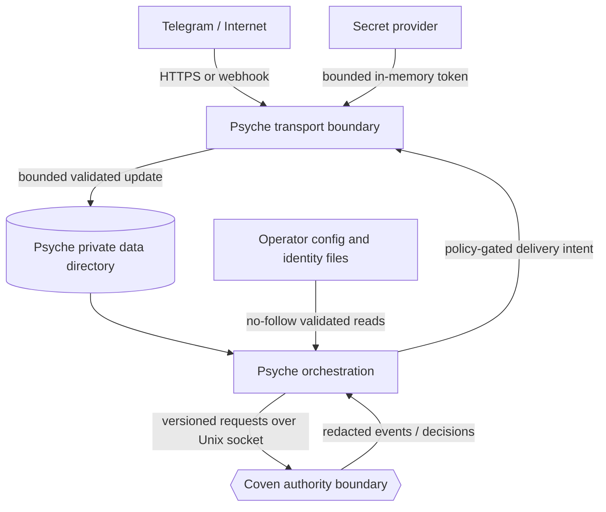

# Psyche Threat Model

**Status:** Proposed v1 - design approval required
**Work unit:** `coven-psy0`
**Companions:** [Product specification](./PRODUCT.md), [Technical architecture](./TECH.md), [Telegram parity ledger](./TELEGRAM_PARITY.md)

## Scope

This threat model covers `psyched`, the `psyche` CLI, Psyche's local database
and media cache, Telegram Bot API traffic, webhook ingress, secret resolution,
identity-file resolution, the same-user Coven Unix socket, npm/native
distribution, and migration from another bot runtime.

Coven's daemon, harnesses, model providers, Telegram's service, the operating
system, and secret providers are dependencies with their own threat models.
Psyche must treat their inputs as untrusted at its boundary even when it relies
on their documented guarantees.

## Security objectives

1. Only an authorized Telegram actor on an authorized surface may trigger a
   familiar turn.
2. A turn must use the route's declared familiar and project scope.
3. Psyche must not grant a tool, memory, session, approval, or external-action
   permission.
4. Accepted updates must not be lost after acknowledgement.
5. Replayed or duplicated updates and callbacks must not repeat logical work
   silently.
6. A Telegram reply or action must not escape its authorized account,
   chat/topic, and action class.
7. Bot tokens and sensitive local data must not appear in config, argv, logs,
   crash reports, databases, packages, or diagnostics.
8. Message and media content must remain untrusted data rather than becoming
   identity, policy, configuration, or shell input.
9. Security-relevant failures must be visible, attributable, and fail closed.
10. The implementation and distribution must remain clean-room and auditable.

## Trust assumptions

- The local operating-system account and kernel are trusted. A malicious
  process running as the same user can read process memory or impersonate a
  local client; Psyche reduces exposure but does not claim to defeat a fully
  compromised same-user account.
- Coven's Rust daemon is the local execution and policy authority. Psyche does
  not trust clients, Telegram, or itself to replace daemon enforcement.
- The configured secret provider returns the intended token to the local
  process. Psyche verifies the token's Telegram bot identity before use.
- Telegram authenticates Bot API HTTPS endpoints. Webhook requests are not
  trusted until Psyche verifies the configured secret header.
- Familiar files and route config may be modified by local software and must be
  revalidated with safe filesystem operations.
- Harness output, model output, transcripts, media-derived text, filenames,
  usernames, callback values, and Telegram message content are untrusted.

## Assets

| Asset | Security property |
|---|---|
| Bot token and secret-provider output | Confidentiality, scoped use, rotation. |
| Familiar declaration, `IDENTITY.md`, `SOUL.md`, role/skill config | Integrity, provenance, coherent binding. |
| Project roots, Coven sessions, tools, memory, approvals | Coven-controlled authorization and integrity. |
| Numeric ACLs, routes, account mapping | Integrity and fail-closed interpretation. |
| Telegram messages, media, observed context | Confidentiality, bounded retention, correct attribution. |
| Ingress queue, offsets, lane state, delivery ledger | Integrity, durability, ordering, replay resistance. |
| Approval IDs and callback nonces | Integrity, expiry, actor/surface binding, one-time use. |
| Logs, metrics, audit records, crash reports | Useful attribution without sensitive payload leakage. |
| Release binaries and npm wrappers | Authenticity, integrity, reproducibility, provenance. |

## Trust boundaries

The Telegram boundary decides whether a network request is authentic enough to
enter Psyche's durable ledger. The Coven boundary decides whether local or
external effects are authorized. Passing the first boundary never implies
passing the second.

## Adversaries

- an unauthenticated Internet client reaching a webhook listener;
- an unauthorized Telegram user, group member, anonymous admin, or bot;
- an authorized user sending malicious prompt, media, markup, or callback data;
- a group member attempting to use DM pairing in a group;
- a compromised or malicious Telegram group;
- a local process modifying config, identity files, the socket, database, or
  secret references;
- a malicious model or harness output attempting to redirect delivery or forge
  approvals;
- a network attacker causing resets, retries, stale DNS, or proxy redirection;
- a dependency or package supply-chain attacker; and
- an operator mistake during token rotation, migration, or rollback.

## Threats and required controls

| ID | Threat | Required control | Verification |
|---|---|---|---|
| P-01 | Forged webhook update | Require exactly one secret header, constant-time compare before JSON parsing, bounded body/read time, non-2xx on failure. | Integration tests for missing, duplicate, malformed, and timing-varied headers; live webhook probe. |
| P-02 | Webhook exposed unintentionally | Bind loopback by default; public bind requires explicit config and startup warning; never trust proxy identity headers as Telegram auth. | Config tests and socket bind inspection. |
| P-03 | Polling and webhook both consume one token | One transport mode per account plus process/database ownership lease; Telegram 409 blocks the account. | Integration conflict tests and operator drill. |
| P-04 | Update acknowledged before durable storage | Commit raw update, normalized event, dedupe key, and cursor state before webhook 2xx or next polling offset. | Crash injection at every acknowledgement boundary. |
| P-05 | Replay repeats a turn | Unique `(account_id, update_id)` key and idempotent durable acceptance; one event record per update. | Duplicate and restart integration tests. |
| P-06 | Out-of-order turns corrupt context | Account/chat/topic lane leases, monotonic per-lane sequence, no concurrent lane owner. | Concurrency property tests and crash replay. |
| P-07 | Unauthorized DM reaches a familiar | Fail-closed DM policy, numeric IDs, one-time DM pairing, explicit wildcard for open mode. | Authorization matrix tests and live unapproved sender probe. |
| P-08 | DM pairing grants group or owner authority | Store pairing scope as account + numeric sender + DM only; group ACL and approver policy remain independent. | Cross-surface authorization tests. |
| P-09 | Mutable username bypasses an ACL | Usernames are display metadata only; ACL keys are decimal numeric IDs. | Config rejection and rename tests. |
| P-10 | Group ID confused with sender ID | Separate typed fields and sign semantics; negative chat IDs cannot parse as allowed user IDs. | Parser/property tests. |
| P-11 | Ambient group traffic triggers work | Require allowed group, allowed sender, and mention/activation policy before dispatch; unauthorized content never enters history. | Group matrix and privacy-mode live tests. |
| P-12 | Anonymous admin or sender-chat attribution bypass | Fail closed when a policy requires a human numeric ID and none is present; add explicit typed policy only in a later reviewed schema. | Anonymous sender fixtures. |
| P-13 | Route ambiguity selects a weaker familiar or project | Deterministic precedence; equal-precedence matches block the event and route set. | Route ambiguity property tests. |
| P-14 | Prompt or route overrides familiar identity | Require declaration, `IDENTITY.md`, `SOUL.md`, role/skill coherence, per-input digests, aggregate digest, Ward revision, and equality on every Coven session/decision binding. | Contradiction matrix and fake-Coven mismatch tests. |
| P-15 | Identity file swapped through symlink or race | Canonical approved root, directory-relative no-follow opens, regular-file validation, digest recheck before each turn. | Symlink, replacement, ownership, and race tests. |
| P-16 | Psyche becomes a policy bypass | Treat capabilities as discovery only; send the complete typed effect; require Coven to recompute effect/request digests and return an allow decision bound to actor/session, surface, familiar/identity/Ward, project, action class, policy revision, and expiry. | Fake-Coven missing/unknown/deny/mismatched-effect/decision tests. |
| P-17 | Malicious message becomes system instruction | Use typed context sections; label channel and derived text untrusted; never concatenate message content into identity or permission fields. | Prompt-construction snapshots and injection tests. |
| P-18 | Model output redirects a reply | Reply surface is pinned from the authorized turn record; model text cannot set account/chat/topic. Cross-chat actions require a separate Coven intent. | Delivery binding tests. |
| P-19 | Model output forges a callback or approval | Callbacks use opaque stored nonces; approval IDs/action digests come only from Coven events; rendered text has no authority. | Forged callback and fake-output tests. |
| P-20 | Approval replay or approval by wrong actor | Bind nonce to account, numeric user, chat/topic, message, approval ID, action digest, decision set, and expiry; consume once; Coven revalidates. | Replay, cross-user, cross-chat, expiry, and mutation tests. |
| P-21 | Sensitive command text leaks in a group approval | Default approval target is authorized DM; group/topic display requires explicit Coven policy and warns that command text is visible. | Policy tests and redaction snapshots. |
| P-22 | Bot token leaks through config or process metadata | Accept secret references only; argv-based provider invocation; bounded pipe; redact token patterns and `/bot<TOKEN>` URLs; zeroize buffers where practical. | Process-list, log, crash, package, and secret-scan tests. |
| P-23 | Secret reference points to attacker-controlled helper | Secret provider executables are operator-configured absolute paths or trusted built-ins; no shell lookup or interpolation. | Config and execution tests. |
| P-24 | Custom Bot API root exfiltrates a token | HTTPS required except explicit loopback self-hosted mode; host allowlist; construct token path internally; never accept token-bearing `api_root`. | SSRF and config tests. |
| P-25 | Telegram media path becomes SSRF or crosses project identity | Fetch only paths returned by the configured Telegram API for the same account; pin origin and reject origin-changing redirects; deny private destinations except the exact explicitly configured loopback self-hosted API origin; require typed artifact admission; digest all bytes/source/project/identity/Ward metadata and verify every echoed binding before turn authorization. | DNS rebinding, redirect, private-address/loopback exception, two-phase admission, and cross-binding artifact tests. |
| P-26 | Filename traversal or unsafe local file | Ignore inbound path components; generate private names; no-follow temp directory; never extract archives. | Traversal, symlink, archive, and platform path tests. |
| P-27 | Media exhausts disk, memory, CPU, or decompressor | Stream with byte/time limits; content sniff; decompression and dimension budgets; per-account quotas; cleanup on every exit path. | Oversize, slow stream, decompression bomb, and quota tests. |
| P-28 | HTML/markup injection changes message meaning | Original allowlisted renderer; escape all untrusted text; Telegram entity validation; plain-text fallback. | Fuzzing and golden rendering tests. |
| P-29 | Callback value is parsed as command text | Typed callback registry; exact opaque values; unknown callbacks are rejected or acknowledged as unsupported, never injected as a user command. | Callback parser and delimiter tests. |
| P-30 | Non-idempotent send repeats after network or server ambiguity | Persist intent before send; only pre-write failures and read-only operations retry automatically; post-write 5xx/reset/timeout becomes `delivery_unknown`; resolution requires a typed Coven decision and a separately authorized recovery effect with duplicate-risk acknowledgement. | TCP reset, proxy/server 5xx, timeout, and unknown-resolution fault injection. |
| P-31 | Flood limit causes reordering or outage | One limiter per token; honor `retry_after`; hold lane order; bounded queue/admission control. | Rate-limit and overload tests. |
| P-32 | Poison update blocks polling forever | Durably classify unsupported/non-dispatchable updates and advance only after that classification commits. | Malformed/unknown update sequence tests. |
| P-33 | Local database tampering creates authorized work | Private permissions, schema constraints, hashes, typed states, callback entropy, startup integrity checks; treat same-user compromise as residual risk. | Permission and tamper tests. |
| P-34 | Logs or metrics leak content/IDs | Structured allowlist logging, hashed identifiers, no payloads by default, privileged diagnostic mode with explicit warning and expiry. | Snapshot tests and automated secret/PII scanning. |
| P-35 | Retained content exceeds policy | Transactional expiry, startup cleanup, bounded backups, auditable hold configuration. | Time-travel retention tests. |
| P-36 | Operator accidentally runs two runtimes during migration | No shared-token shadow mode; explicit quiesce and ownership checks; 409 blocks; named rollback operator. | Migration rehearsal under dedicated tokens. |
| P-37 | Migration imports compromised private state | Import only human-reviewed, secret-free manifest fields; never read OpenClaw databases, code, credentials, prompts, or caches. | Import schema rejection tests and review checklist. |
| P-38 | Malicious npm/native package replaces binary | Signed release provenance, checksummed platform artifact, wrapper verifies expected version/hash, reproducible build evidence. | Release verification in CI and clean-host install. |
| P-39 | Dependency compromise adds telemetry or exfiltration | Minimal dependencies, lockfile review, license/security audit, no analytics, egress limited to Telegram, Coven socket, and configured secret provider. | Dependency audit and egress integration tests. |
| P-40 | Unknown schema/API is interpreted permissively | Exact major-version match, unknown enum rejection, quarantine persisted unknown events, missing capabilities denied. | Forward-version contract tests. |
| P-41 | Lost Coven response repeats a turn | Require Coven idempotency keys and adoption lookup; reuse with another digest conflicts; inconclusive lookup blocks the lane as `coven_adoption_unknown`. | Launch/input lost-response and restart crash tests. |
| P-42 | Secret rotation silently switches Telegram bots | Pin expected numeric bot ID; compare every `getMe`; different bot requires a new account identity or audited destructive rebind. | Valid-wrong-token startup/reload and rebind tests. |
| P-43 | Client supplies a harmless digest but executes another effect | Send a strict `psyche.telegram_effect.v1`; Coven parses the actual fields, recomputes canonical digests, and rejects class/effect or digest disagreement. | Effect mutation, unknown-field, and digest-confusion tests. |
| P-44 | Restart or local transformation escapes the decision that authorized a delivery | Persist immutable effect JSON plus effect/request digests, decision ID, policy/Ward revisions, and expiry; append renewals; require a distinct decision for every physical chunk, preview edit, cleanup, or fallback. | Restart, chunk/fallback mutation, and expired-decision retry tests. |
| P-45 | Local CLI self-asserts principal authority | Local operator actions carry only a Coven-minted short-lived operator context; Coven derives and revalidates principal identity. | Forged, expired, and cross-user operator-context tests. |
| P-46 | Psyche reads arbitrary Coven output paths or swaps media bytes | Retrieve output artifacts only as opaque, session-bound streams after an exact media-send decision; verify familiar/project/identity/Ward, expiry, hash, size, and media type. | Cross-session ID, expired decision, stream substitution, and hash/size/type tests. |

## Security invariants

These invariants are release-blocking:

- No code path launches a harness, edits project files, writes familiar memory,
  or resolves an approval without Coven.
- No route activates without one valid identity snapshot and matching Coven
  familiar binding.
- No turn or Telegram effect proceeds from capability presence alone; each has
  a matching unexpired Coven allow decision.
- No Coven launch or input is retried after an inconclusive adoption lookup.
- No Telegram update is acknowledged before its durable disposition exists.
- No username authorizes a sender.
- No group authorization is inherited from DM pairing.
- No delivery fallback changes account, chat, topic, or action class.
- No raw bot token is accepted in config or emitted in diagnostics.
- No unknown callback becomes prompt text.
- No outbound ambiguity is recorded as confirmed success.
- No public webhook listener starts implicitly.

## Secret lifecycle

1. Config stores a provider-specific reference.
2. The secret adapter resolves it through an argv-only child process or
   OS-native API.
3. Psyche bounds output size, trims only documented transport whitespace, and
   rejects an empty or structurally invalid token.
4. Psyche calls `getMe` and requires the numeric bot ID to equal the account's
   configured pin before activating or swapping the client.
5. The token is installed in a token-scoped HTTP client and excluded from debug
   formatting.
6. Bot API URLs are built by a redacting URL type whose display form replaces
   the token.
7. Reload creates a new client, verifies the same bot ID, atomically swaps it,
   closes
   the previous client, and clears old buffers where the platform permits.
8. A different bot ID is not an in-place rotation. The operator creates a new
   account ID or performs an audited rebind that archives token-scoped cursors,
   callbacks, pairings, and pending deliveries before route revalidation.
9. Shutdown closes clients and drops token buffers.

Raw environment-token fallback is rejected in v1 because process environments
are commonly captured by diagnostics and service managers. Secret providers
may themselves use environment-backed authentication without exposing the bot
token to Psyche config.

### Webhook secret lifecycle

Webhook mode requires a second secret-provider reference whose resolved value
is structurally valid and distinct from the bot token. The value is excluded
from debug output, process arguments, database state, metrics, and crash
reports. Rotation first resolves the candidate, obtains an account-activation
decision for the new config digest, and calls `setWebhook`. Only a successful
Telegram response promotes it. The prior secret remains accepted for exactly
five minutes for in-flight requests, after which its buffer is dropped. A
failed rotation keeps the prior secret and listener state unchanged. Health
reports only secret version IDs and digest prefixes.

## Webhook posture

- Default listener: `127.0.0.1`, operator-selected port.
- HTTPS termination: trusted reverse proxy or direct Rust TLS when explicitly
  configured.
- Secret header: exactly one value, fixed maximum length, constant-time match.
- Failed-auth rate limiting: applies only to failed requests so authenticated
  Telegram delivery cannot be starved by the same bucket.
- Request controls: maximum headers, body bytes, nesting depth, read timeout,
  connection limit, and JSON duplicate-key rejection.
- Success: empty 2xx only after durable commit.
- Failure: generic status and request correlation ID, with detail confined to
  redacted local logs.

The webhook secret is distinct from the bot token and rotates independently.

## Approval bridge posture

Telegram is a presentation and input surface for Coven approvals, not the
approval store.

- Approval buttons carry random callback nonces, not shell commands, project
  paths, policy text, or self-contained authorization claims.
- Psyche stores the nonce binding and sends an acknowledgement to Telegram
  promptly.
- Approval prompts show the familiar, action class, bounded redacted summary,
  expiry, and origin surface.
- The default destination is a configured approver DM.
- A decision event contains the numeric Telegram actor and nonce binding; Coven
  remains responsible for principal mapping and final authorization.
- Edited messages do not alter the action digest.
- Expired, superseded, already decided, or mismatched approvals render a stable
  refusal and cannot restart the action.

## Data protection

The data directory is created mode `0700`; regular state files are mode `0600`.
Psyche rejects group/world-writable parent directories unless an explicit
development-only override is active.

Content encryption at rest uses a random data key protected by the OS keychain.
On platforms where that profile is unavailable, production startup requires an
explicit acknowledgement that filesystem permissions are the only at-rest
control. The acknowledgement is stored as non-secret policy metadata and
reported by `psyche doctor`.

Database backups are not automatic in v1. An operator export applies retention
and redaction before writing a new archive.

## Abuse and overload handling

- Per-account, per-sender, per-chat, and global admission limits protect the
  durable queue.
- Authenticated updates are persisted when capacity exists; overload returns a
  retryable webhook failure or stops polling before advancing the offset.
- Pairing attempts have stricter limits and do not reveal whether a numeric
  user is otherwise authorized.
- Unsupported media is rejected before full buffering.
- Repeated permanent failures are dead-lettered under attempt and age gates.
- Operators can pause an account or route without deleting durable state.

## Clean-room controls

- Requirements cite only public behavior and protocol documentation.
- Implementers do not consult OpenClaw source while writing Psyche code.
- No OpenClaw source file, symbol map, internal module name, test fixture,
  prompt, error prose, configuration parser, or asset enters the Psyche
  repository.
- Test fixtures are independently authored from Telegram's public Bot API
  schema and Psyche's own contracts.
- A provenance note accompanies each parity implementation PR.
- Review checks both functional independence and copyright/license hygiene.

## Residual risks

1. A same-user local compromise can access process memory, the Coven socket,
   identity files, or the database.
2. Telegram controls update delivery and can observe bot messages and metadata.
3. Bot API sends have an unavoidable accepted-but-response-lost ambiguity
   because Telegram provides no client idempotency key.
4. Authorized users can still prompt-inject a model; containment relies on
   typed context plus Coven policy, not on perfect model obedience.
5. Secret providers, proxies, harnesses, models, and dependencies may be
   compromised outside Psyche's boundary.
6. Message deletion in Telegram does not guarantee deletion from clients,
   notifications, Telegram infrastructure, or previously created Coven events.

These risks must appear in operator documentation and may not be described as
solved.

## Incident response

Security events that immediately block an account or route:

- bot-token authentication failure or suspected disclosure;
- identity or Coven binding mismatch;
- unauthorized dispatch or approval attempt;
- webhook secret failure spike;
- database integrity failure;
- repeated delivery to a wrong surface;
- secret detection in logs or artifacts; or
- unexpected token ownership conflict during migration.

Response:

1. stop intake for the affected account;
2. preserve the private database and redacted correlation bundle;
3. rotate the bot token or webhook secret when implicated;
4. revoke active callback nonces and pairings when actor scope is implicated;
5. confirm Coven sessions and approvals associated with the incident;
6. restore from a known release or roll back the transport;
7. document accepted, rejected, and ambiguous events; and
8. require a new live security probe before reactivation.

## Security acceptance

Psyche v1 cannot release until:

- all invariants have automated negative tests;
- crash tests prove durable acknowledgement;
- webhook, media, callback, identity, and Coven-boundary fuzz targets run in
  CI;
- a security review finds no open critical or high-severity issue;
- release artifacts pass secret scanning and provenance verification;
- migration and token-rotation drills pass on a dedicated account; and
- Val approves this threat model with the other `coven-psy0` documents.
